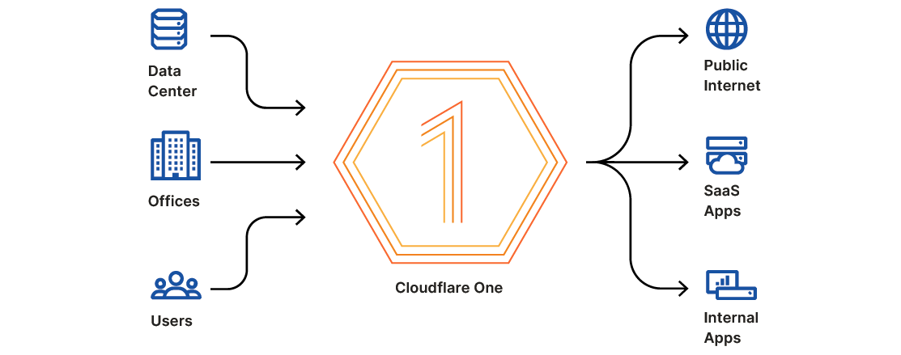
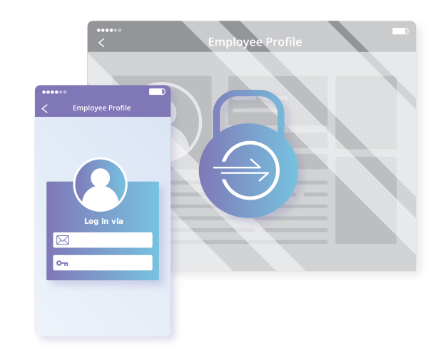

I am a Director of Product at Cloudflare, where I work with wonderful people to build Zero Trust security products. The products in my group include [Access](https://www.cloudflare.com/teams/access/), [Tunnel](https://www.cloudflare.com/products/tunnel/), [Gateway](https://www.cloudflare.com/teams/gateway/), [Browser Isolation](https://www.cloudflare.com/teams/browser-isolation/), and the Cloudflare for Teams client.

Back in the day, I also launched our Registrar and, no, I do not know when we will support the `.horse` or `.uk.` TLDs.

## 🌥️ Currently

<main class="grid">
  <article>
    
    

      <h3>Cloudflare One</h3>
      
Cloudflare One connects and secures your entire organization.

      
<a href="https://blog.cloudflare.com/cloudflare-one/">Learn more</a> >

    

  </article>
  <article>
    
    

      <h3>Cloudflare Zero Trust</h3>
      
Keep your applications, devices, and data safe without compromising speed or usability.

      
<a href="https://blog.cloudflare.com/cloudflare-for-teams-products/">Learn more</a> >

    

  </article>
</main>

## 🌱 Previously

<main class="grid">
  <article>
    
    

      <h3>Cloudflare Access</h3>
      
<b>
Launch -> 2020
</b>

      
Zero Trust control over your applications and data.

      
<a href="https://blog.cloudflare.com/cloudflare-access-now-teams-of-any-size-can-turn-off-their-vpn/">Learn more</a> >

    

  </article>
  <article>
    
    

      <h3>Cloudflare Tunnel</h3>
      
<b>
2019-2021
</b>

      
Connect applications and resources to Cloudflare without poking holes in your firewall.

      
<a href="https://www.cloudflare.com/products/tunnel/">Learn more</a> >

    

  </article>
  <article>
    
    

      <h3>Cloudflare Gateway</h3>
      
<b>
2020
</b>

      
Keep your team safe from threats on the Internet without slowing them down.

      
<a href="https://www.cloudflare.com/teams/gateway/">Learn more</a> >

    

  </article>
  <article>
    
    

      <h3>Cloudflare Browser Isolation</h3>
      
<b>
2020
</b>

      
You'll forget you're using it.

      
<a href="https://www.cloudflare.com/teams/browser-isolation/">Learn more</a> >

    

  </article>
  <article>
    
    

      <h3>Cloudflare Registrar</h3>
      
<b>
Launch-2019
</b>

      
A domain registrar you can trust.

      
<a href="https://blog.cloudflare.com/using-cloudflare-registrar/">Learn more</a>>

    

  </article>
</main>

## 🚀 Launches