I work on the Emerging Technology and Incubation team at Cloudflare. We spend every day building the capabilities on Cloudflare's network that we think customers will need next.

I previously spent six years launching, building, and leading the [Zero Trust](https://www.cloudflare.com/products/zero-trust/) business at Cloudflare as the VP of Product. I was responsible for the enterprise security use cases of [Cloudflare One](https://blog.cloudflare.com/cloudflare-one-one-year-later/) and the proprietary private networking components.

I [launched](https://blog.cloudflare.com/cloudflare-access-now-teams-of-any-size-can-turn-off-their-vpn/) the first prototype in this group into GA as a Product Manager in 2018. A few years later we became the [only new vendor in the Gartner Magic Quadrant](https://blog.cloudflare.com/cloudflare-sse-gartner-magic-quadrant/) and then made the biggest leap the [year after that](https://blog.cloudflare.com/cloudflare-sse-gartner-magic-quadrant-2024). The business is now led by a brilliant team that joined me on that journey. They are building something bigger and better than I could have ever imagined.

The products in my group include:
* [Cloudflare Access](https://www.cloudflare.com/products/zero-trust/access/), our Zero Trust access control solution.
* [Cloudflare Tunnel](https://www.cloudflare.com/products/tunnel/), our secure networking product.
* [Cloudflare Gateway](https://www.cloudflare.com/products/zero-trust/gateway/), our DNS filter and Secure Web Gateway.
* The [Cloudflare Browser](https://www.cloudflare.com/zero-trust/products/browser-isolation/), an isolated browser so seamless that you'll forget you're using it.
* The [Cloudflare One Agent](https://developers.cloudflare.com/cloudflare-one/connections/connect-devices/warp/), an agent-based on ramp built on Cloudflare [WARP](https://1.1.1.1/) to connect your device to anything through Cloudflare's network.
* [Cloudflare Data Loss Prevention](https://www.cloudflare.com/products/zero-trust/dlp/), earth's only comprehensive DLP solution that improves user experience.
* [Cloudflare CASB](https://blog.cloudflare.com/cloudflare-zero-trust-casb/), our Cloud Access Security Broker that keeps one eye open for SaaS security issues so you can focus on your real work.
* [Cloudflare Digital Experience](https://blog.cloudflare.com/introducing-digital-experience-monitoring/), the analytics and triage tool that gives administrators visibility into Cloudflare's network and the wider Internet.
* [Cloudflare Email Security](https://www.cloudflare.com/zero-trust/products/email-security/), an industry-leading email security product that works seamlessly with the rest of our Zero Trust suite. 

I spend every day working with curious, empathetic product managers and product directors in my group who obsess over how we can use Cloudflare's network to solve security problems for teams of any size.

Back in the day, I was a Product Manager for most of the products above or the Director of Product when Product Managers  smarter than me built those tools. I consider myself terribly lucky to have worked with brilliant teammates to watch these prototypes and moon shot ideas evolve into Cloudflare's next act. I could not be more excited to see what we can solve next for our customers.

I also [launched our Registrar](https://blog.cloudflare.com/using-cloudflare-registrar/) years ago and miss the bizarre dance of domain registration. I'm sorry -- I do not know when we will support the `.horse` TLD.

## 🌥️ Currently

Right now I am heads down solving security problems for 20,000+ organizations [around the world](https://www.cloudflare.com/case-studies?usecase=Enable+zero+trust+security+for+workforce).

<main class="grid">
  <article>
    
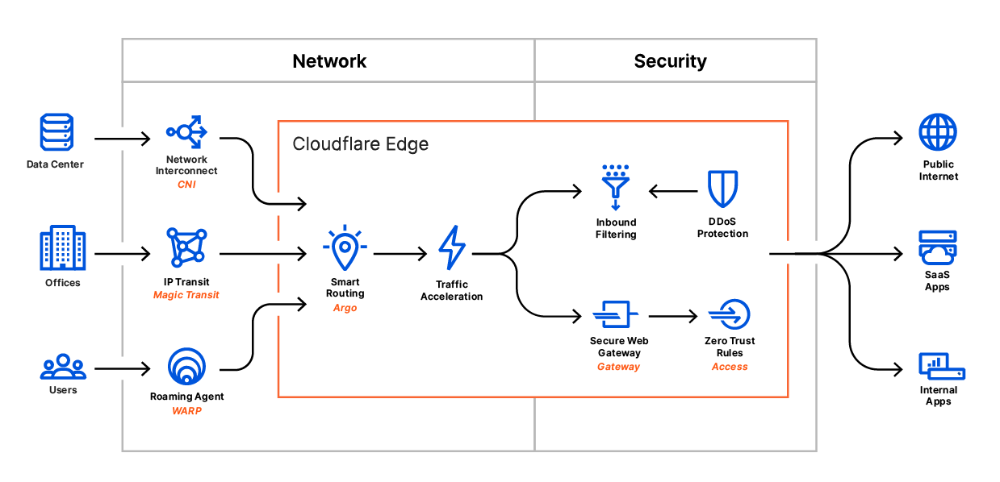

    

      <h3>Cloudflare One</h3>
      
Cloudflare One connects and secures your entire organization.

      
<a href="https://blog.cloudflare.com/cloudflare-one/">Learn more</a> >

    

  </article>
  <article>
    

    

      <h3>Cloudflare Zero Trust</h3>
      
Keep your applications, devices, and data safe without compromising speed.

      
<a href="https://blog.cloudflare.com/cloudflare-for-teams-products/">Learn more</a> >

    

  </article>
</main>

## 🌱 Previously

Years ago they let me build stuff. I had the wonderful opportunity to work with brilliant people at Cloudflare to ship products that change how our customers keep their teams safe. These products are now led by Product Managers who are taking them to new places to help even more customers. I was the individual contributor Product Manager for the following products.

<main class="grid">
  <article>
    
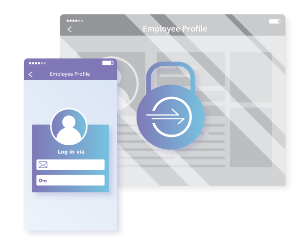

    

      <h3>Cloudflare Access</h3>
      
Zero Trust control over your applications and data.

      
<a href="https://blog.cloudflare.com/cloudflare-access-now-teams-of-any-size-can-turn-off-their-vpn/">Learn more</a> >

    

  </article>
  <article>
    
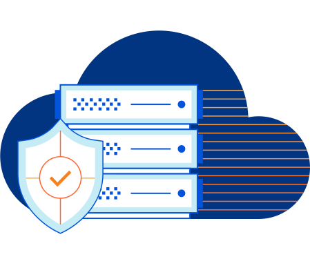

    

      <h3>Cloudflare Tunnel</h3>
      
Connect applications and resources to Cloudflare without poking holes in your firewall.

      
<a href="https://www.cloudflare.com/products/tunnel/">Learn more</a> >

    

  </article>
  <article>
    

    

      <h3>Cloudflare Gateway</h3>
      
Keep your team safe from threats on the Internet without slowing them down.

      
<a href="https://www.cloudflare.com/teams/gateway/">Learn more</a> >

    

  </article>
  <article>
    
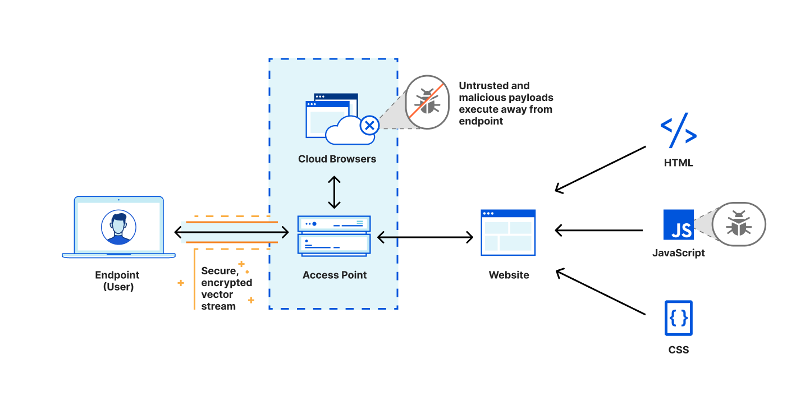

    

      <h3>Cloudflare Browser Isolation</h3>
      
You'll forget you're using it.

      
<a href="https://www.cloudflare.com/teams/browser-isolation/">Learn more</a> >

    

  </article>
  <article>
    
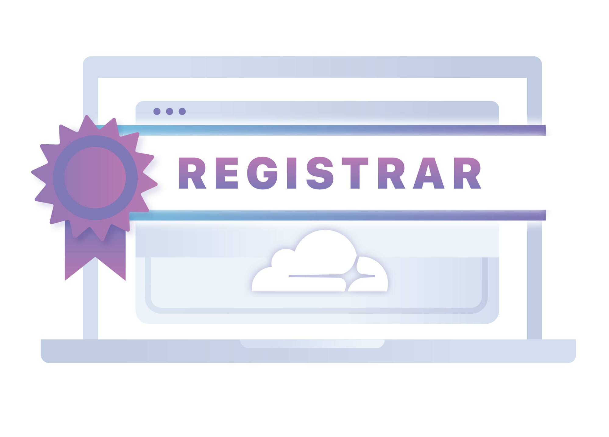

    

      <h3>Cloudflare Registrar</h3>
      
A domain registrar you can trust.

      
<a href="https://blog.cloudflare.com/using-cloudflare-registrar/">Learn more</a>>

    

  </article>
</main>

## 🚀 Launches

We ship quickly at Cloudflare. When we do, Product Managers write [painfully detailed technical posts](https://blog.cloudflare.com/author/sam/) about our new features. Here are a few that I had the opportunity to launch.

<main class="grid">
   <article>
     
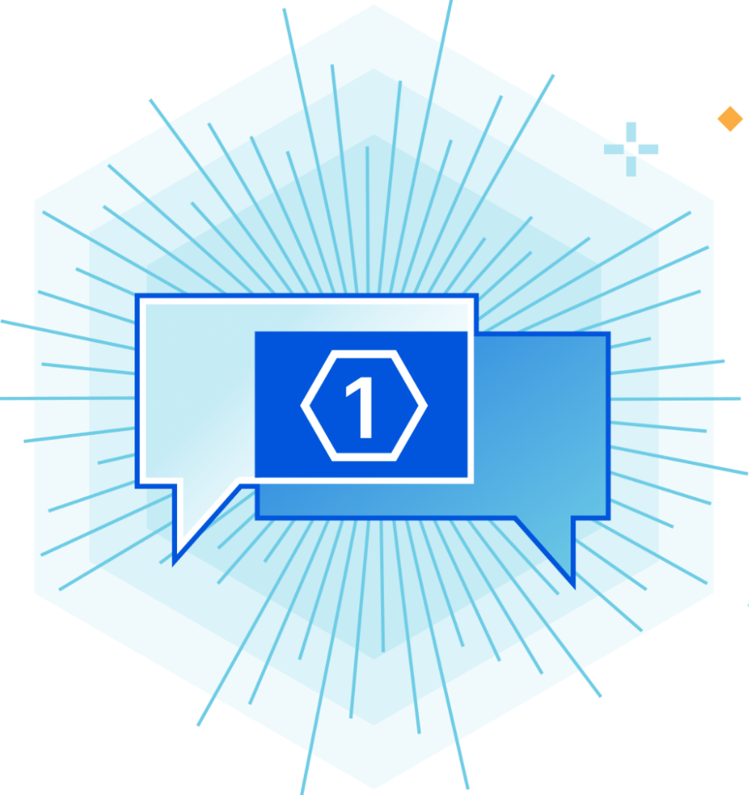

       <h3>Gartner SSE 2024 MQ</h3>
       
<b>
2024
</b>

       
Consecutive placement.

       
<a href="https://blog.cloudflare.com/cloudflare-sse-gartner-magic-quadrant-2024">Learn more</a> >

     

   </article>
   <article>
     
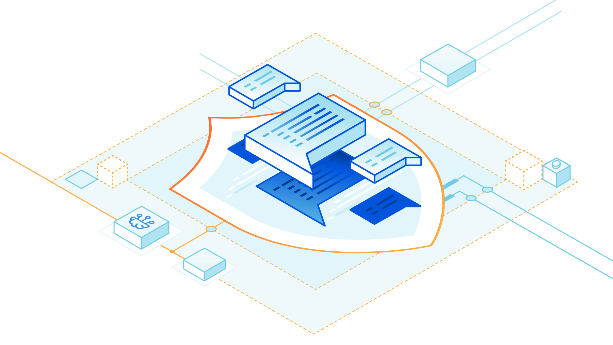

       <h3>Zero Trust security for AI tools</h3>
       
<b>
2023
</b>

       
Let your team use AI safely.

       
<a href="https://blog.cloudflare.com/zero-trust-ai-security/">Learn more</a> >

     

   </article>
   <article>
    

    

      <h3>Why do CIOs choose Cloudflare One?</h3>
      
<b>
2023
</b>

      
Breaking out the reasons they select Cloudflare.

      
<a href="https://blog.cloudflare.com/why-cios-select-cloudflare-one/">Learn more</a> >

    

  </article>
  <article>
    

    

      <h3>Cloudflare Zero Trust for Project Galileo and the Athenian Project</h3>
      
<b>
2022
</b>

      
Helping protect democracies and sensitive organizations.

      
<a href="https://blog.cloudflare.com/cloudflare-zero-trust-for-galileo-and-athenian/">Learn more</a> >

    

  </article>
  <article>
    
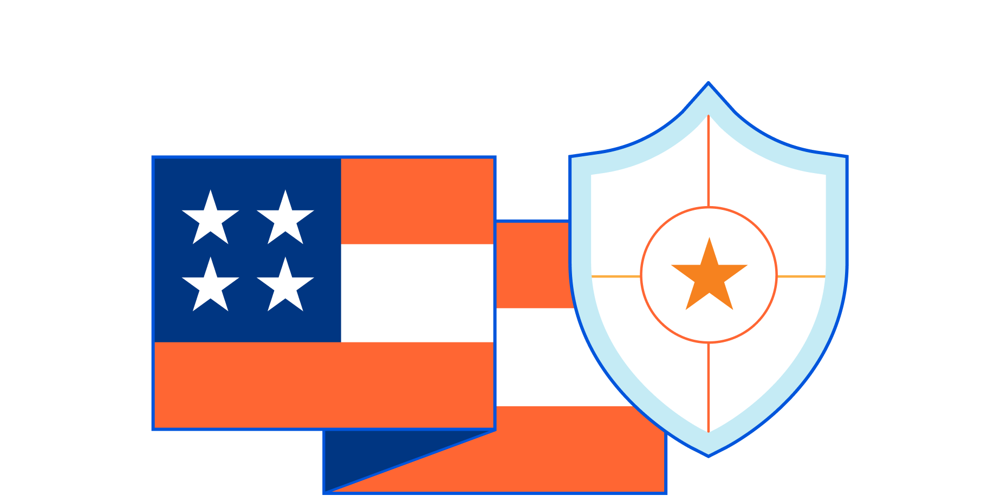

    

      <h3>Security with CISA</h3>
      
<b>
2021
</b>

      
Helping protect the Department of Homeland Security keep the Government secure.

      
<a href="https://blog.cloudflare.com/helping-keep-governments-safe-and-secure/">Learn more</a> >

    

  </article>
  <article>
    
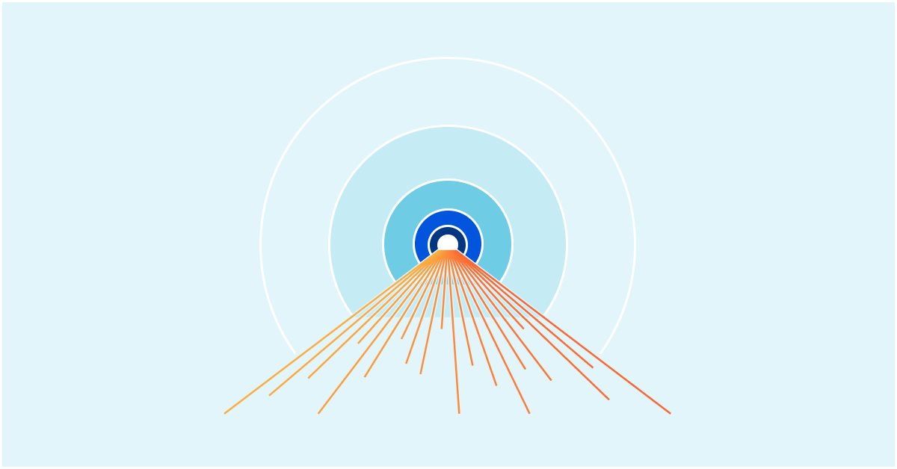

    

      <h3>Cloudflare Private Network</h3>
      
<b>
2021
</b>

      
Build a Zero Trust network on Cloudflare's network.

      
<a href="https://blog.cloudflare.com/build-your-own-private-network-on-cloudflare/">Learn more</a> >

    

  </article>
  <article>
    
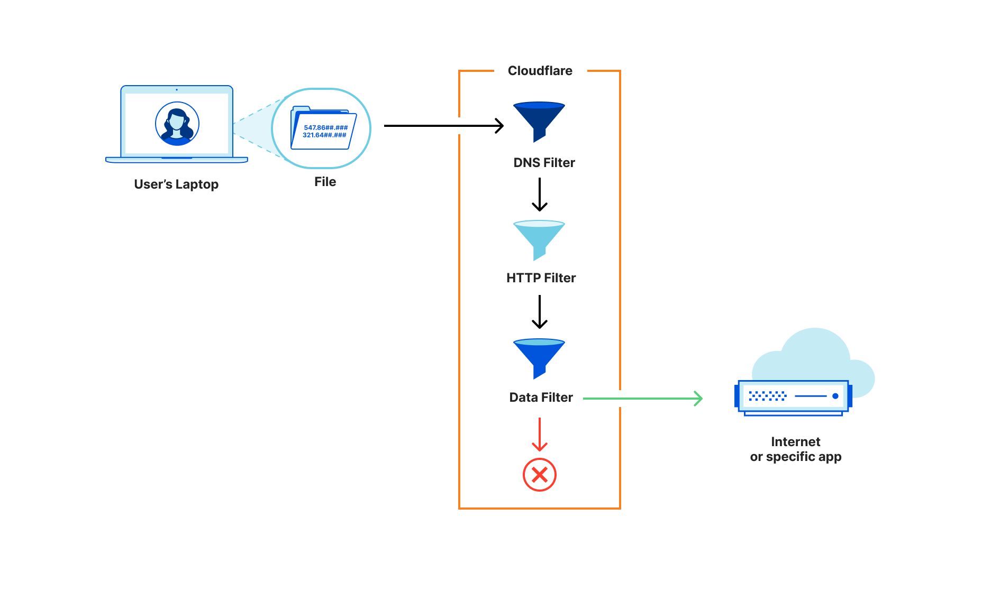

    

      <h3>Cloudflare DLP</h3>
      
<b>
2021
</b>

      
Protect your data without compromising on performance.

      
<a href="https://blog.cloudflare.com/data-loss-prevention/">Learn more</a> >

    

  </article>
  <article>
    

    

      <h3>Workplace Records</h3>
      
<b>
2020
</b>

      
Audit where work is happening without any new tools

      
<a href="https://blog.cloudflare.com/work-jurisdiction-records-for-teams/">Learn more</a> >

    

  </article>
  <article>
    
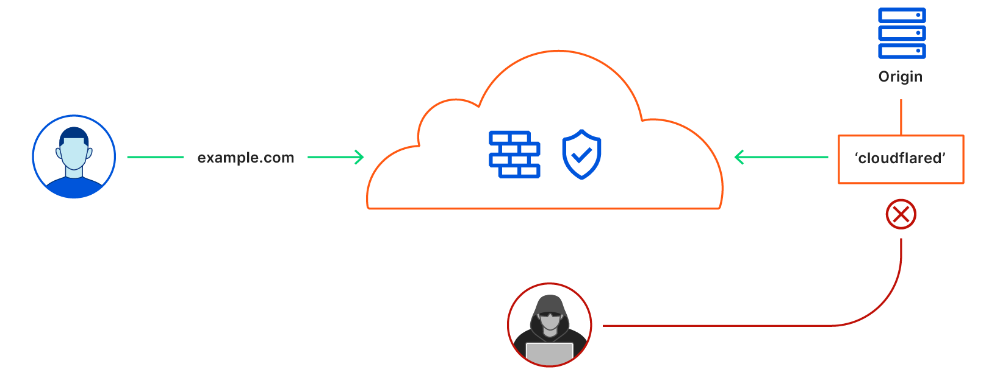

    

      <h3>Persistent Tunnels</h3>
      
<b>
2018-2019
</b>

      
Connect anything to Cloudflare once and run it forever.

      
<a href="https://blog.cloudflare.com/argo-tunnels-that-live-forever/">Learn more</a>>

    

  </article>
  <article>
    
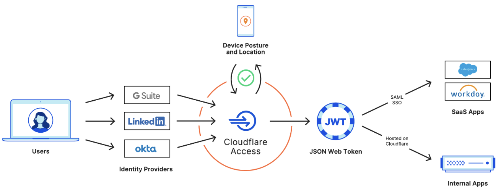

    

      <h3>Zero Trust SaaS</h3>
      
<b>
2020
</b>

      
Build Zero Trust rules in Cloudflare's network for your SaaS apps.

      
<a href="https://blog.cloudflare.com/cloudflare-access-for-saas/">Learn more</a>>

    

  </article>
  <article>
    
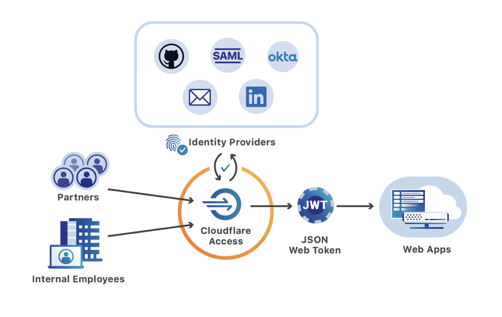

    

      <h3>Region Control Rules</h3>
      
<b>
2020
</b>

      
Build Zero Trust rules based on user location.

      
<a href="https://blog.cloudflare.com/two-clicks-to-enable-regional-zero-trust-compliance/">Learn more</a>>

    

  </article>
  <article>
    

    

      <h3>Require Hard Keys</h3>
      
<b>
2020
</b>

      
Build Zero Trust rules that require certain types of MFA.

      
<a href="https://blog.cloudflare.com/require-hard-key-auth-with-cloudflare-access/">Learn more</a>>

    

  </article>
  <article>
    
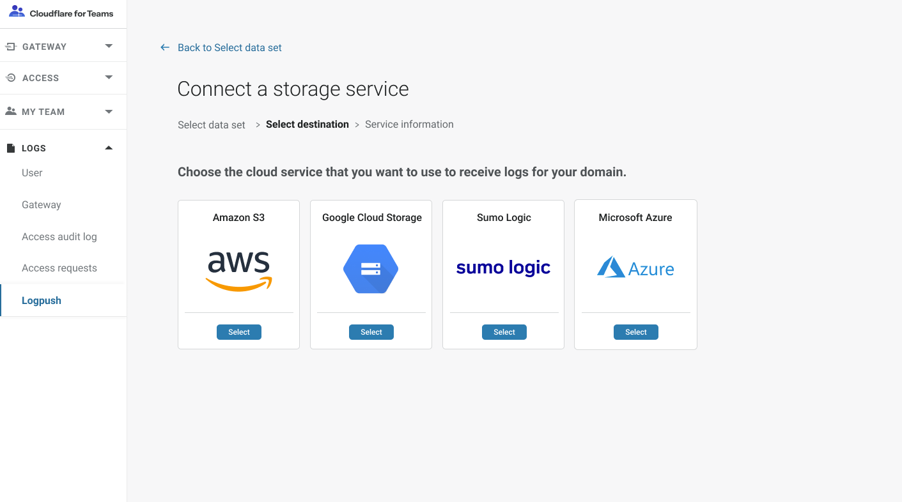

    

      <h3>SWG Log Export</h3>
      
<b>
2020
</b>

      
Export your SWG logs to your SIEM.

      
<a href="https://blog.cloudflare.com/export-logs-from-cloudflare-gateway-with-logpush/">Learn more</a>>

    

  </article>
  <article>
    

    

      <h3>Cloudflare + Tanium</h3>
      
<b>
2020
</b>

      
Build Zero Trust rules that require Tanium checks.

      
<a href="https://blog.cloudflare.com/tanium-cloudflare-teams/">Learn more</a>>

    

  </article>
  <article>
    

    

      <h3>Per-Resource IdP</h3>
      
<b>
2020
</b>

      
Configure the IdP used on a per-resource basis.

      
<a href="https://blog.cloudflare.com/releasing-cloudflare-access-most-requested-feature/">Learn more</a>>

    

  </article>
  <article>
    
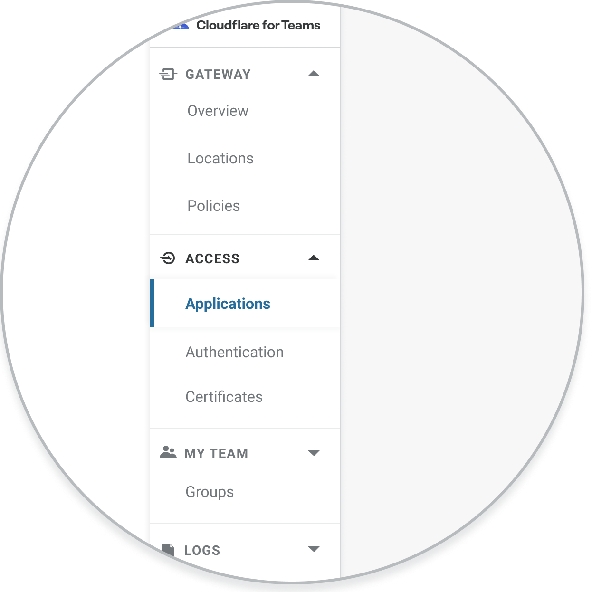

    

      <h3>Cloudflare for Teams Dash</h3>
      
<b>
2020
</b>

      
A single control plane for your Zero Trust deployment.

      
<a href="https://blog.cloudflare.com/a-single-dashboard-for-cloudflare-for-teams/">Learn more</a>>

    

  </article>
  <article>
    
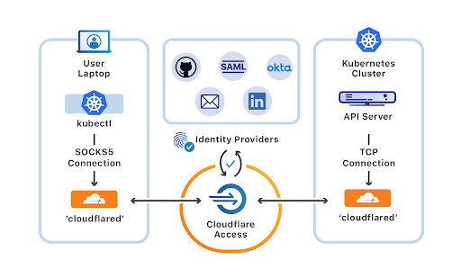

    

      <h3>Zero Trust kubectl</h3>
      
<b>
2020
</b>

      
Seamless, Zero Trust access to your Kubernetes deployments.

      
<a href="https://blog.cloudflare.com/releasing-kubectl-support-in-access/">Learn more</a>>

    

  </article>
  <article>
    

    

      <h3>Sentry SSO</h3>
      
<b>
2020
</b>

      
SSO through Cloudlfare to your Sentry instance.

      
<a href="https://blog.cloudflare.com/open-sourcing-our-sentry-sso-plugin/">Learn more</a>>

    

  </article>
  <article>
    

    

      <h3>Cloudflare mTLS</h3>
      
<b>
2020
</b>

      
Require mTLS authentication to your applications.

      
<a href="https://blog.cloudflare.com/using-your-devices-as-the-key-to-your-apps/">Learn more</a>>

    

  </article>
  <article>
    
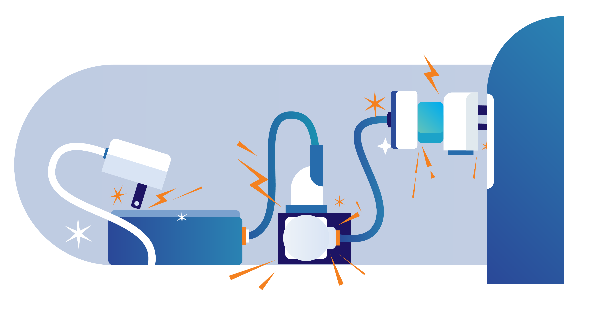

    

      <h3>Cloudflare MultiSSO</h3>
      
<b>
2020
</b>

      
Authenticate to any application with any IdP.

      
<a href="https://blog.cloudflare.com/multi-sso-and-cloudflare-access-adding-linkedin-and-github-teams/">Learn more</a>>

    

  </article>
  <article>
    

    

      <h3>Access App Launcher</h3>
      
<b>
2020
</b>

      
Launch any application with a single click.

      
<a href="https://blog.cloudflare.com/announcing-the-cloudflare-access-app-launch/">Learn more</a>>

    

  </article>
  <article>
    
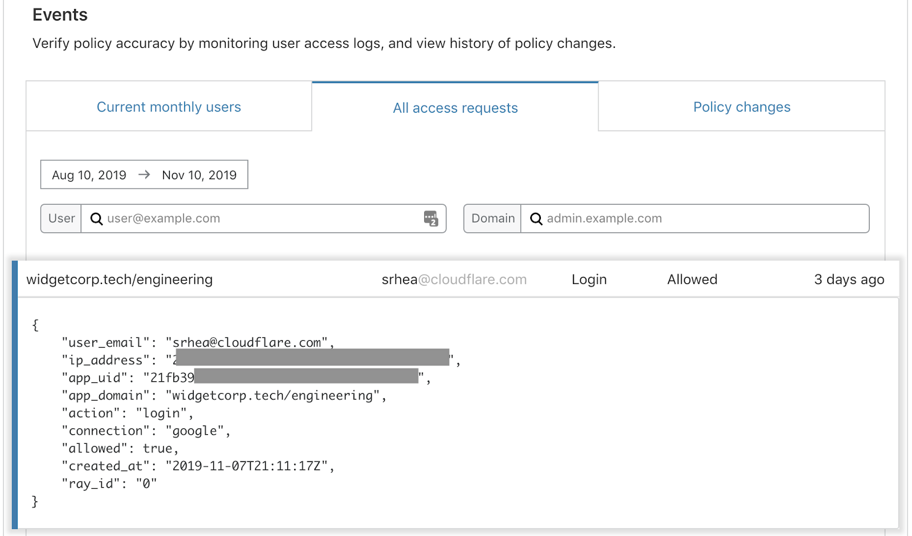

    

      <h3>Zero Trust Logging</h3>
      
<b>
2019
</b>

      
Log every request - no code changes required.

      
<a href="https://blog.cloudflare.com/log-every-request-to-corporate-apps-no-code-changes-required/">Learn more</a>>

    

  </article>
  <article>
    
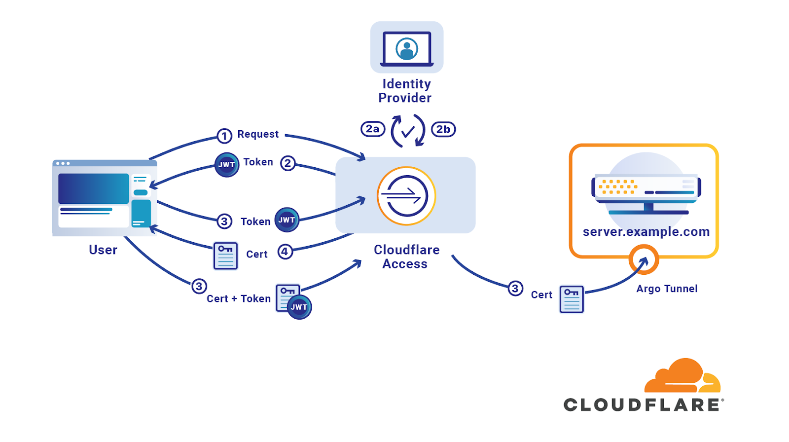

    

      <h3>Short Lived Certificates</h3>
      
<b>
2019
</b>

      
Delete your long-lived SSH keys.

      
<a href="https://blog.cloudflare.com/public-keys-are-not-enough-for-ssh-security/">Learn more</a>>

    

  </article>
  <article>
    
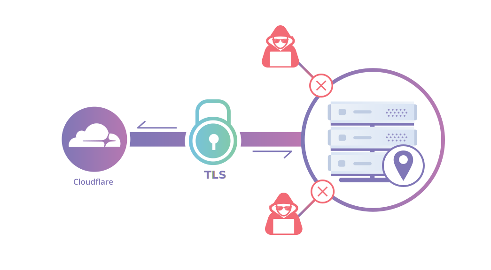

    

      <h3>Free Tunnels</h3>
      
<b>
2019
</b>

      
Connect your service to Cloudflare's network - no account or credit card required.

      
<a href="https://blog.cloudflare.com/a-free-argo-tunnel-for-your-next-project/">Learn more</a>>

    

  </article>
  <article>
    

    

      <h3>Zero Trust RDP</h3>
      
<b>
2019
</b>

      
Connect to your RDP deployment with seamless Zero Trust rules.

      
<a href="https://blog.cloudflare.com/cloudflare-access-now-supports-rdp/">Learn more</a>>

    

  </article>
  <article>
    
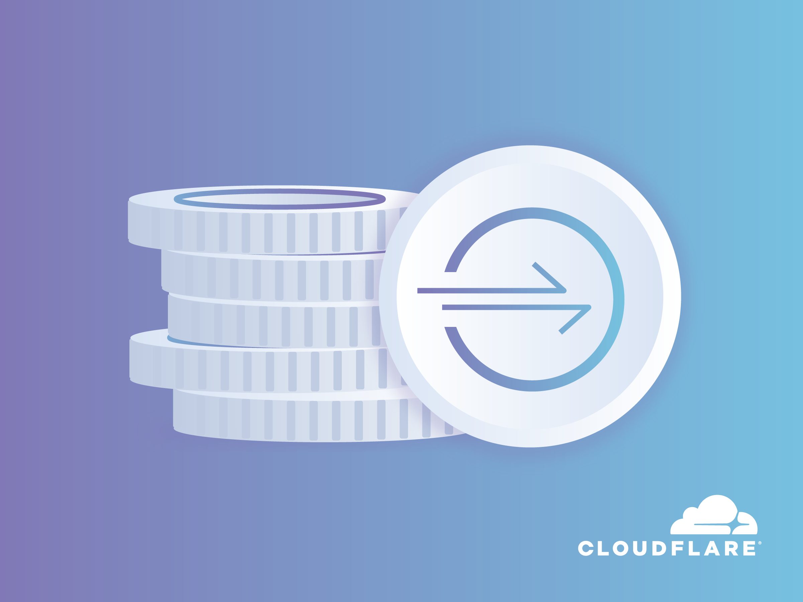

    

      <h3>Zero Trust Service Tokens</h3>
      
<b>
2019
</b>

      
Give your services tokens to connect to your resources.

      
<a href="https://blog.cloudflare.com/give-your-automated-services-credentials-with-access-service-tokens/">Learn more</a>>

    

  </article>
  <article>
    

    

      <h3>One-Click DNSSEC</h3>
      
<b>
2019
</b>

      
Add DNSSEC to your site with a single click.

      
<a href="https://blog.cloudflare.com/one-click-dnssec-with-cloudflare-registrar/">Learn more</a>>

    

  </article>
  <article>
    

    

      <h3>Zero Trust SSH</h3>
      
<b>
2019
</b>

      
Connect to machines and services over SSH with built-in Zero Trust controls.

      
<a href="https://blog.cloudflare.com/releasing-the-cloudflare-access-feature-that-let-us-smash-a-vpn-on-stage/">Learn more</a>>

    

  </article>
  <article>
    

    

      <h3>Atlassian SSO</h3>
      
<b>
2019
</b>

      
SSO through Cloudlfare to your Atlassian instance.

      
<a href="https://blog.cloudflare.com/cloudflare-access-sharing-our-single-sign-on-plugin-for-atlassian/">Learn more</a>>

    

  </article>
</main>
