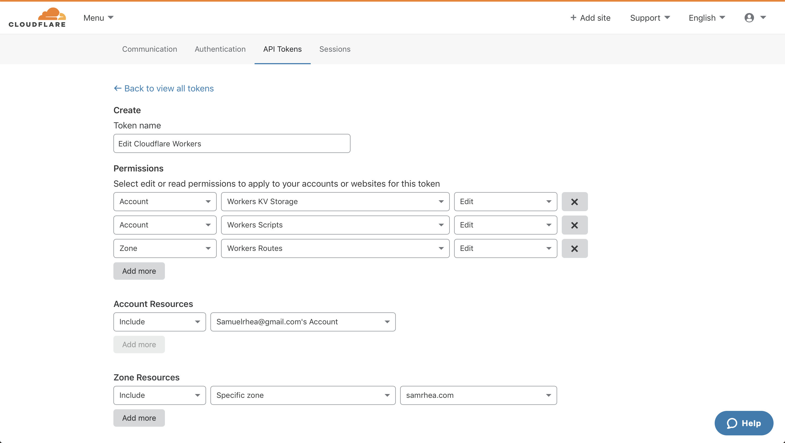
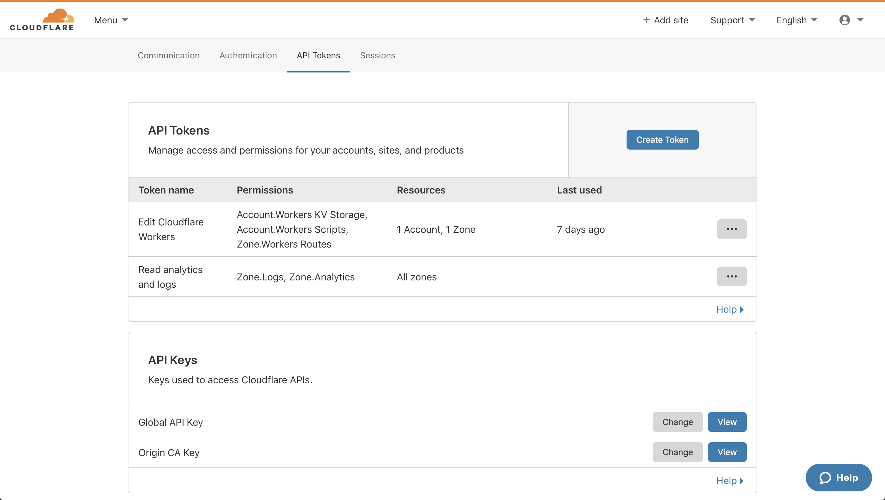
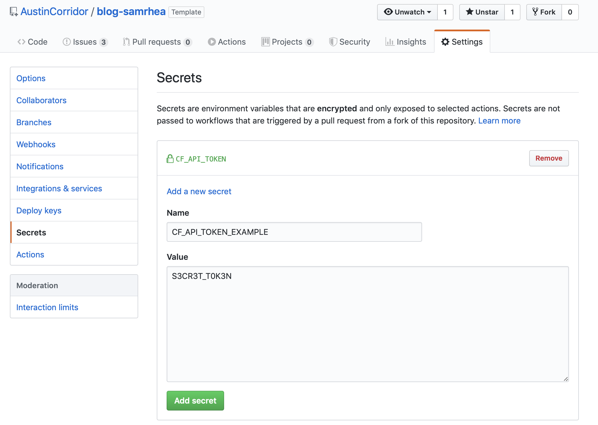
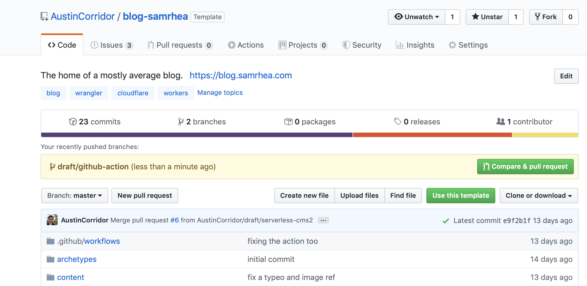
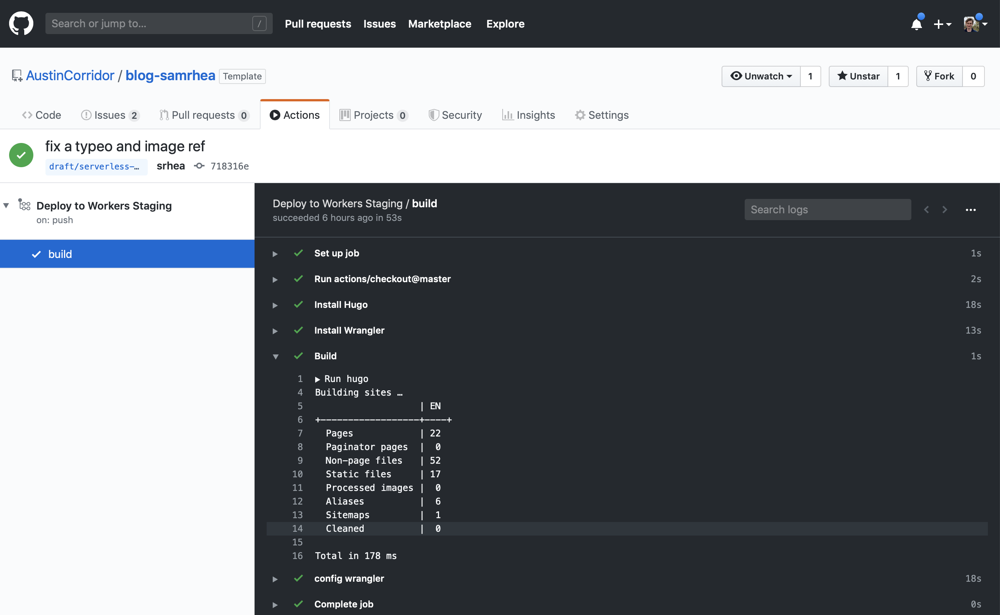
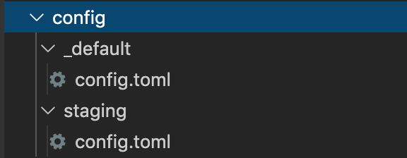

A couple months ago, I [migrated](https://blog.samrhea.com/post/wrangler-sites/) this blog from WordPress and GCP to Cloudflare Workers. The blog itself is a Hugo static site, published with Wrangler, and I store the content in a [now public](https://blog.samrhea.com/post/serverless-cms/) GitHub repository.

I used Cloudflare Access and Wrangler to build a [deployment pipeline](https://blog.samrhea.com/post/deploy-pipeline/) that could publish a staging version of the site that was only visible to me. However, that still required manual steps. I would write content, manually publish it to staging, review and edit the post, and then manually publish it to production.

I can use GitHub Actions to automate this entirely. Once complete, I can finally return to blogging about topics that aren't blogging.

---

**🎯 I have a few goals for this project:**

* Automatically build and deploy my site to staging when I'm working on a draft post
* Automatically build and deploy my site to production when I merge my draft post

---

**🗺️ This walkthrough covers how to:**

* Configure Hugo in GitHub Actions to build a static site at both a staging and production
* Configure GitHub Actions to follow different workflows based on branch activity and merges
* Configure Wrangler in GitHub Actions to publish to staging and production

**⏲️Time to complete: ~2 hours**

---

> **👔 I work there.** I work at Cloudflare, but not on the Workers or network team. As far as the topics covered here, I'm a customer and [pay](https://twitter.com/LakeAustinBlvd/status/1200380340382191617) my own invoice for the services to run this blog.

## GitHub Actions

[GitHub Actions](https://github.com/features/actions) read from a configuration file in your repository, saved in a specific path, and follow the instructions in that file.

You can specify the OS and OS version; GitHub will launch a VM or container based on that spec and then execute the steps in the file.

In my case, I'll have GitHub launch a machine that follows the steps I used to take on my laptop. The Action will grab my repository, install Hugo, build the site, install Wrangler, and then publish the site. The example below breaks down every step in the file.

First, though, I need to automate **me**, at least my identity.

### GitHub secrets and Cloudflare API tokens

When I perform those steps manually, I still need to login to my Cloudflare account. Once I authenticate, Wrangler has permissions to publish to my site.

Since GitHub installs Wrangler which publishes to my account, I need to give it a way to login to my personal Cloudflare account on my behalf. This repo is public, so I definitely do not want to put those credentials in the file. Even if it were private, though, that would still be a terrible idea to save those in plain text in the configuration file.

Instead, GitHub Actions provides a secret store where I can save a token, give it a name, and then the Action will securely pull and use that token during the workflow.

Even though I trust that the token is kept a secret, I want to limit its permissions within my Cloudflare account to just be able to deploy Workers and only for my blog's hostname. Cloudflare [supports](https://blog.cloudflare.com/api-tokens-general-availability/) the creation of scoped API tokens to solve that problem.

In the Cloudflare dashboard, under "My Profile", I'll create a new API token for this action with the permissions below.



Once saved, I can come back and reference it as needed in the UI.



Next, I need to give that scoped token to GitHub. Back in my repository's settings page, I'll create a new secret and give it a name. In the example below, the one I'm actually using, `CF_API_TOKEN` has already been created.



## Deploying to staging vs production

Now that GitHub can impersonate me (to the extent that it can publish Workers for this blog's domain), I can teach it to follow my old workflow.

I use two GitHub actions for this blog; [one](https://github.com/AustinCorridor/blog-samrhea/blob/master/.github/workflows/staging.yml) to deploy to staging and [another](https://github.com/AustinCorridor/blog-samrhea/blob/master/.github/workflows/main.yml) to deploy to production.

These actions automate the steps required to publish drafts to my staging blog (which lives at `https://blog-staging.samrhea.com/`) and the "production" blog available at `https://blog.samrhea.com`. Shameless plug: I keep my staging blog locked down from public view with [Cloudflare Access](https://www.cloudflare.com/products/cloudflare-access/).

However, I need to tell GitHub what should go to staging and what should go to production. I want to signal that without manual configuration.

To do so, I'm going to rely on how I name branches. The file below will build my staging site and deploy it whenever I push a new version to a branch that starts with `draft`.

```
name: Deploy to Workers Staging

on:
  push:
    branches:
      - 'draft/*'

jobs:
  build:
    runs-on: ubuntu-latest

    steps:
      - uses: actions/checkout@master

      - name: Install Hugo
        run: sudo snap install hugo

      - name: Install Wrangler
        run: sudo npm i @cloudflare/wrangler -g

      - name: Build
        run: hugo --environment staging

      - name: config wrangler
        run: CF_API_TOKEN=${{ secrets.CF_API_TOKEN }} wrangler publish --env staging 
```

One of my favorite things to do in tutorial blog posts is to break down config files with a table. A silly idea, but I find this really helpful in walking through what each line does.

| Section | Description |
|---|---|
| `name` | This assigns a name to the entire GitHub action. Each GitHub action can contain one sequence of events. I'm going to call this "Deploy to Workers Staging" to differentiate from the action that deploys to production. |
| `on` | This is the most important piece of the workflow. It's the trigger that initiates this action. I have it configured with the "draft" wildcard there, telling GitHub that anytime I push to a branch that starts with "draft", to run this action and deploy to staging. |
| `jobs` | This gives GitHub the heads up that the following sections will contain the jobs I want it to run. This also tells it the type of machine operating system that I need; in this case, I'm using the latest version of Ubuntu. If I was concerned about compatability, I would define a particular version so that future versions did not break this flow. |
| `steps` | This tells GitHub that the following sections contain the detailed recipe to follow. |
| `uses: actions/checkout@master` | With GitHub actions, I'm talking this machine to do the steps I used to take myself. In this case, I want to make sure it grabs the current action. `master` refers to the master version of this script, not the master branch of my repository. |
| `Install Hugo` | Tells GitHub to install Hugo, the static site generator I use. |
| `Install Wrangler` | Tells GitHub to install Wrangler, the Workers CLI tool I use. |
| `Build` | Now that this machine has Hugo, from the install step earlier, I cann tell it to run a command that I used to run manually. Running "hugo" creates the static site content from my branch. |
| `config wrangler` | In the previous steps, I installed Hugo, built the site, and installed Wrangler. All things I used to do on my laptop. Now, this GitHub machine has those pieces. I can have the machine run the same command I would run to deploy to staging. |
| `--env staging` | The command I'm telling GitHub to run includes the staging flag. Take a look at the wrangler.toml file in this repository; that defines where to publish when I give it this flag. Here, that means the staging draft hits "blog-staging.samrhea.com" |

In this setup, I now start the name of all working branches with `draft/` and what follows is the content of my current post.



## Viewing logs

Creating that workflow involved making some mistakes. To review what was actually happening, I need to view logs from the machine following the instructions I gave it.

In the GitHub Actions UI, I can review the relevant details from any given job. In the screenshot below, I see the standard output from Hugo when it builds the site. If you run into trouble, I'd recommend starting here.



## Handling Hugo environments

In my blog post detailing my first deployment pipeline for Workers Sites, I wrote about using two lines in my Hugo config file. One line pointed the `baseURL` to my production site; the other packaged my static site for staging. I would manually comment out one line when building the site, depending on where I was deploying.

Not only is that inconvenient, it breaks down when I'm automating forked deployment pipelines. I cannot configure GitHub actions to manually comment a line out of a config file in the repository.

As Dick Ceuppens [pointed out](https://twitter.com/dirk_ceuppens/status/1201535694277140482?s=20), Hugo makes it possible to keep two distinct config files and use arguments to specify which should run. The default file applies when I run `hugo`. The staging file only needs to contain the configuration details that change for staging deployments. When I run `hugo --environment staging` the lines from my staging file are injected and overwrite their production equivalents.

My staging file now looks like this:

```
title = "Sam Rhea's blog (Staging)"
baseURL = "https://blog-staging.samrhea.com/"
```

Both files are named `config.toml` so the folder structure needs to specify which is which:



Now, when I run my staging deployment, Hugo builds the site for my staging hostname. With GitHub actions, the staging action uses this environment variable to create the static site.

## Troubleshooting

### Theme and submodule management

Repositories for Hugo sites consist of three primary components: the content you create (living in the `content` folder), the site configuration (the `config.toml`) file, and the Hugo theme. Unless you built your own, the Hugo theme consists of `.css` and `.html` and example files that define how your built site will look and feel.

Many common Hugo themes, including the one for this blog post, are open-sourced and available as public repositories. You can add these as submodules into your repository or clone them directly into the `themes` folder. Either way, you now have a living repository.

If added as a submodule, you'll need to make sure that the checkout step in your GitHub action adds `with: submodules`. Otherwise you might see this:

```
##[error]Process completed with exit code 255.

Run hugo

Total in 14 ms

Error: module "hugo-cactus-theme-avatar-mod" not found; either add it as a Hugo Module or store it in "/home/runner/work/blog-samrhea/blog-samrhea/themes".: module does not exist

##[error]Process completed with exit code 255.
```

In my case, I make edits to the theme for some of the site-wide files (like the avatar image). To reduce the confusion over grabbing the submodule, I just download the theme repository and upload it as part of my blog repo. This is not a great practice and leaves a bunch of files in the repo that could otherwise be referenced dynamically. I'll try and clean it up at some point.

### What about my environment variables in my `wrangler.toml` config file?

The `wrangler.toml` file needs both my Cloudflare account tag and the zone tag for the hostname where I am deploying the Workers script. When I built the site locally, I saved those as local environment variables.

With GitHub Actions, I need that to be explicit so I have added them to the public repository. These don't present a security risk to share in this way.

## What's next?

This is my fourth blog post _about_ writing this blog. I'm going to try and write about some other topics next and let this category rest a bit.