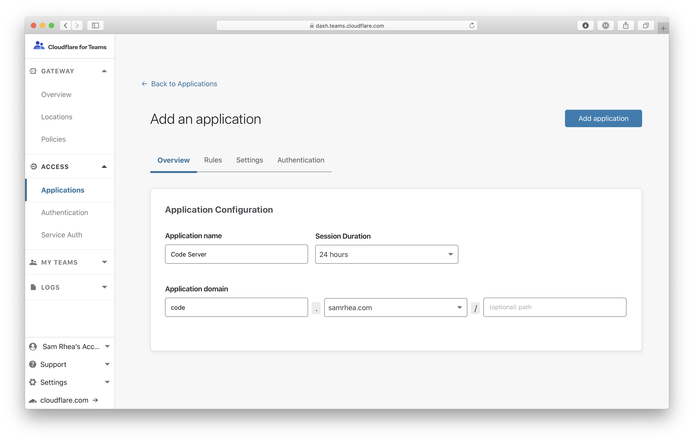
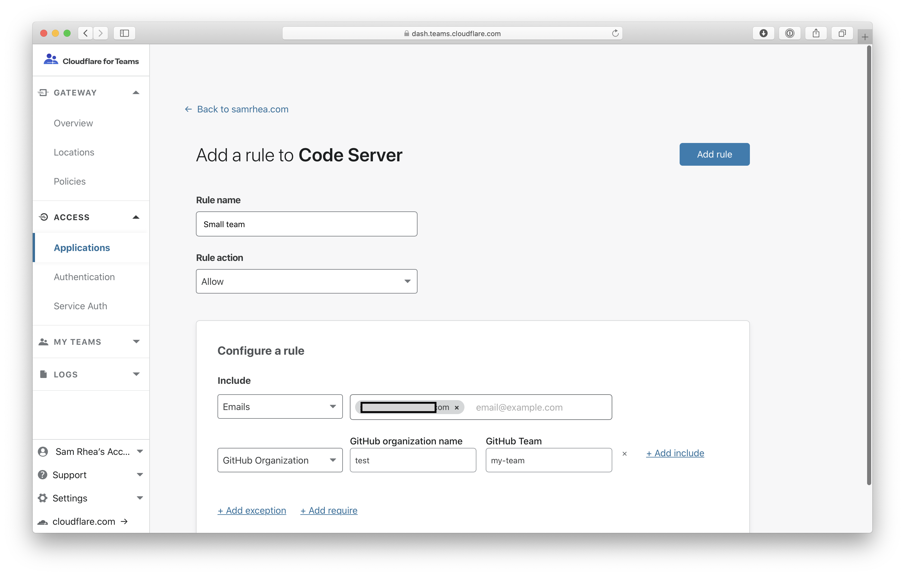

Last month, GitHub [announced](https://github.blog/2020-05-06-new-from-satellite-2020-github-codespaces-github-discussions-securing-code-in-private-repositories-and-more/) Codespaces, a really slick browser-based Visual Studio IDE. Users will be able to launch a full-featured implementation of VS Code from a repository in GitHub, all without leaving the browser.

I purchased an iPad Pro earlier this year and, mostly, love it. Other than a terminal (which I somewhat work around with [Blink Shell](https://blink.sh), the most common reason I open my MacBook Air is still a real text editor. I don't plan to do any real work on it, but I would like to tackle some one-off projects. When GitHub announced Codespaces, I figured that would get me one step closer to letting dust settle on my personal Mac.

While I'm waiting for the Codespaces invite, I wanted to find a way to test this experience a bit. I found a [blog post](https://medium.com/@ow/its-finally-possible-to-code-web-apps-on-an-ipad-pro-90ad9c1fb59a) from [Owen Williams](https://twitter.com/ow) highlighting the open-sourced project [code-server](https://github.com/cdr/code-server) from the team at Coder. With `code-server` users can run their own Visual Studio Code instance on a server and then connect from a browser.

I'm excited to test this out. Owen mentions adding security to the deployment in the post, so I'm going to walk through one option for that by layering Cloudflare Argo Tunnel and Access on top of my own instance. That will keep this secure without the need for a VPN on my device.

---

**🎯 I have a few goals for this project:**

* Run my own Visual Studio Code server that I can access from a browser on any device
* Secure that server with Cloudflare Argo Tunnel and Access
* Test it out on an iPad

---

**🗺️ This walkthrough covers how to:**

* Deploy `code-server` in Digital Ocean
* Connect my `code-server` instance to Cloudflare with Argo Tunnel
* Secure the instance with Cloudflare Access

**⏲️Time to complete: < 30 minutes**

---

> **👔 I work there.** I [work](https://www.linkedin.com/in/samrhea/) at Cloudflare. Several of my posts on this blog that discuss Cloudflare focus on building things with Cloudflare Workers. This blog is powered by Workers Sites, and I'm a Workers customer and [pay](https://twitter.com/LakeAustinBlvd/status/1200380340382191617) my invoice to use it. However, this experiment uses products where I'm on the team (Access and Tunnel).

## Deploying `code-server`

I'm going to move quickly through this section; Owen's [blog](https://medium.com/@ow/its-finally-possible-to-code-web-apps-on-an-ipad-pro-90ad9c1fb59a) walks through these steps in detail and I'm just following those instructions along with the project's [install guide](https://github.com/cdr/code-server).

The highlights:
* Start a Digital Ocean droplet.
* Run the project's [install script](https://github.com/cdr/code-server).
* Use the command below to make sure it's running.
`sudo netstat -tulpn | grep LISTEN`
* The first time I connect to the `code-server` instance, I'll be prompted to enter a password stored in `~/.config/code-server/config.yaml` - so I'll go ahead and grab that now.

Once installed, I can get started connecting it to Cloudflare.

## Securing with Cloudflare Access

I'm going to begin by locking down a subdomain, `code.samrhea.com`, in my Cloudflare account with Cloudflare Access. Much of this section and the Tunnel section below [repeats a tutorial](https://blog.samrhea.com/post/gitlab-auth/) I wrote that applies this flow to your own hosted GitLab EE instance.

Cloudflare Access is a bouncer that asks for identity at the door (each and every door). When a user makes a request to a site protected by Access, that request hits Cloudflare’s network first. Access can then check if the user is allowed to reach the application. When integrated with Argo Tunnel, the zero-trust architecture looks like this:


To determine who can reach the application, Cloudflare Access relies on integration with identity providers like Okta or AzureAD or Google to issue the identity cards that get checked at the door. While a VPN allows me inside free range on a private network unless someone builds an active rule to stop me, Access enforces that identity check on every request (and at any granularity configured).

First, I'll navigate to the new Cloudflare for Teams dashboard, `dash.teams.cloudflare.com`, and build an app for the subdomain that I'll create in the next section with Argo Tunnel.



I'll create a quick rule that only allows my Google account to reach the instance. In the example below, I've added a hypothetical GitHub org - I could use that as well.



## Connecting to Cloudflare Argo Tunnel

Cloudflare Argo Tunnel creates a secure, outbound-only, connection between this machine and Cloudflare's network. Why does outbound-only matter? I can then prevent any direct access to this machine and lock down any externally exposed points of ingress. And with that, no open firewall ports.

Argo Tunnel is made possible through a lightweight daemon from Cloudflare called `cloudflared`. I need to first download and then install that on this machine with the two commands below.

```sh
sudo wget https://bin.equinox.io/c/VdrWdbjqyF/cloudflared-stable-linux-amd64.deb
sudo dpkg -i ./cloudflared-stable-linux-amd64.deb
```

Once installed, I need to authenticate this machine. `cloudflared` will create DNS records for the hostname that I have in Cloudflare and I need to get a certificate that tells Cloudflare's network that this instance is allowed to register DNS entries on my behalf.

```bash
cloudflared login
```

`cloudflared` will print a URL that I need to visit in a browser. Once there, I'll login with my Cloudflare account and select the hostname I want to use here. In this case, I'll pick `samrhea.com`. Once I click "Authorize", Cloudflare will send a certificate to `cloudflared` on this Droplet.


## Connecting as a user

With those three sections above, I now have:
* `code-server` running.
* `code-server` connected to Cloudflare with a hostname I can reach from any device without a VPN.
* that hostname secured with Cloudflare Access.

I can visit that hostname directly, or use the Cloudflare Access App Launch to launch VS Code in my browser with a single click.

<iframe
  src="https://iframe.videodelivery.net/4cfa3ebd9ec4d59156fd620d19e959e5"
  style="border: none;"
  height="200"
  width="400"
  allow="accelerometer; gyroscope; autoplay; encrypted-media; picture-in-picture;"
  allowfullscreen="true"
></iframe>

### Some caveats

* If you leave your browser for some time, you'll return to find it reconnecting. This seems to happen more often on an iPad that a desktop.
* `code-server`, and the person using it, has access to the machine's file tree. I think a multi-tenant option is out there, but this is really only appropriate for a single-user.

## What's next?

Launching this on my iPad from the App Launch feels pretty slick, but I need to tinker with this a bit before I feel more comfortable using it for real projects. It's hard to shake the habits that you form with keyboard shortcuts and window management on a traditional desktop OS. I keep forgetting I'm in a browser tab and wind up making a silly mistake.

With some ergonomic familiarity, though, I could get used to this.