I don't think I have taken my personal MacBook Air outside of my home in over two years. My iPhone handles most of what I need and I do real work on my work laptop. However, I do sometimes find a reason to need to grab my personal MacBook. Maybe I left a [file locally on it](https://blog.samrhea.com/posts/2021/zero-trust-samba) that I need, I'm using an iPad and I need the desktop version of a site, or I just want to write a longer response to an iMessage thread and prefer a keyboard.

Last summer, I wrote about [running your own browser-based VS Code](https://blog.samrhea.com/posts/2020/zero-trust-vs-code). I love the idea of moving more use cases into a browser. Any device with a modern can become part of your workflow with just a couple clicks. In today's post, I'm going to go beyond just a single use case or application - instead, I'm going to walk through moving my entire Mac into a browser.

---

**🎯 I have a few goals for this project:**

* Be able to reach my personal Mac remotely from any device, in any location, with just a browser.
* Restrict access to that Mac to just me.
* Do not punch holes in any firewalls or expose any ports or IPs to the Internet.

---

**🗺️ This walkthrough covers how to:**

* Build a Zero Trust access control rule that integrates with identity providers to secure access to my Mac.
* Deploy Cloudflare Tunnel to create an outbound-only connection to Cloudflare's network to make my Mac available remotely without a private network.
* Enable the VNC server on my Mac.
* Connect from a browser on a different device.

**⏲️Time to complete: ~45 minutes**

---

> **👔 I work there.** I [work](https://www.linkedin.com/in/samrhea/) at Cloudflare. Several of my posts on this blog that discuss Cloudflare [focus on building](https://blog.samrhea.com/tag/workers/) things with Cloudflare Workers. I'm a Workers customer and [pay](https://twitter.com/LakeAustinBlvd/status/1200380340382191617) my invoice to use it. However, this tutorial uses products where I'm on the team (Access and Tunnel).

## Build a Zero Trust rule

I want to be the only person who can reach this device. To do that, I'm going to start by building a rule in [Cloudflare Access](https://www.cloudflare.com/teams/access/), the access control layer of Cloudflare's Zero Trust portfolio.

Cloudflare Access follows a Zero Trust architecture: by default, Access assumes every connection or request is untrusted and forces the user (or service) to authenticate. This gives me the security posture I need to build a simple rule to only allow myself to reach this device.

> For obscurity purposes, I'm building all of these rules and configuring the steps in this tutorial with a different hostname from what I'll use long-term.

To begin, I'm going to navigate to the [Cloudflare for Teams dashboard](https://dash.teams.cloudflare.com). I'll choose `Access` from the sidebar and I'll click **Add an application.**

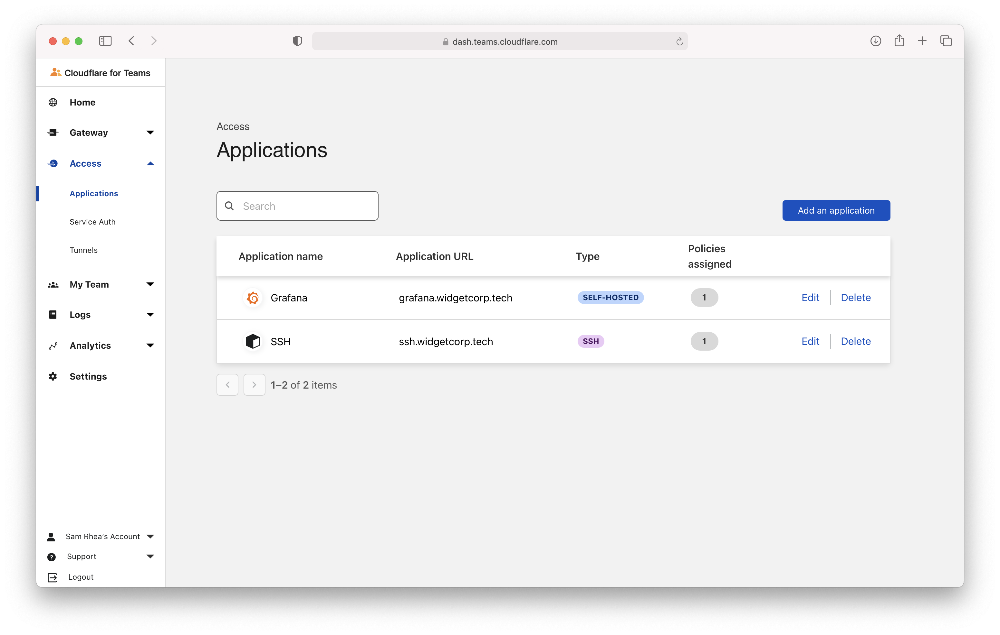

I'll give the application a name and input the URL where the application will be available. We'll create the DNS record for that URL later in this tutorial when we connect my Mac with Cloudflare Tunnel

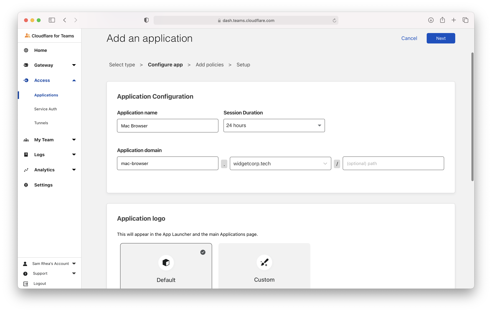

Next, I'm going to create a rule that will only allow me to reach this destination. The action here is just `Allow`. Thanks to the Zero Trust model in Cloudflare Access, everything not allowed will be denied by default so this is the only policy I need.

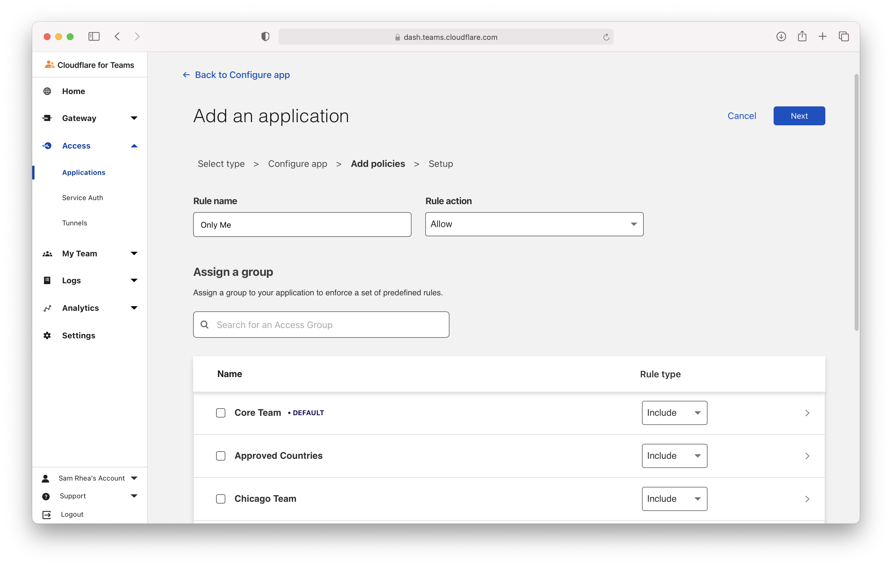

I'll scroll down to the bottom of the page to define who is allowed by defining an `Include` rule. in this case, it's a single email address. I'll come back and add a `Require` rule to [force logins to use a hardkey](https://blog.cloudflare.com/require-hard-key-auth-with-cloudflare-access/) as the multifactor method.

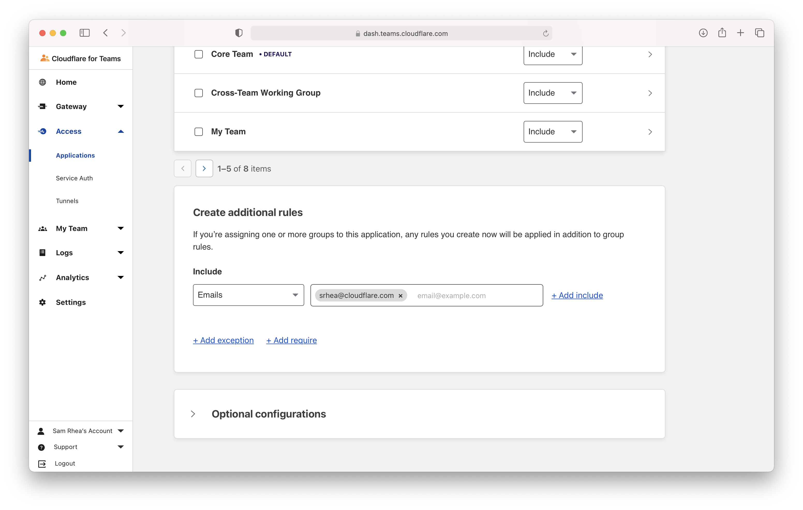

Alright, now the fun part. I'm first going to configure a custom logo for this application. I've found an Apple logo at a public URL that I'll paste into the field here.

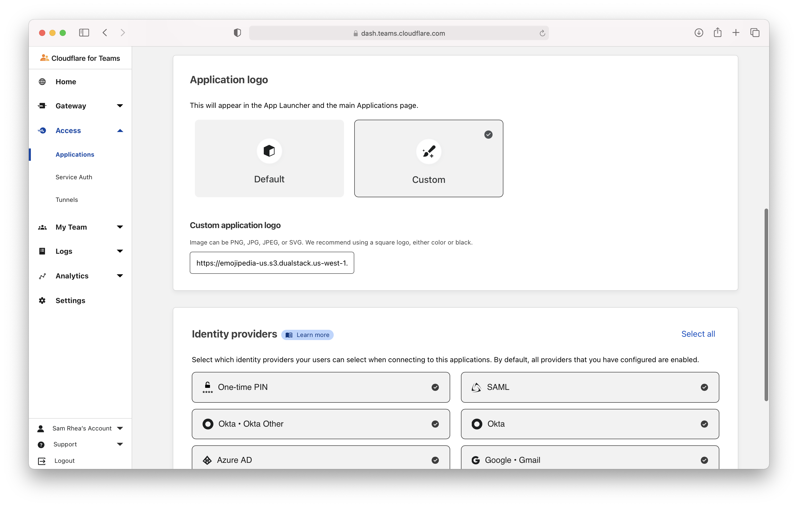

Next, I want to control the identity providers this application can use. As you can see, I've integrated several, but I will limit it to just a few options.

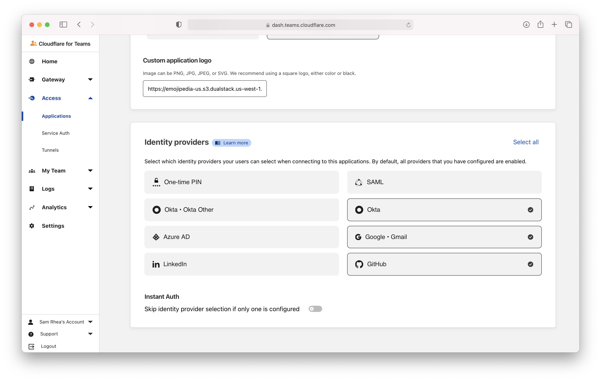

Finally, I'm going to set this to be a `VNC` application on the last page of this configuration flow. Choosing `VNC` will tell Cloudflare to render this non-HTTP use case in the browser.

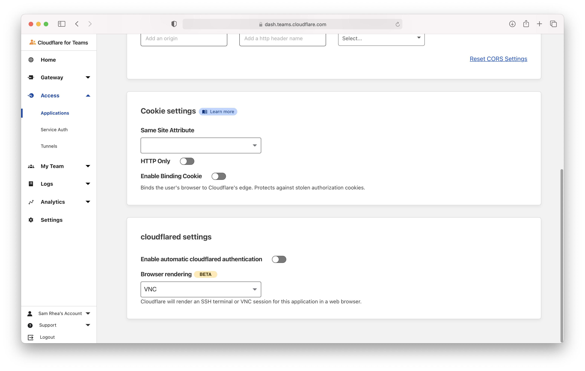

Once saved, the application (and the custom logo) will appear in my Application list and I can begin connecting my Mac.

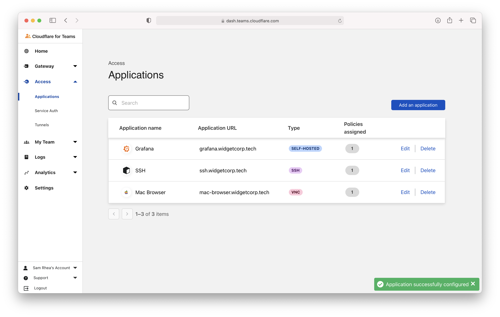

## Configure Mac VNC

macOS devices can create VNC servers using its default "Screen Sharing" feature. To begin, I'll navigate to my system settings and choose `Sharing`. Once there, I need to toggle "Screen Sharing" to enabled.

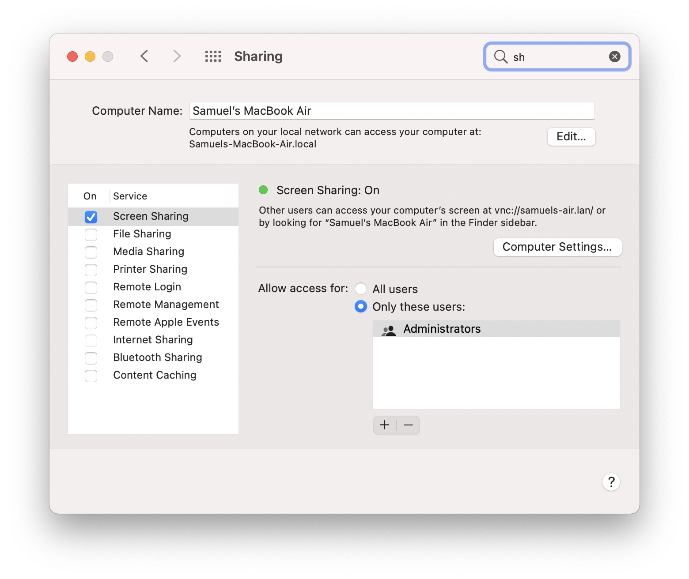

Next, I'll click "Computer Settings..." where I will add a password to allow viewers to control the screen.

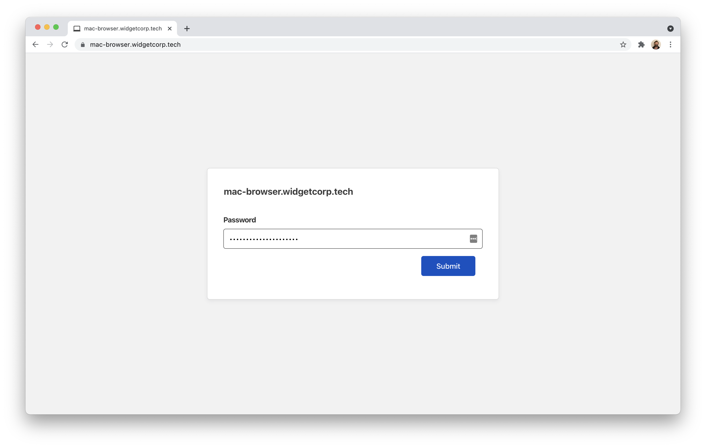

You'll probably notice that this requires a URL available on my local network. My local network in this case is just my home. Connecting still requires my device password, so it's not terribly different from someone already in my home walking over to my device and trying to type in my password. That said, it's something to keep in mind and a topic I'm going to address in a follow-up blog on home network security.

## Deploy Cloudflare Tunnel

I mentioned earlier that I want the convenience of being able to reach this from the public Internet, but I do not want to expose any ports or IPs to the public Internet. [Cloudflare Tunnel](https://www.cloudflare.com/products/tunnel/) solves that for me.

Cloudflare Tunnel relies on a lightweight connector, `cloudflared`, to create an outbound-only connection from my infrastructure (in this case my Mac) to Cloudflare's edge. I can run a single instance of `cloudflared` to support multiple applications and hostnames, but in this example I'm just running it for this particular workflow.

> I'm running `cloudflared` on my Mac as a manual process. In the "What's Next?" section below, I'll add instructions on running it as a service and my plans to put it on a Raspberry Pi in front of the Mac.

First, I'll download `cloudflared` on to the Mac that I want to reach. I'll use the package manager `brew` but you can also build `cloudflared` yourself or download the latest release [using its open-source repository](https://github.com/cloudflare/cloudflared#installing-cloudflared).

```bash
brew install cloudflare/cloudflare/cloudflared
```

Next, I need to authenticate this instance of `cloudflared` into my Cloudflare account. This step allows the connector to create connections and DNS records in my account.

```bash
cloudflared tunnel login
```

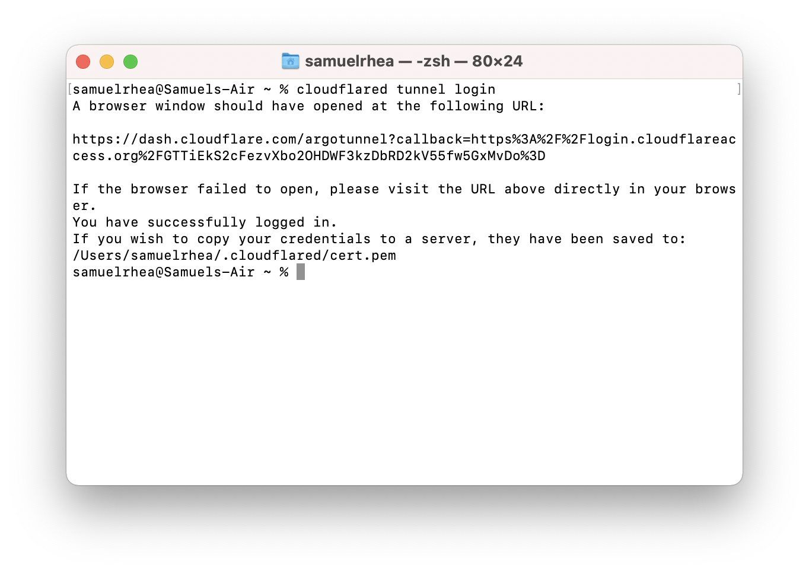

I'll be prompted to sign in to my Cloudflare account in my browser and Cloudflare will return a certificate to my device.

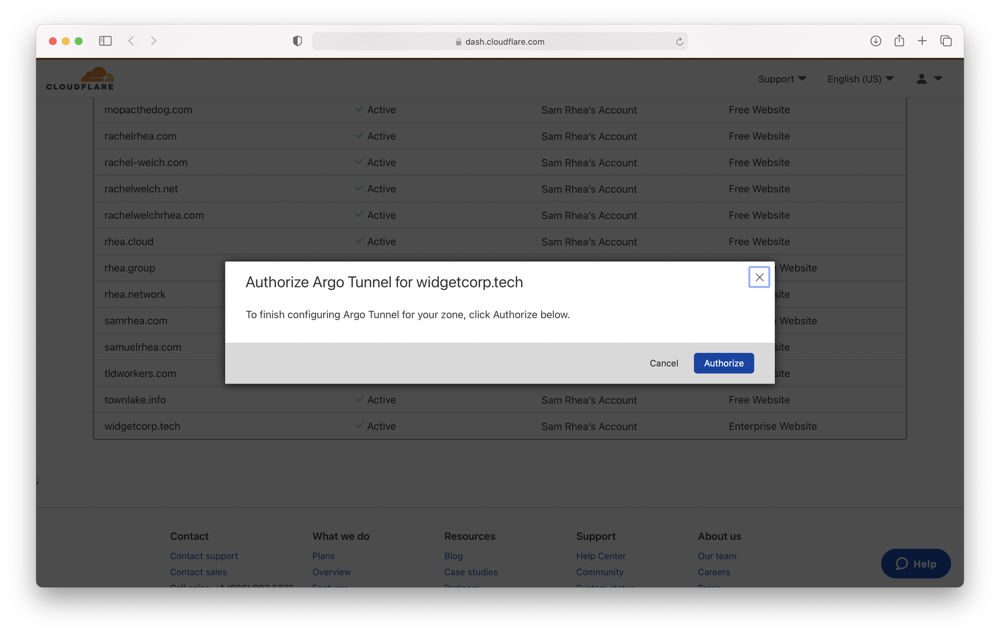

I can now create the Tunnel in my acccount with the following command.

```bash
cloduflared tunnel create macbook
```

Once created, Cloudflare will generate a UUID and credentials file for the Tunnel. To run this Tunnel, at any time, all I need is that credentials file. I can delete the original authentication certificate after creating the DNS records if I want to do so.


Next, I want to configure `cloudflared` to send traffic destined for the hostname I protected earlier to the VNC port on my target Mac.

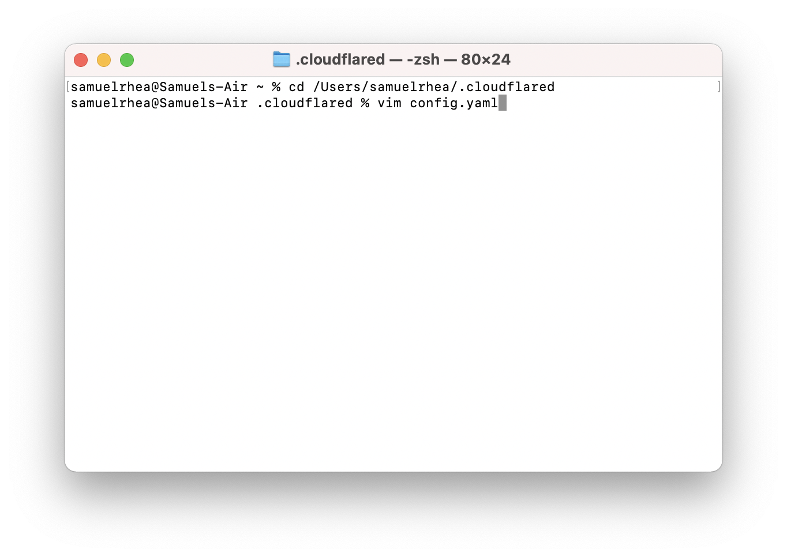

The configuration file below takes the UUID of the Tunnel I created earlier, the credentials file for that Tunnel, and defines ingress for that Tunnel.

```yaml
tunnel: 5493469b-01fe-8b3f-0003abb31654
credentials-file: /Users/samuelrhea/.cloudflared/5493469b-01fe-8b3f-0003abb31654.json

ingress:
  - hostname: mac-browser.widgetcorp.tech
    service: tcp://localhost:5900
  - service: http_status:404
```

Once I save that configuration file, I need to tie the hostname I want to use to the Tunnel I just created. I can do that without leaving the command line. The command below will create a DNS record in my Cloudflare account and associate it with this Tunnel.

```bash
cloudflared tunnel route dns macbook mac-browser.widgetcorp.tech
```

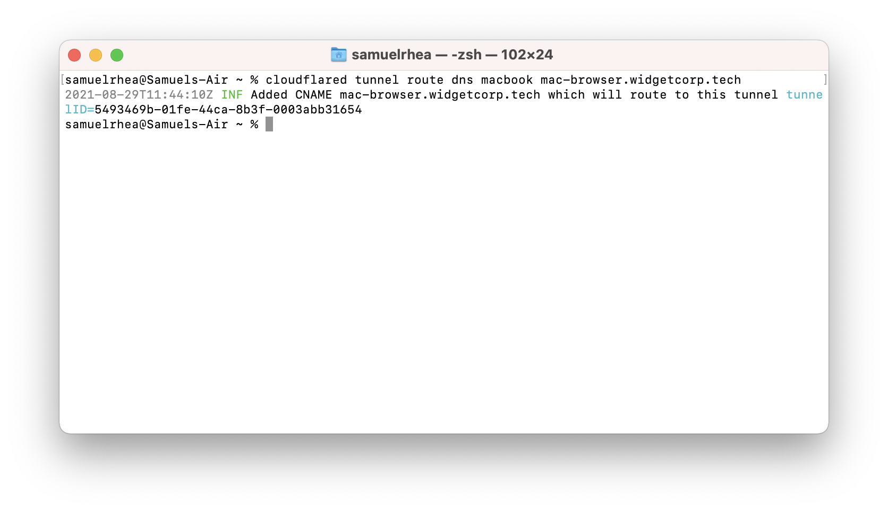

And with that, I can go ahead and run the Tunnel and it will connect to two nearby data centers in Cloudflare's network.

```
cloudflared tunnel run macbook
```

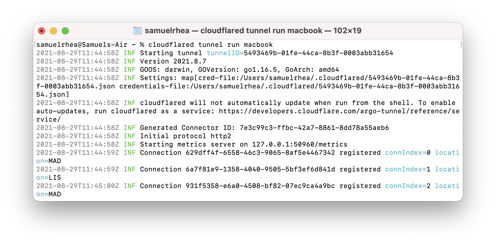

## Connect from a browser

I can now test this out. I'll go to a different machine and visit the URL in my browser.

When I do, I'm prompted to authenticate with one of the three identity providers I allowed earlier.


Alternatively, I can go to my [App Launcher](https://blog.cloudflare.com/announcing-the-cloudflare-access-app-launch/) where I can launch this application and any other I'm able to reach.

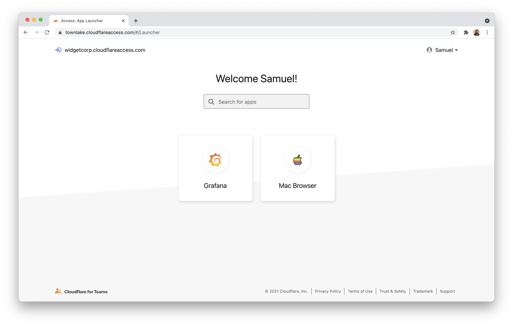

Either way, when I connect to the application I'll be prompted to input the VNC password I created previously.


And, once I've input my password, I can remotely access my Mac in Chrome on a different device.


## What's next?

The steps described in this tutorial require that `cloudflared` is running (in addition to the Mac itself). I can go go ahead and use `launchtl` [on macOS](https://support.apple.com/guide/terminal/script-management-with-launchd-apdc6c1077b-5d5d-4d35-9c19-60f2397b2369/mac) to run `cloudflared` like [a service](https://developers.cloudflare.com/cloudflare-one/connections/connect-apps/run-tunnel/run-as-service), but what I really want to do is instead put `cloudflared` on a Raspberry Pi in my home to serve this use case and others. I've promised that tutorial in [past posts](https://blog.samrhea.com/posts/2021/zero-trust-samba) and I'll get to it.

A couple of notes on set up and usage, though:

* The Cloudflare Tunnel configuration work is still more burdensome than I want it to be. We're working on that. Are there specific pain points that frustrate you as well? Tell us [here](https://github.com/cloudflare/cloudflared/issues).
* I'm not planning on using this as a daily driver. First, any use case on my Mac that can run in a browser as a dedicated web-based application is probably going to be a better experience in that specific web app. Second, we need to keep making this faster. This set up is catch all, for now.
