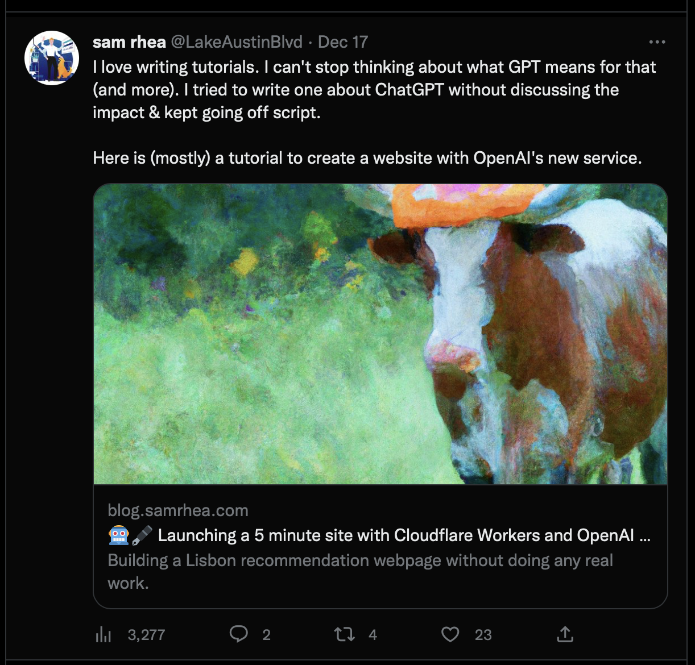
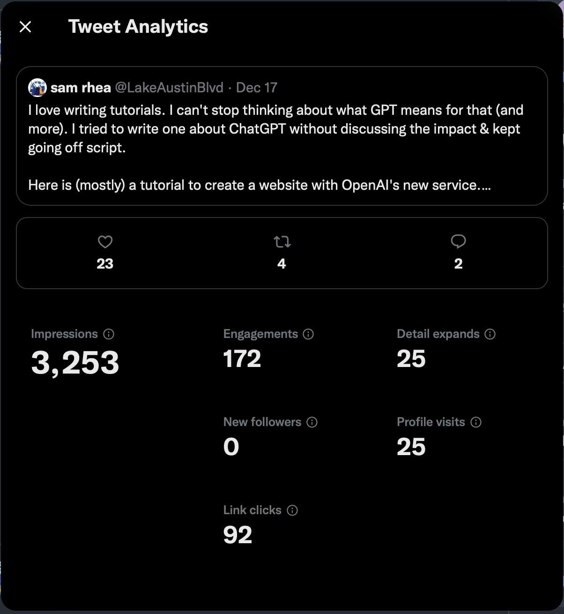
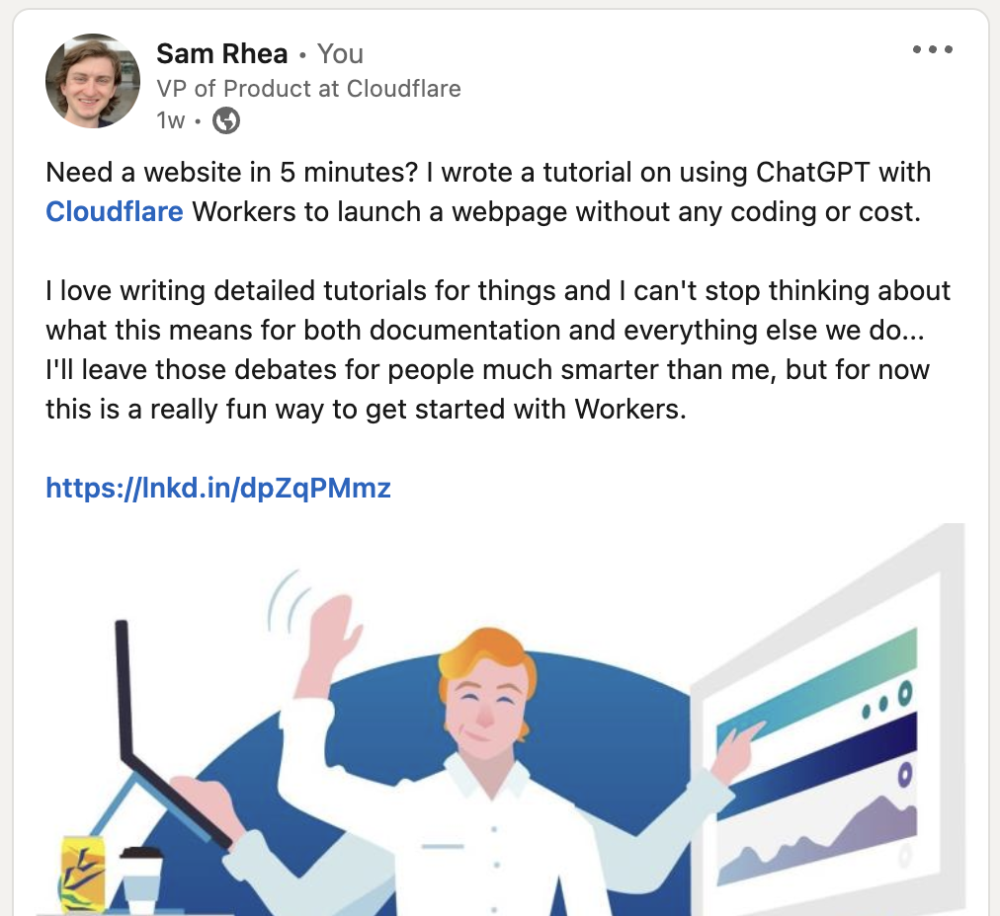
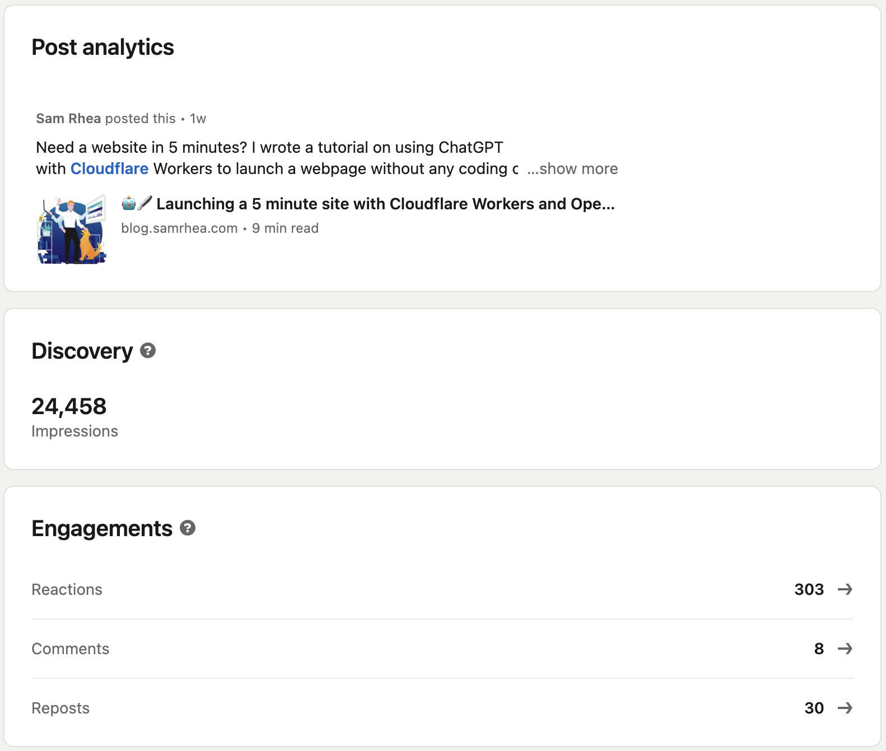
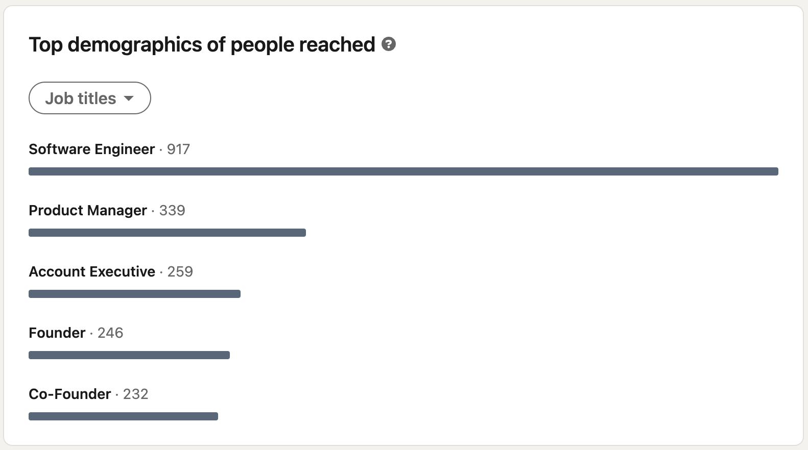
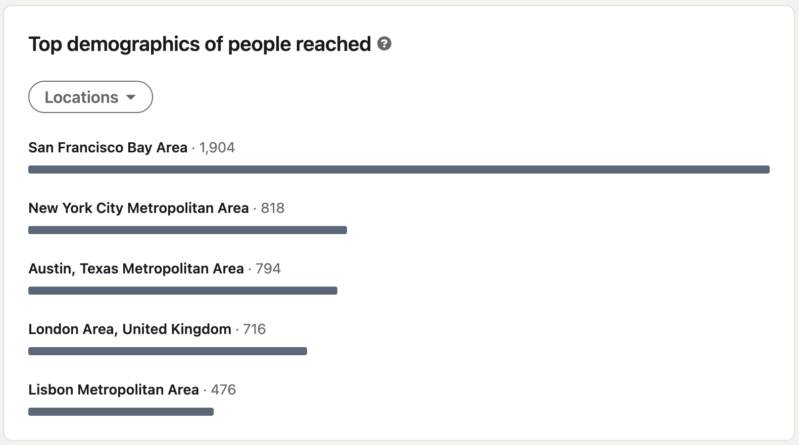
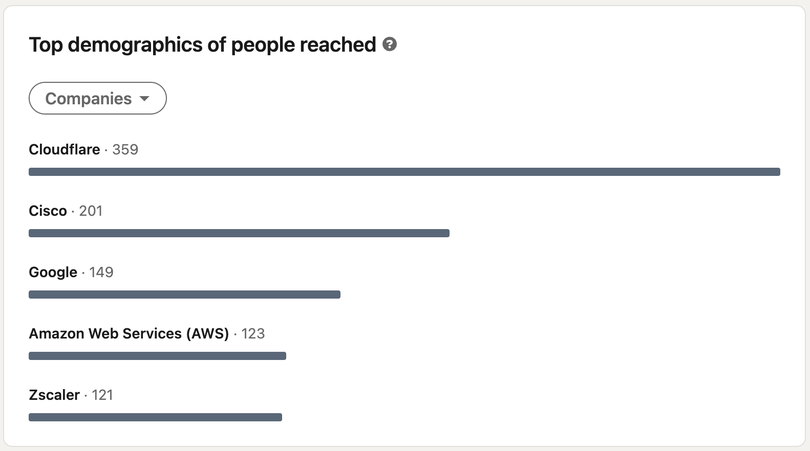
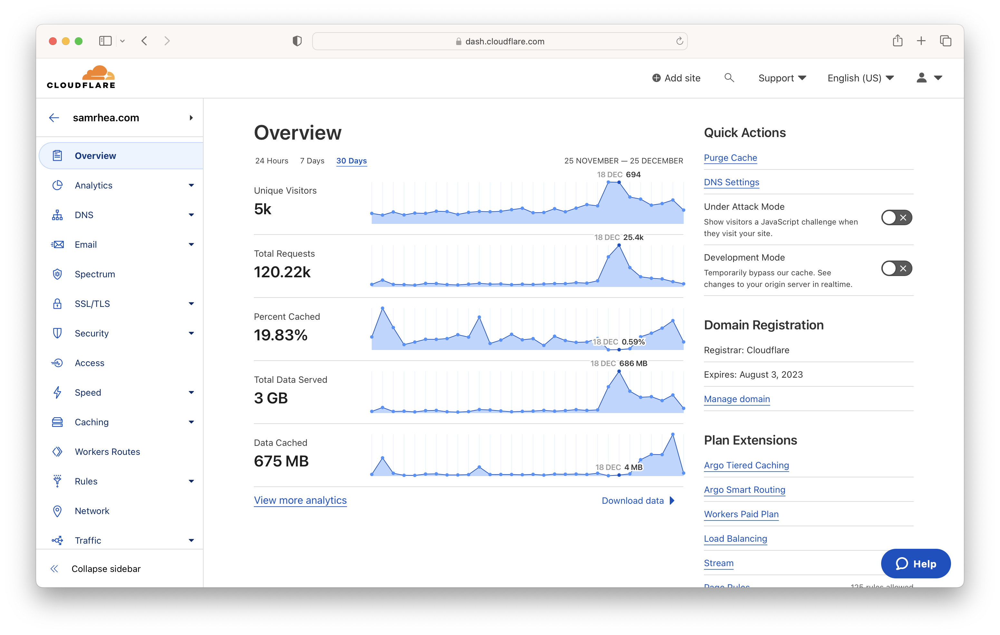
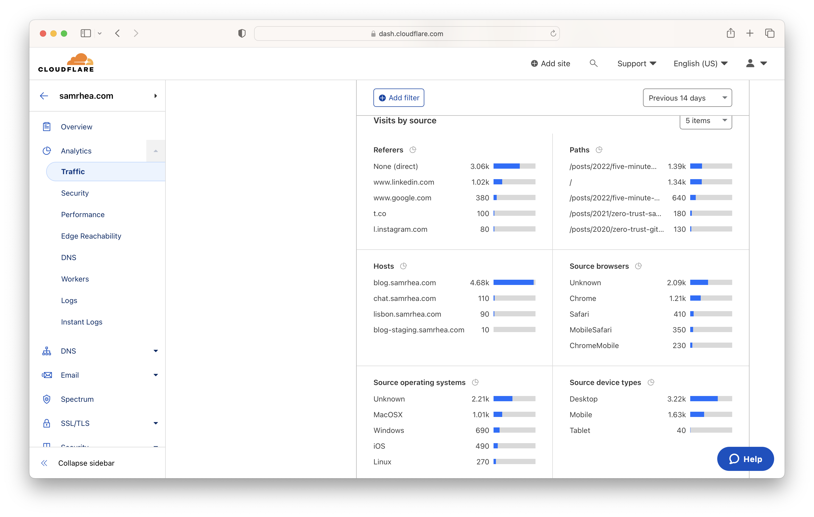

Last week I wrote a midly technical and somewhat corporate [tutorial about ChatGPT](https://blog.samrhea.com/posts/2022/five-minute-ai-site), a technology that I cannot stop thinking about. I shared the blog post on three social networks: LinkedIn, Twitter, and Instagram. I normally only share blog posts on Twitter, but that place has a real “*The Purge* meets the last day of summer camp” flavor these days. Accounts and friends I follow continue to claim that they are leaving for greener pastures.

That bums me out - I love Twitter and my screentime stats back that up. I'm still optimistic about where the platform is going to land, but I wanted to run a very unscientific experiment to see where everyone is hanging out. I don't believe that we have the self control to spend less time on social media, we just open different apps when we're still.

Based on some anecdotal analysis, LinkedIn might be where the party is moving - at least for conversations of a certain genre.

|Metric|Twitter|LinkedIn|
|---|---|---|
|`Network`|1,331 Followers|**1,700 Connections**|
|`Impressions`|3,253|**24,458**|
|`Likes`|23|**303**|
|`Re(posts/tweets)`|4|**30**|
|`Link Clicks`|92|**~1,020**|

LinkedIn also seems to have a longer half-life. I’m writing this unscientific review ~8 days after I posted the ChatGPT blog and I woke up to 4 more likes.

I had a suspicion that LinkedIn would have more engagement but did not think the gulf would be this large. LinkedIn seems to be the place to call home if the goal is reaching a larger audience with more "work" oriented material. That makes sense. The professional network where user accounts map to real, named, humans is a better platform for semi-professional content. What about the weird stuff? I wrote this post to explore the results and try to reason through how I want to use either network.

## Controls (or lack thereof)

Like I said, this is not terribly scientific - I don't have a proper control to compare against. The closest data point I have is an announcement from a little over a month ago that I crossposted in [both](https://twitter.com/LakeAustinBlvd/status/1596099507351130120?s=20) social networks about new jobs in the Cloudflare Lisbon office. Twitter had 2,342 impressions and LinkedIn had 2,956.

## Why even bother writing these blog posts?

First, what is the bigger problem we are trying to solve? I write blog posts that fall into two broad categories.

```
├── tutorials and professional content
│   ├── expat notes
│   ├── tech tutorials
│   ├── Cloudflare
└── personal anecdotes
    ├── stories about texas
    ├── stories about portugal
```

At this point in my career, I have two goals:
* help more customers solve more problems and
* put other people in a position to thrive.

The blog contributes to those goals in small ways and gives me a reason to practice writing.

### Tutorials and Professional Content

I think the definition of "better" for this category of posts should be engagement. My costs (which are just my time) don't increase with an increase in the count of readers. However, a larger audience does translate to more opportunities to achieve the outcomes below.

|Weight|Reason|Why?|
|---|---|---|
|60%|`Promote Cloudflare`|At this point in my career all that I want is for my team to find their own version of success. They made a decision to spend the, hopefully, best years of their careers building with me. We wake up every day to ship software to earn the trust of customers and that starts by connecting with them. Writing about how these products can be used is one small way to do that.|
|10%|`Helpful Guides`|Maybe I’m learning to do something that someone else wants to try and my post could help them. If not, at least I’m helping feed AI models in the future.|
|10%|`Runbook Notes`|I am terribly forgetful. Sometimes I write things to make sure I can come back to the steps that I took as a younger person.|
|10%|`Learn by Writing`|I learn best when I force myself to write about a new subject.|

### Personal Anecdotes**

The second category of blog posts is a little less formal. I care about engagement for these stories in terms of three, very specific, audiences.

|Weight|Reason|Why?|
|---|---|---|
|10%|`Shout into Void`|We’re all going to die. Writing down what happened to me in a medium that, theoretically, could last centuries makes me feel like I carved my name somewhere in stone for a brief moment - even if no one ever reads these.|
|10%|`Make Myself Laugh`|One of my worst personality traits is that I find myself hilarious. I will sometimes chuckle when I’m walking alone because of a funny thought. I laugh the entire time I write these posts.|
|80%|`Make Rachel Laugh`|My wife does not think I am hilarious. She is a 7th generation Texan from a family of honest-to-God cowboys who raised cattle west of Midland in a windswept, barren land. On brand, she has three primary modes: resolute determination, pensive reflection, and simmering rage. I am madly in love with her. Sometimes we will have a glass of wine on our patio and I’ll send her something that I wrote and it will make her giggle and in that moment I am happy.|

Alright, with those goals in mind, let's see the results.

## Twitter Results
I posted a link to the ChatGPT blog on Twitter with some casual text. The tweet pokes fun at how I could not stay on topic and write a plain tutorial. I previewed that this will contain more editorial around the impact of tools like ChatGPT than just a vanilla walkthrough guide. I didn’t mention Cloudflare.



Another banger! Between the time when I posted the tweet and publishing this blog, Twitter added a feature where anyone can see the view count of any tweet. Most of “Product Management and Design Twitter" seems to consider this a crime against user experience, but you can use the tool to keep me honest.

Twitter does offer one data point that LinkedIn doesn't provide - link clicks. I think that is the most interesting of all the metrics here. I wouldn’t be surprised if you had told me that the `Like` count was less than the link clicks amount. I am sure that some friends will like a tweet as a sign of support but (reasonably) avoid committing to a long-form blog.



Another interesting data point that Twitter doesn’t share is when the last `Like` occurred. I manually kept a note of this - 3 days after the original tweet. Twitter seems much more ephemeral than LinkedIn.

## LinkedIn Results
The corporate version of me on LinkedIn posted something much sunnier. I opened with the (genuinely) exciting fact that anyone can create a website in less than five minutes without fees or any software development experience. I mentioned Cloudflare. Rather than poking fun at my inability to stop talking about the themes of OpenAI, I called this post “fun.”



Both versions of a person can be true! I think it’s easy to be cynical and call posts on LinkedIn saccharine. We present a more optimistic, censored, version of ourselves on that platform. That is still a valid part of who we are and the excitement I shared in this post was real.

The reaction was even more exciting.



LinkedIn created engagement larger than Twitter by an order of magnitude and, like I mentioned earlier, those interactions persisted more than a week later.

LinkedIn might not share the amount of link clicks, but the analytics of your audience almost make up for it. Their ability to capture this information makes sense - LinkedIn is home to Real People™. Users voluntarily create high-fidelity profiles of themselves. LinkedIn can surface some aggregate data that tells you about who you are reaching.

One metric that does not show up in this data is the offline interactions based on this post. I had four members of the Cloudlfare sales team reach out to ask me more about it, including someone in person at the Lisbon office. My team and I ask our sales leaders to trust us and deliver the newest products in the group to their customers. I like the idea of reaching them where they spend time to share more about why I'm excited about what we're building.



I assumed that most of the folks who spend time on LinkedIn would trend towards sellers and individuals in customer-facing roles, especially after the interactions I had with those members of the Cloudflare team. That is still a large part of the audience, but “Software Engineer” dwarfed all other roles.

I’m going to make some wild guesses as to why:
* **I’m connected to more engineers.**
    * My initial guess, but a review of the “People” stats in LinkedIn tells me that is not true.
* **Engineers are spending more time on LinkedIn given the more tenuous job market.**
    * No way to independently verify that.
* **Depending on your outlook, the post documents an existential threat to your job as an engineer or a playful exploration of a technology you believe will change how people work.**
    * Again, no way to verify.

The location of my audience makes sense for my industry with the caveat that I’ve lived in Portugal for 3.5 years.



The results around where people work tickled me the most. Cloudflare makes sense - I work there and am connected on LinkedIn to most of the folks that work there. AWS and Google also seem right; those are some of the largest employers in my industry. Cisco is also an older vendor adjacent to our space with something like 25x more employees.



Zscaler is fascinating, though. If you are familiar with the products I work on at Cloudflare, you’ll know that we compete in several areas with Zscaler and other [SASE](https://www.gartner.com/en/information-technology/glossary/secure-access-service-edge-sase) vendors. Cloudflare is newer in the SASE industry but we feel ready to win any deal in this space. I guess if I worked at another vendor, I would keep an eye on us given how fast we build. Or they’re just around because [our blog](https://blog.cloudflare.com/) and what our employees write is more [fun](https://blog.cloudflare.com/the-tale-of-a-single-register-value/) and [transparent](https://qz.com/work/1666535/cloudflare-turned-outage-into-teaching-point-about-transparency) than most corporate blogs.

## Cloudflare Analytics

No way I was going to get to the end of this without plugging Cloudflare. Beyond an entirely free platform (at my level of usage) to share the site built by ChatGPT and this blog, Cloudflare also provides privacy-centric analytics on the performance of a given Internet property.

In the 8 days since publishing the ChatGPT blog, 3,531 unique visitors arrived at my blog. I seem to average about 200 unique visitors on any given day, so this represents a nearly 2,000 user increase over that span of time. I recognize this is not a scientific analysis of `visitor`, but I think it is directional.



The referrer data is even more interesting and lines up with the popularity of LinkedIn over Twitter. This helps give me something approximating "link clicks" when comparing to Twitter.



~1,020 visits from LinkedIn compared to 100 from Twitter, which seems to line up. One note - `samrhea.com` is also my link-in-bio for Twitter, which seems to only reinforce how much more reach LinkedIn has. Funny to see Instagram almost as close, where it is also my link-in-bio and I shared the link from this blog in an Instagram story.

## What about the weird stuff?
A post about building websites in Cloudflare Workers with a new AI tool feels at home on both Twitter and LinkedIn. The off script commentary about the role of humans seems to fit Twitter a little better than the lighter, professional cocktail hour of Microsoft-owned LinkedIn.

That works for last week’s blog but sometimes I write [weird stuff](https://blog.samrhea.com/tag/texas). Well, [mildly](https://blog.samrhea.com/tag/portugal) weird.

My less corporate content includes a feature about a bizarre, all-boy [summer program](https://blog.samrhea.com/posts/2020/a-trip-back-to-boys-state) where high schools in Texas ship student “leaders” while the program alternates between a rapid descent into neo-fascism and a heartwarming showcase of democracy featured in an Apple TV+ special. Or that [horses hate me](https://blog.samrhea.com/posts/2020/dimestore-cowboy).

Those categories do not feel at home on LinkedIn. The end goal of LinkedIn is career advancement. The first thing you see about someone when you open their profile is their literal work history. The text under their avatar defaults to their job title. People use real headshots. No one is funny on LinkedIn.

The dynamics that make Twitter hilarious and terrible and magical are all absent. You don't have billionaires arguing with anonymous users that go by handles like "Daniel Craig's Romper from Glass Onion." Consumer packaged goods manufacturers don't have to affirm that they do, in fact, support the troops after misusing a hashtag. The memes are terrible. For better or worse, the rotating main character of the Internet on any given day winds up on Twitter.

Despite all of my posts on Twitter and LinkedIn being public and the blog itself being on the open Internet, knowing that I’m going to share it to a LinkedIn audience gives me some pause. It’s where the grown ups hang out.

Maybe we should change that and share more about our own selves on LinkedIn. I’m not referring to the hustle porn that sometimes becomes viral on the platform. I'd just love it if users took themselves less seriously and shared their spiciest hot takes and workshopped their standup material a little more. Or we just keep bouncing back and forth between both platforms until that existential dread problem mentioned above catches up to us.