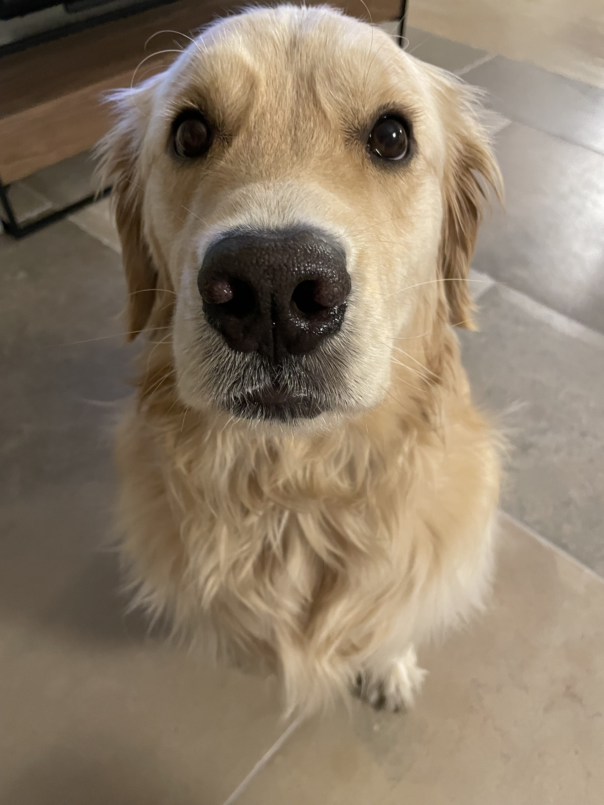

When we moved to Lisbon nearly three years ago, we settled in Campo de Ourique, a neighborhood northwest of the city center home to Portuguese families and French expats. The neighborhood sits on top of one of the city’s tallest hills, lacks a metro station, and lacks must-see attractions. Tourists, especially Americans, are rare.

A few months into living in Campo de Ourique, the absence of Americans brought out something shameless in me. If I heard an American accent in the neighborhood, I could not stop myself from marching over to say hello and, somewhat politely, ask “why are you here? Are there more of us? Do you want to be friends?” Mopac, my dog, became the critical component of these investigations because Americans cannot resist a golden retriever.

On one particular walk with Mopac in early 2020 we stopped for a coffee at a bakery that faces the neighborhood’s park. After a couple of minutes sitting there, I heard the siren’s call of someone saying “y’all” just a few tables to my left. I looked over to see a young couple chatting in American English. I looked at Mopac, whispered “showtime,” and began to slowly walk past their table on our way to the park.

As we strolled by, the couple reached out to pet Mopac and told me, in broken Portuguese, “thank you.” I responded in Texan English. They invited me to sit down. We chatted for over an hour. Months later we spent Thanksgiving at their home in Lisbon, Mopac included.

I have about half a dozen close friends I have met this way. I held a Fourth of July party last year where most of the American attendees met me through my dog. I’ve also made Portuguese friends this way, too, [but only with other dog owners](https://blog.samrhea.com/posts/2020/dog-parties-in-portugal). That filter expanded abruptly when we inadvertently adopted a symbol of national pride two months ago.

In 2020, we bought a home with a yard in Sintra and moved about 45 minutes west of Lisbon. We did this so that we could stay in bed longer in the mornings by just opening a door to let Mopac out instead of putting on real clothes to walk him in the city. We also like Sintra.

In 2022, we decided we could share our home with a second dog. We scouted shelters on Instagram and heard wonderful reviews about [Cantino da Milu](https://www.ocantinhodamilu.com/), a shelter in Setúbal home to hundreds of dogs looking for good homes. We wanted to be one of those homes. On January 1st, we visited with the intention of just window shopping. We drove home an hour later with ~90 pounds of Serra da Estrela.

The Serra da Estrela dog resembles a larger, scruffier German Shepherd. Squint and you’ll think a small brown bear has found you. Everything I am going to tell you about this dog breed is anecdotal from my Portuguese friends, but I think most of it is true. These dogs were bred centuries ago to protect sheep from wolves and Portuguese shepherds from Castilians in the mountains along the border with Spain. Like Hemingway’s cats, they have vestigial extra toes and, like most large dogs, they enjoy napping and stealing food off of counters. Mine does at least.

Her name is Nadja. The veterinarian thinks she is between two or three years old. Cantino da Milu took her in after she was found, nearly starving, on the streets somewhere in the country’s south. When we visited the shelter, Nadja spent our entire tour standing on my wife’s feet and looking up at her. I wasn’t going to leave without her.

True to her roots, she tries to protect us (all of us, including Mopac - I think she considers him a kind of long-haired sheep). She acts like a Secret Service agent, following me into the bathroom to guard the door and then following me to my desk to protect me from my computer screen. Nadja does another thing that I did not anticipate: she inspires national pride.

From what I am told by friends over bifanas in Lisbon, the Serra da Estrela’s resilience, loyalty, and calm embody the Portuguese spirit. I believe them, but I respond that my particular Serra sleeps on my couch and steals pizza. They tell me this is my fault because I instruct her in English. Traits embodied or not, when we venture into Lisbon or any town with the dogs, Nadja becomes a minor celebrity.

Fathers point at us and tell their kids “look, a Serra!” Mothers bring children over to pet her. Even the retired Portuguese grandpas who play cards in the parks acknowledge me for the first time when they say hello to Nadja. From what I gather, most Portuguese have seen a Serra at some point in their lives, but only when visiting the countryside. To see one on a leash in Lisbon is apparently like growing up in Texas and seeing someone ride a horse in downtown Austin. You know that it's part of the cultural ethos, but it’s still surprising to see in the middle of town.

This also makes me something of an enigma. My wife blends in on the Continent much better than me. She’s commonly mistaken for French and occasionally Portuguese. I look like I was kicked out of an English boarding school last week as punishment for not getting a haircut. My height, my skin tone, the fanny pack I wear when I walk our dogs, and everything else about me is a little different. I stick out in any part of Portugal that doesn’t cater to British and German tourists. So when I walk Nadja, people balance their enthusiasm for the dog with their skepticism of the human. Probably a good idea.

Not enough to scare them off, though. Last weekend, we went to a small coffee cart in the seaside town of Azenhas do Mar before going on a hike. As we walked into the patio, I heard at least two whispers of “a Serra” from other customers. An older couple sitting next to us lured Nadja over with outstretched hands and began speaking to us (well, to my wife) in Portuguese. We sat and chatted for 20 minutes, learned about their lives and how their kids are now out of the house but used to wait tables during the summer at a restaurant near our home. They opened up to us in a way that made us feel a little less like outsiders. I didn’t even have to slow roll the dog past their table.

We adore Nadja, not just because she helps us make new friends, but that has been fun. On Friday night, my wife and I went to dinner with a younger American couple who just moved to Lisbon. I gave them the same advice I share with any new arrivals: the only thing that matters when making a new country home is building a community. My wife accomplished that by going to graduate school, learning the language, and working in an all-Portuguese company. She put in the work. I built mine thanks to dogs.

