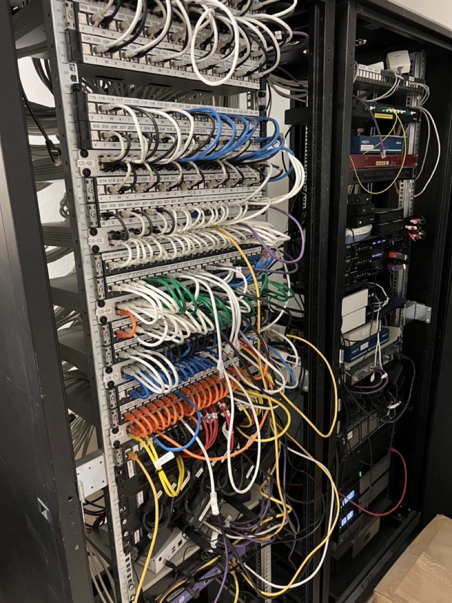
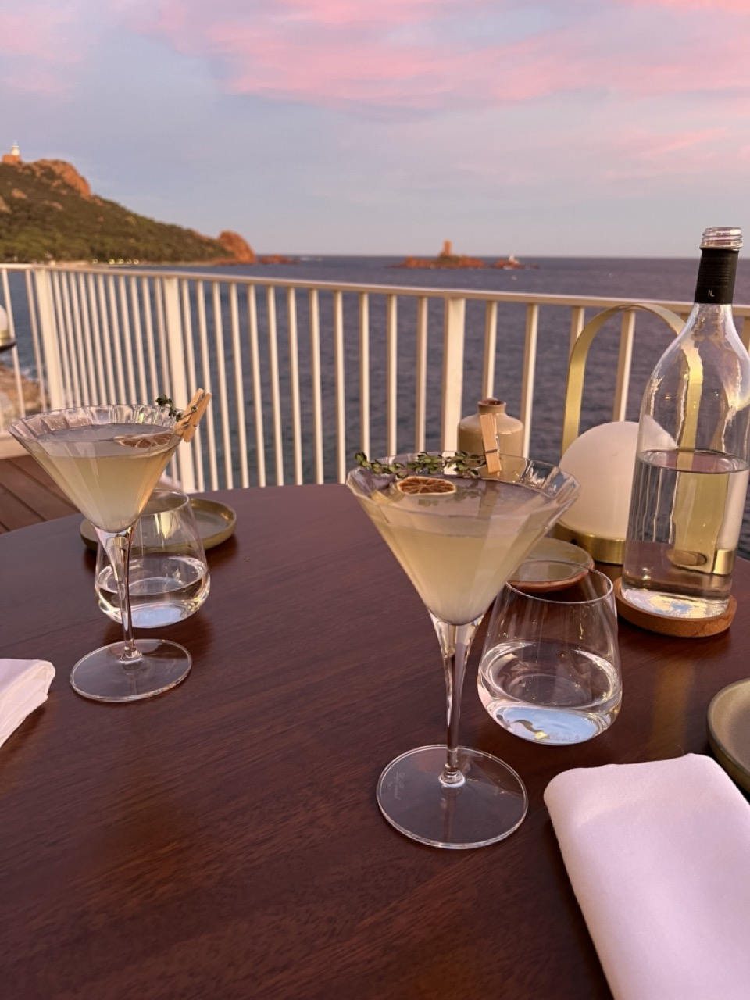

## The Stranger
Growing up in Texas I had very little contact with the French. The closest thing that Austin has to a French connection is the former French Legation to the Republic of Texas. Before we joined the Union, Texas was a modestly sovereign nation complete with a tiny limestone building in Austin that housed a delegation from the July Monarchy.

Texan sovereignty did not last long and the French sponsor of the legation returned to Europe, but Texans still honor this era by celebrating “Texas Independence Day” every March. This is a holiday with a shelf life. The story of the Texas Revolution is a kind of 19th Century cautionary tale about gentrification. A bunch of middle class white people who could not afford to live in the Old Money neighborhoods of the era, like Philadelphia or Connecticut, found a cheap and trendy spot in a diverse part of the continental town. After a few years those newcomers rebranded the place.

Anway, the first French person I remember encountering was Jean Reno’s character from Roland Emmerich’s 1998 film, *Godzilla*. In that spectacle, Reno plays a French special forces officer who attempts a Southern accent and chews gum to look more American as part of infiltrating Matthew Broderick’s New York. He shoots his way out of Madison Square Garden. Cool as hell.

Shortly after Godzilla destroyed the Chrysler building, I met a real human person from France. A friend of my parents was the child of music professors, one of whom was French. He spent much of his childhood in France and wrote the number 7 with a line through it, which I vividly remember my father telling me was a French thing (I think it’s generally a European thing). I immediately adopted the habit and still write the number with a strike. This friend returned to France frequently and even took my [Flat Stanley project](https://en.wikipedia.org/wiki/Flat_Stanley) to Paris on one of those trips. He was in a band and drove a convertible. Also cool as hell.

The third French influence in my life was a teacher of mine at The University of Texas. She was formal and chic and reserved and I adored her. I spent most of that semester doing everything that I could to try and make her laugh. I succeeded twice.

As the academic term came to a conclusion, she summoned me to her desk after class. She asked me if I would sit down with “a local French community of parents” to answer their questions about social life at universities in Texas. I responded by asking, “are you sure you want me to do this?”

She was. The children of Austin’s small French population were about to graduate high school. These Franco-Texan teenagers had started to pester their parents about living in dorm rooms or joining the fraternity/sorority system. These petitions reached enough of a boiling point that their WhatsApp group chat convened a meeting with me, apparently the most Texan person that one of them knew.

For two hours I sat down at a bakery in West Austin with eight or nine French grown ups who peppered me with questions about daily life at American colleges. Three of them brought notepads. I tried to hide my drawl and shared stories in what was probably the most bewildering cultural exchange between the French and an Austinite since the opening of the Legation almost 200 years prior.

At present, I live in Europe and have way more opportunity to make new friends from new places. That was less easy when I spent the first three decades of my life within five miles of where I was born. Today, some of my favorite people are French. Better said, I have favorite people and some of them happen to be French.

## The Plague
My wife and I went on holiday in the South of France last month, a sentence that Americans can’t say without throwing up in our mouths a little. This is our second trip to the region since we moved to Europe. She loves reading on lounge chairs, French food, and water that is warmer than the North Atlantic in Sintra. I prefer the people watching.

On the last evening of that trip, the American football team of the University of Texas played the Alabama Crimson Tide. Alabama was the best team in the country. They were 20 point favorites over my unranked Texas Longhorns. Kickoff was scheduled for 7PM in Cannes.

I don’t frequently watch Longhorn sporting events anymore. First, the time zone makes watching games inconvenient. Second, the Longhorns have been bad for the last decade and that is partially Alabama’s fault.

In 2009 Texas played Bama in the National Championship. We lost after our starting quarterback was injured early in the first quarter of the game. I remember the sorrow I felt on that day and figured I’d tune in for this rematch, hoping to find some closure.

I found a free trial of a streaming service that would broadcast the showdown on my phone. While my wife enjoyed the seaside, I hid in our hotel room, hunched over my phone, witnessing a miracle - the Longhorns kept it competitive and even claimed the lead.

However, about 3 minutes after the Longhorns pulled ahead, the power died in our hotel, taking the WiFi with it. About 3 minutes after that, the power returned, but the WiFi stayed down. I waited an appropriate amount of time and then meandered up to the lobby to see if someone could turn the WiFi back on. I figured I might be the only sad person at this small hotel using it while everyone else was enjoying the sunshine.

The hotel manager told me they were doing their best. I offered to help - assuming they would decline but hoping that my insincere gesture would demonstrate how important this was to me and my fragile, always-on, psyche.

To my bewilderment, she accepted. The outage had disabled most of their management systems and they, too, were desperate. She led me to a service elevator and down a tunnel to a server/broom closet where Mathieu, the bellhop, stood with his arms crossed, staring at a rat’s nest of cables.

She introduced us and promptly left. Mathieu spoke about as much English as I speak French, so our conversation consisted of hand gestures and grunts. Management seems to have sentenced Mathieu to the room so that the hotel could tell guests they were working on it while they called their local service provider to send a technician. We bonded immediately, two prisoners trapped in an unventilated server closet on a summer day where our only escape was the resumption of Internet services.

He pointed to their modem, their switch, the gear that controls the patio cafe speakers, and we agreed that certain status lights were *non*. We stood side-by-side, both of us crossing our arms now, and let out loud “hmms” in our respective accents.

I crept behind the racks and began experimenting with turning things off and on. I eventually isolated the outage to a surge protector that did not survive the power surge - everything connected to this off-brand extension cord combo remained off. I sacrificed another working outlet connected to the patio sound system and, moments later, their OneAccess box flickered to life. On the other side of the server rack I heard Mathieu cheer.

I climbed back out. We reached for our phones, connected, and found joy. We briefly jumped up and down. We were free.

## The Myth of Sisyphus
I scurried back to my room to check if the Internet was working there but mostly to regale Rachel with my ordeal. She was happy for me, but we needed to get moving towards our dinner reservations. Meanwhile, Bama had pulled ahead by just one point. Rachel begrudgingly agreed to allow me to watch the final minutes of the game on my phone at our table.

The hotel is built on a cliffside. You enter the lobby, which is the top floor, from street level. About thirty rooms sit on three levels below it. The hotel’s nicer restaurant is on that top floor and you need to pass through the lobby to reach it from the guest rooms. This is where the victory parade happened.

While I was talking to Rachel in my room, Mathieu had returned to the lobby to tell the rest of the staff that I had fixed the Internet. A true friend, I don't think he shared with them how I just plugged something into a working outlet. When the elevator doors opened, the general manager of the hotel walked up to us and called me “the Messi of the Internet.” Another member of the staff told us that I had saved the hotel as if I defused a ticking bomb.

When we sat down to dinner, the restaurant manager opened with, “the hero of WiFi! Drinks are on the house.” I relished every second of this. For the first time in my career or career-adjacent activities, I think Rachel was mildly impressed. The patio was eerily quiet without music, something I did not bring up.

I settled into my chair and put the game back on my phone. I was a local celebrity. The Longhorns were playing competitive football and had retaken the lead. I had a new French friend and a free gin martini.

However, during my *fête*, Alabama had marched 61 yards down the field. We missed a sack. They lined up for a game-winning field goal and nailed it. Bama was inevitable and won. The Longhorn nation returned to our lost decade having briefly experienced more hope than we deserved.

Rachel attempted to cheer me up but I am a petulant child about losing. The waiter brought the check on a hand-written piece of paper along with the payment terminal, which I assume has cellular connectivity. Their point-of-sale system was not working and so they could not print bills. I think that was my fault, too. *Je suis désolé.*
