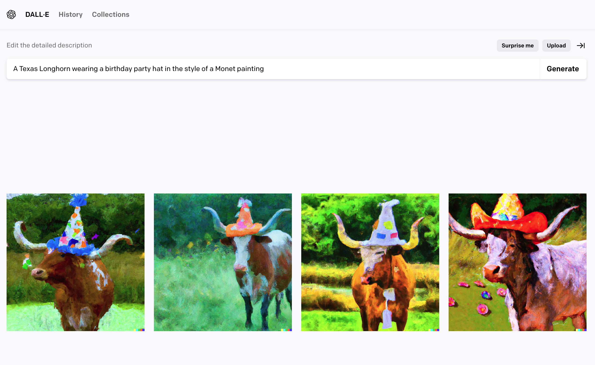
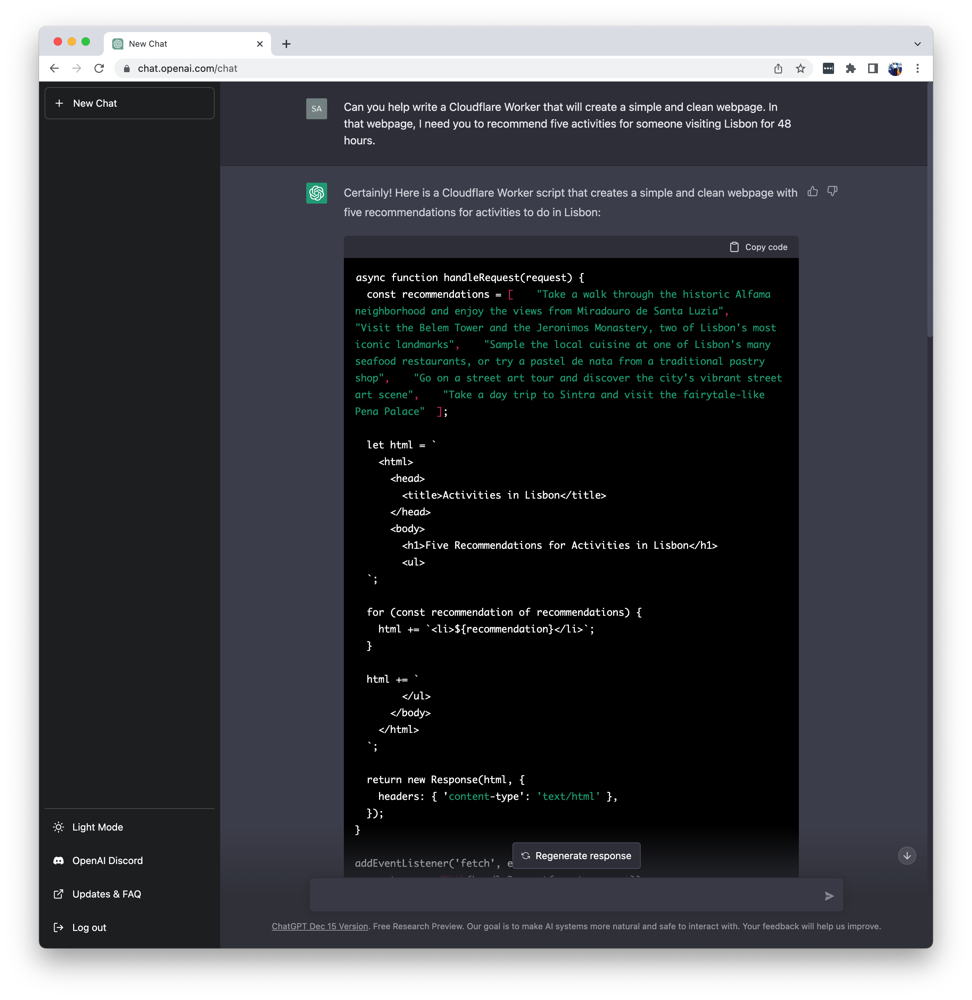
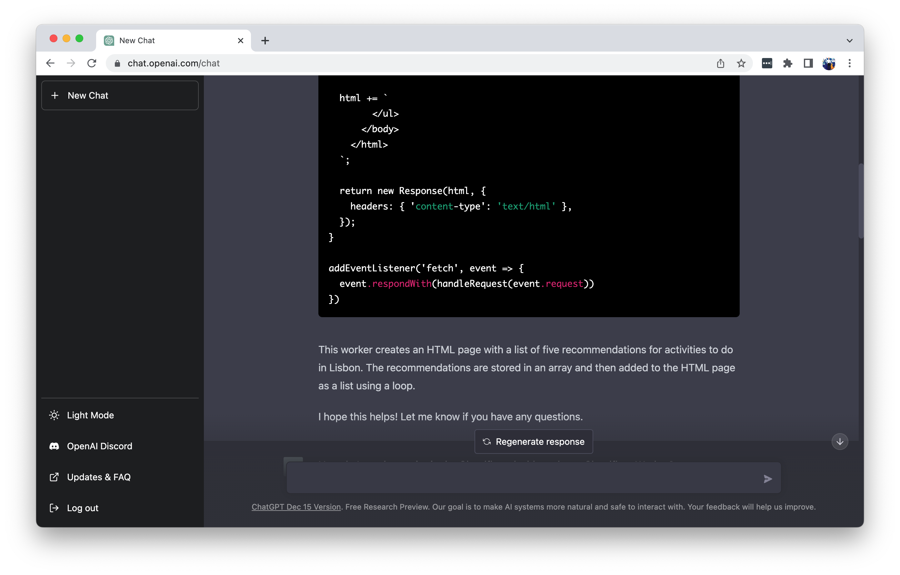
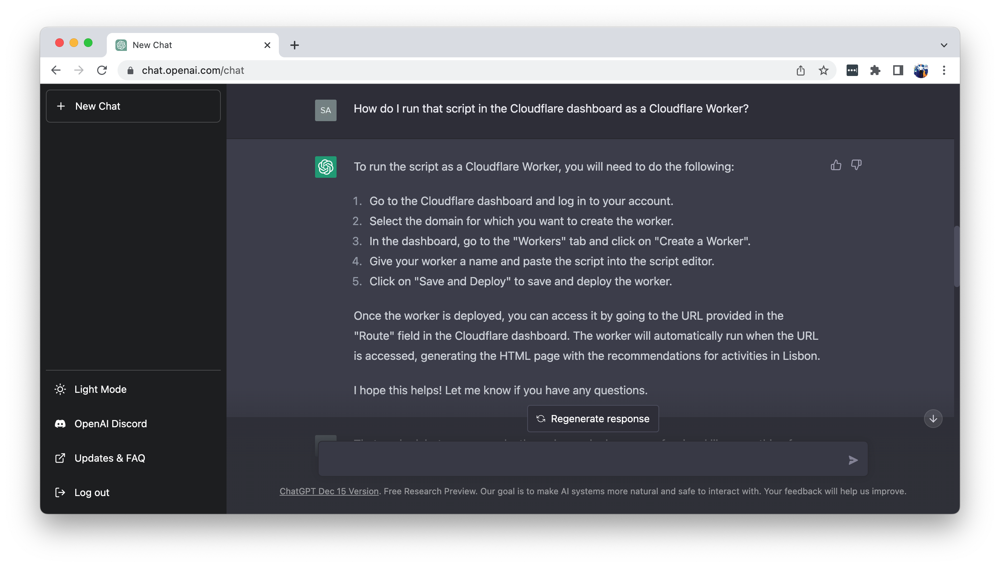
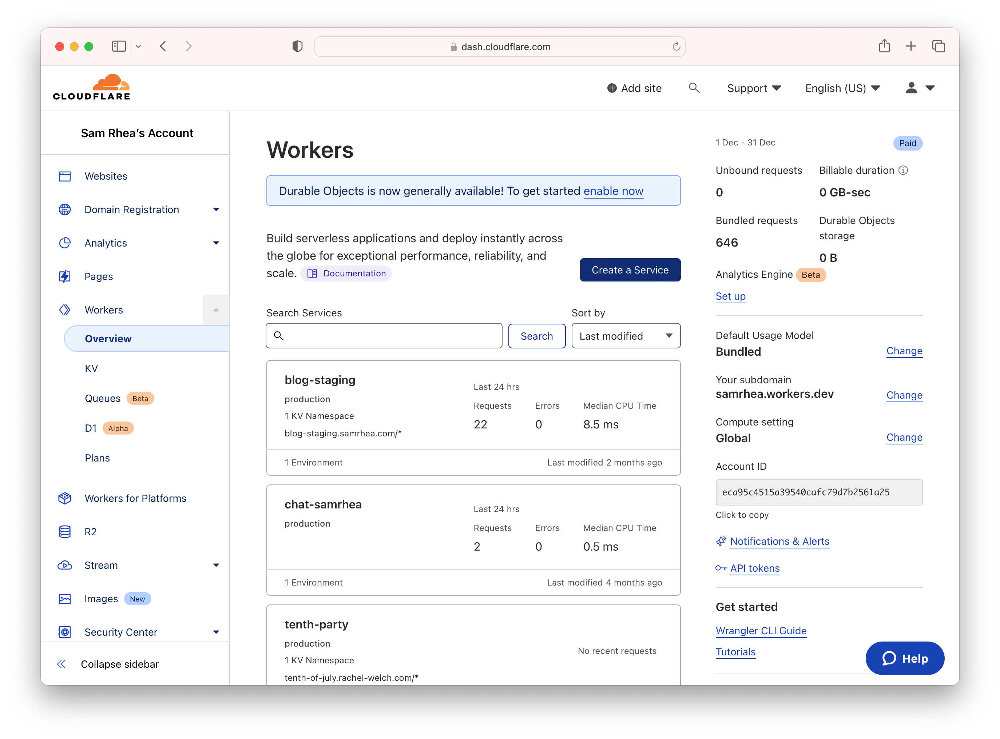
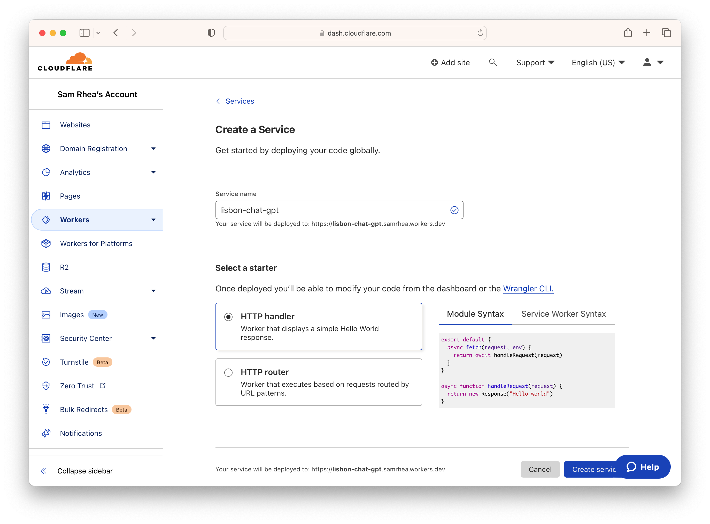
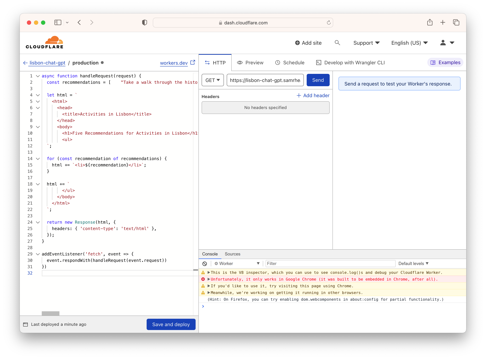
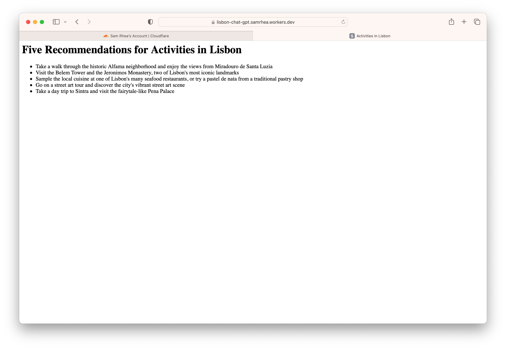
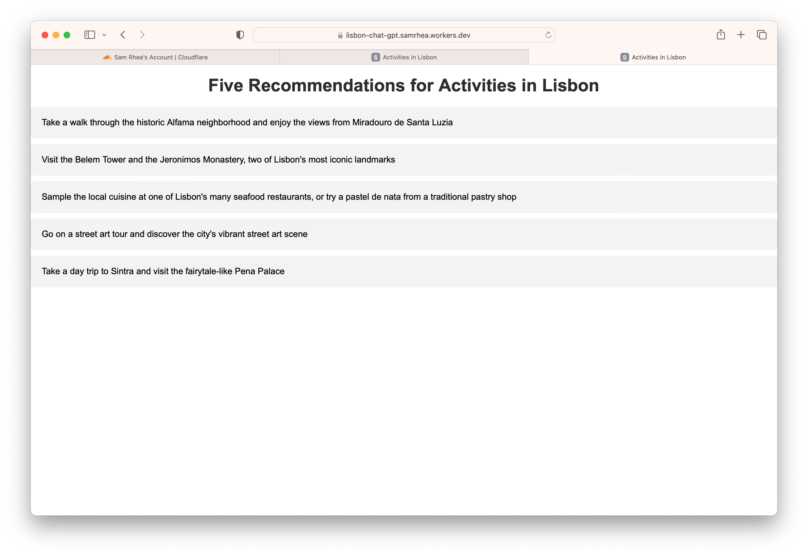
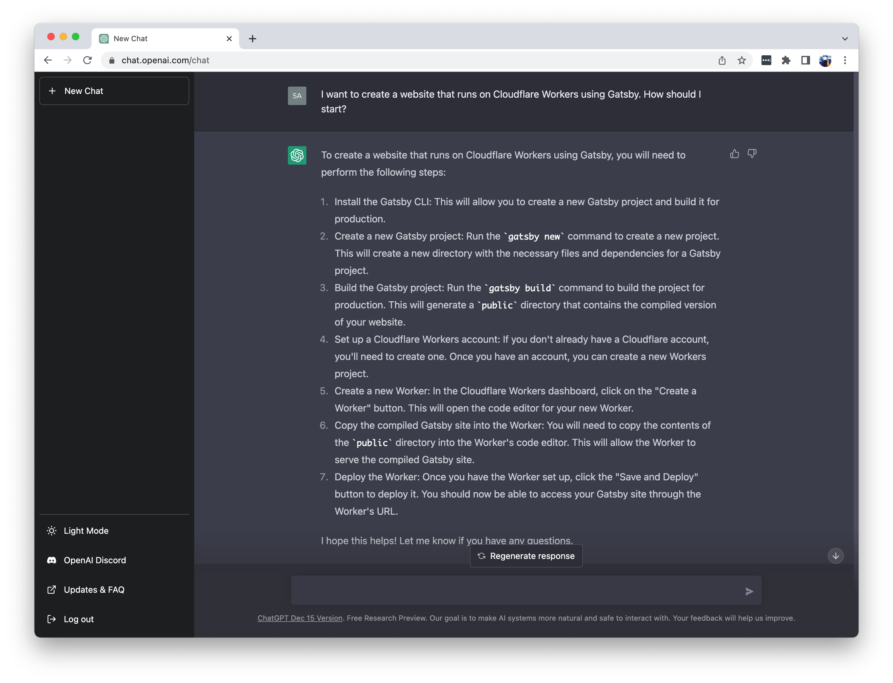

I like to learn how to do things and write [painfully detailed tutorials](https://blog.samrhea.com/category/walkthrough/). Something happened about three weeks ago that made me wonder if that matters anymore.

OpenAI’s launch of ChatGPT started doing the work for me with terrifying proficiency. I can’t stop thinking about it - and not just because the thing can document how to use the products I manage at Cloudflare while also writing an email to a plumbing repair service about scheduling a fix for a leak in a remodeled home. I can’t stop thinking about what this means for how we work going forward.

I sat down today to write a tutorial about using ChatGPT to build a website. It worked. I’m documenting how I did it because this is both a fun thought exercise and because I believe tools like this make creation more accessible to more people. Anyone can "create" software today without the need for formal training or even a code editor. The software might not be great right now, and having expertise about how to edit and use it makes it better, but I am cautiously optimistic for what it means.

I recognize this presents a whole host of ethical conundrums, from how we compensate the work that feeds models like GPT to what we consider “creation.” I haven’t figured out where I land on those yet and I’m not using this post to explore those topics, but they are fascinating and scary and important. Today I’m just building a website.

---

**🎯 I have a few goals for this project:**

* Build a website on the public Internet without opening a code editor **or** using a site generator like Squarespace.
* Do as little work as possible by relying on OpenAI instead of my brain.
* Write no code of my own.

---

**🗺️ This walkthrough covers how to:**

* Prompt OpenAI’s ChatGPT tool to create a Cloudflare Worker script that creates a website with recommendations for things to do in Lisbon, Portugal.
* Upload that script to Cloudflare’s dashboard and publish it to the Internet.

**⏲️Time to complete: ~10 minutes**

---

> **👔 I work there.** I [work](https://www.linkedin.com/in/samrhea/) at Cloudflare. Several of my posts on this blog that discuss Cloudflare [focus on building](https://blog.samrhea.com/tag/workers/) things with Cloudflare Workers. I'm a Workers customer and [pay](https://twitter.com/LakeAustinBlvd/status/1200380340382191617) my invoice to use it.

## OpenAI

[OpenAI](https://openai.com/) is an artificial intelligence (AI) “research and deployment company.” As part of that research, they have released several popular tools for creating output from written prompts. You might be familiar with the fantastical images created by their [DALL·E](https://openai.com/dall-e-2/) service. Give it a prompt and DALL·E will bring an entirely new image into existence.

Here is an example when I asked it to create an image of a Texas Longhorn wearing a birthday party hat in the style of a Claude Monet painting.

I like this one in particular.

My description of this image as “entirely new” pushes some boundaries. This image has never existed before. OpenAI is not clipping and copy-pasting a photo of a longhorn and a photo of a party hat and a photo of a Monet landscape. The service looked at, basically, all images that exist on the Internet and knows how to create new ones now. Most people have a rough idea of what a Monet painting should look like, but OpenAI also consumed thousands of photos of Longhorn cattle shared on the Internet. This model relies on that work but does not credit the sources; the attribution would be nearly impossible. I don’t imagine bovine photographers are terribly concerned by this, but that does pose a dilemma for artists. I’m not going to use this post to explore that topic, experts and folks impacted have discussed it in much more eloquent depth, but I think the framing matters to understand how this works.

OpenAI launched a text-based tool called the Generative Pre-trained Transformer (GPT) a couple of years ago. GPT read everything on the Internet and can now create new content. All of the subsequent blessings and curses you can imagine resulting from “reading the whole Internet” are probably true.

The thing writes emails and medical patient notes and short stories with the right prompt. I asked my old man, who is a trial attorney in Texas, to join a video call and we had GPT start writing hypothetical client emails about case law. For good reason, OpenAI added some limitations to how you can use the tool - GPT is very nervous about impersonating a lawyer and tries hard not to give legal advice. Convincing it to do so takes some finagling; I can’t imagine what you can do without those guardrails.

Last month OpenAI released a version that you interact with as if you were chatting with a person. That interface seems to be the secret to demonstrating the technology to a [wider audience](https://www.cnet.com/tech/computing/chatgpt-why-everyone-is-obsessed-this-mind-blowing-ai-chatbot/).

I don’t know how exactly, but my job and that of most people I know will look very different in five years because of GPT and technologies like it. I’m not writing this post to comment on that; if you are curious about discussions around the implications, I’d recommend starting with Ben Thompson and James Allworth’s [conversation last week](https://exponent.fm/episode-197-chatgpt-at-normal-speed/). Alright, on to the tutorial.

## Prompt OpenAI ChatGPT

First, I’m going to open [ChatGPT](https://chat.openai.com/) and ask it to create a Cloudflare Worker. [Cloudflare Workers](https://workers.cloudflare.com/) is a computing platform created and delivered by Cloudflare. Developers use it to run services without the need to worry about actual servers. You’re using it right now - [this blog is a Cloudflare Worker](https://blog.samrhea.com/pages/projects#%EF%B8%8F-this-blog).

I have not told ChatGPT anything about what `Cloudflare` or `Workers` is. Not only does it just know what they are already, ChatGPT knows how to write software for Cloudflare Workers. I asked it to write a Cloudflare Worker that would create a website that recommends activities for someone who is visiting Lisbon. The service produced the following code output.

Four wild things about this:
* ChatGPT created editorial content as part of the request for code, the Lisbon list, and the output is pretty vanilla but not that different from what I’d tell a friend.
* ChatGPT remembered my request to feature that editorial content in the code I need to create this website and embedded the activities list.
* ChatGPT wrote code to create a website that would provide that editorial on a webpage.
* ChatGPT added a small blurb at the bottom to explain to me what it just did. I didn’t ask it to do that.

That's it. That's all the work required. When I mentioned earlier that I felt curious about what this tool means for tutorials, this is why. A tutorial to create a generic HTML page with Cloudflare Workers would need to walk through how to use a code editor, the structure of HTML, and how to think about HTTP requests. That is not a tutorial - it's a month of lessons in a lower-level high school computer science course.

I would then have to write a tutorial on Lisbon or ask the audience to spend time thinking about the five top attractions in their city. We would then need to return to the monthslong classroom work and add that content into our new webpage. ChatGPT did all of this for me in about 15 seconds.

## Upload to Cloudflare

I know how to use the Cloudflare Workers interface, but I was curious how this would go for someone who doesn’t. I asked ChatGPT to tell me how to deploy this code with Cloudflare. We don't have a button in the ChatGPT interface that just does that for me or an integration where I could give ChatGPT keys to my Cloudflare account and ask it to go ahead and deploy this (yet).

So for now I'll need to just do what the robot tells me. ChatGPT wrote a short tutorial on how to share this with Workers. Let’s go try that.

Following instructions like this feels familiar. I had a teacher in the sixth grade ask everyone to write a paper documenting how to make a peanut butter and jelly sandwich. She then read them out loud and followed the instructions literally. If the essay started with “put the peanut butter on the bread,” she would place a jar of peanut butter on the loaf of bread to demonstrate that context matters. The guidance from ChatGPT assumes you have some idea what Cloudflare is or what a Cloudflare account is, but I bet I could get it to walk me through that, too.

I logged into my Cloudflare account and visited the Workers section of the dashboard first. Why not follow Step 2 from ChatGPT? OpenAI has a cutoff date on what GPT consumed and, since then, our dashboard has changed a little bit.

I could pick back up on the instructions at Step 3, from which point this is pretty accurate. I named the Worker.

Next, I pasted the code from ChatGPT (the tool has a convenient `Copy code` button). I did not edit a single line. After pasting it, I clicked `Save and deploy`.

I visited the link created and there it was - a website on the Internet with the recommendations for tourist activities in Lisbon.

At this point I’ve hit my goal. I created a [real website on the Internet](https://lisbon-chat-gpt.samrhea.workers.dev) in a couple of minutes with actual content. However, this thing is ugly as hell.

## Make it look better

To see if this could be less ugly, I went back to ChatGPT. I told ChatGPT that the code worked, but that I wanted something that looked more professional with more style.

Three wild things about this:
* ChatGPT remembered the first website it created for me and acknowledged that it could improve it.
* ChatGPT updated the original code, keeping the editorial content, with styling for the HTML.
* ChatGPT made decisions about what “more professional” looks like.

I returned to Cloudflare and ran the updated code. The new site does look _somewhat_ better.

## Low-background radiation steel

If this creeps you out and excites you then we are on the same page. Hot takes on this technology include the idea that we’re all about to be replaced. I’m not sure I agree. I expect these tools will replace much of the mundane activities around knowledge work. Oh, and schools are [absolutely not ready](https://www.theatlantic.com/technology/archive/2022/12/chatgpt-ai-writing-college-student-essays/672371/) for what this means.

Thinking back to testing this with my father, I bet the bulk of what junior associates and paralegals do at a law firm will be replaced by a GPT-licensed service. The idea of “legal” work will instead focus on how to structure the prompts and how to edit and approve the output. You can imagine an assembly line where an associate takes input from a client, crafts a prompt, edits the output from OpenAI, and sends it to a partner for a final review. Still has real repercussions for real people, but not a post-scarcity Star Trek future. Also not a dystopia, probably.

As an extension of that assembly line concept, I've heard some critiques which point out inaccuracies in ChatGPT output. Those occur. One dangerous aspect about the service today is that it can be both wrong and very confident that it is right. However, finding flaws in the output is nothing more than good feedback for better model training. Using those flaws to write it off feels like an artisan shoe cobbler pointing out that the new sneaker factory produced a shoe with a shoelace eyelet missing. Sure, that’s going to happen, but the volume of sneakers produced from a factory means more people can afford sneakers and over time the quality improves.

What excites me the most about this technology is the opposite response to the idea that we are now irrelevant - creation just became that much more valuable. [John Graham-Cumming](https://twitter.com/jgrahamc), Cloudflare’s CTO and my neighbor a couple blocks over here in Lisbon, described the launch of ChatGPT as a “low-background steel” moment. If you aren’t familiar, steel made before the first atomic bomb test has [higher value](https://en.wikipedia.org/wiki/Low-background_steel) in certain scientific fields because the air used to create the steel dates to an era before we released traces of nuclear fallout into the atmosphere. Need to build a Geiger counter? Better start looking for a World War II shipwreck.

Since OpenAI trains its model on what humans create, the value of high-quality human-generated content increases. Feeding AI models with content created by AI models will create a bizarre self-reinforcing cycle that trends towards mediocrity. The ability to write new thoughts, create new software paradigms, produce new designs matters more now. In a couple years, most of what you read on the Internet is going to be written by something like OpenAI. [Some](https://news.ycombinator.com/item?id=24164470) of it already is.

Genuine and novel creative output will be both more fun to read and more important to training the next generation of AI models. That should be true for a decade or so, at least.

## What’s next?

The website I created is still pretty crude, but it’s real. I have seen ChatGPT create much more sophisticated output. For example, the blog you are reading uses something called “Gatsby” to maintain this layout and be, generally, better looking than that plain page that ChatGPT created. To give you a preview of what could be created, I started a new prompt. I asked ChatGPT to begin walking me through how to build a Gatsby website. I'm not going to make this blog post longer by appending that project to the end here, but you can see how I could.

Creepy and exciting, right? [Go tinker](https://chat.openai.com/chat) with it - it’s free! Ask it to do things that are more specific to your field. I’ve found that the output improves when you challenge ChatGPT with subjects that are more detailed.

Weirder things are about to happen. I told a friend that, at some point, I'll have my first text conversation with what I think is a human I know but I'll be interacting with an AI the entire time - the movie *Her* feels possible now. I jokingly challenged the Product Managers on my team that the first to write a Product Requirements Document (PRD) with ChatGPT wins lunch if I approve it without knowing OpenAI wrote it. I think one of them already did it. I promise ChatGPT did not write this blog post but I bet I'll try that someday. Just to see if I can. Until then I'm going to leave typos in all my blog posts so you know a human wrote it. Buckle up because this is going to get rowdy and strange and either wonderful or terrifying or a mix of both.

One of my **many** gut reactions to this technology was “detailed tutorials don’t matter anymore. They’ll all just begin and end with instructions to open ChatGPT.” However, I think they matter more now. For better or worse, everything you and I write will contribute to training the next generation of AI models. Let’s hope they pick the good stuff.
