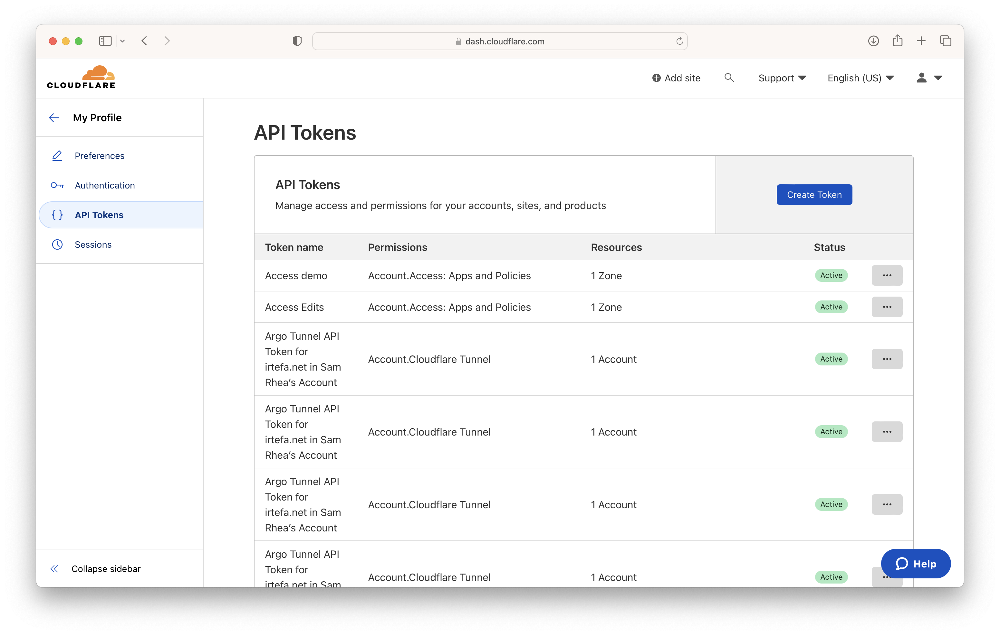
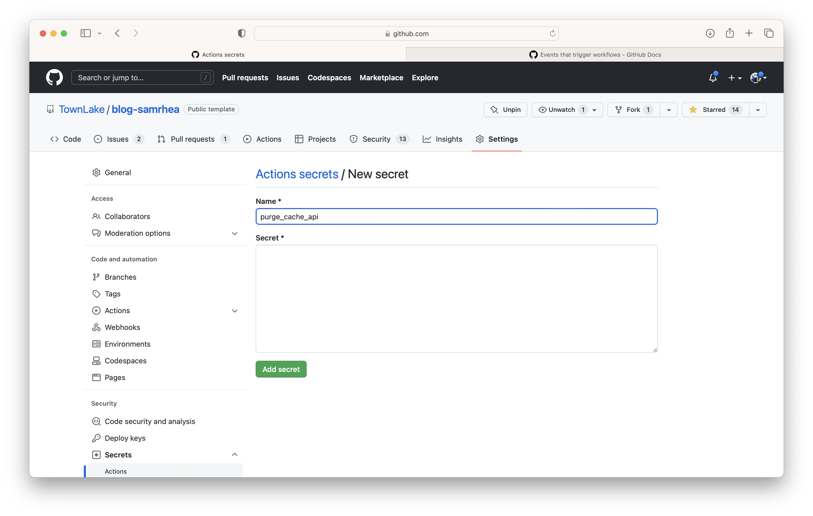
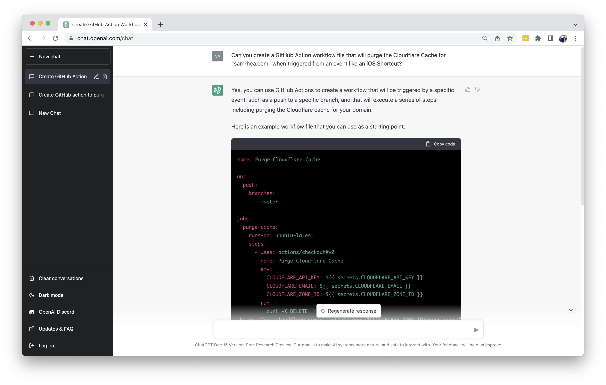

I published a blog post about LinkedIn and Twitter metrics recently and went to check the result on `blog.samrhea.com`. I noticed that the content on the page was missing the new post - the older version was cached.

I said out loud "oops, need to purge the cache." I logged into the Cloudflare dashboard on my phone and punched the `Purge Everything` button. And then I thought "what if my phone could hear that and do it for me?" So today I'm building an iOS Shortcut to allow me to do exactly that.

---

**🎯 I have a few goals for this project:**

* Be able to purge the cache on my site by just talking to my Apple Watch.

---

**🗺️ This walkthrough covers how to:**

* Create a GitHub Action that calls the Cloudflare API to purge the cache for a website in your account.
* Configure the workflow to trigger when you push to `main` or when a dispatch event occurs.
* Create an iOS shortcut that creates a dispatch event, which can be used in the Shortcut menu or with Siri.
* Bonus: See how well OpenAI's ChatGPT would perform if it was writing this instead of me.

**⏲️Time to complete: ~10 minutes**

---

> **👔 I work there.** I [work](https://www.linkedin.com/in/samrhea/) at Cloudflare. Several of my posts on this blog that discuss Cloudflare [focus on building](https://blog.samrhea.com/tag/workers/) things with Cloudflare Workers. I'm a Workers customer and [pay](https://twitter.com/LakeAustinBlvd/status/1200380340382191617) my invoice to use it.

## Create workflow file

I'm going to start by creating a workflow file that relies on a virtual machine (VM) for the sole purpose of having a place to run a `curl` command. This is the same command you'd run from your command line on your laptop; the workflow file just prepares GitHub to run it for me on certain triggers.

I thoroughly exercised GitHub Actions to modify Cloudflare settings in previous blog posts; including dynamically updating the workflow configuration file to use new values from Cloudflare. You can read more about those more complex cases [here](https://blog.samrhea.com/posts/2020/cloudflare-api-github-actions-config). Today I'm more excited about the Siri integration and my use case is simple so I will try not to overengineer it.

First, I need to create a Cloudflare API token that will allow GitHub to authenticate and make changes to my account.



I'm going to scope it to just be allowed to control cache purge settings and only for the site where my blog lives.


Since this repository is public, I don't want to add the token to my workflow file. Even if it was private, that would be bad practice. Instead, I'll use a GitHub secret to securely hold on to my token for me in a way that I can reference in the file.



I'm also going to go ahead and do that for my email address, too.


I can now create a workflow file in the same GitHub repository that is home to my blog. The file configures the GitHub Action to just run a `curl` to the public Cloudflare API. I'm using environment variables for [all of the inputs](https://api.cloudflare.com/#zone-purge-all-files) needed.


I'll go ahead and save that file and merge it to my repository.

### Confirm outcome

The GitHub workflow file is part of this repository and when I merge these changes that qualifies as a push to `main` and I conveniently trigger the workflow. I can see that the GitHub Action run was succesful.


Now to verify at Cloudflare. I'll go to the Audit Logs section of the Cloudflare dashboard and make sure the GitHub Action did trigger the purge event.


**Isn't this enough?**
It could be. By configuring this workflow I can purge the cache for `samrhea.com` anytime I push new content to `main`. However, there are some circumstances where I might not want that in the future:
* If I want more control over my deployments and do not want to purge the cache anytime I push code or merge, I could remove this.
* If I use this zone, `samrhea.com` for several different sites and don't want to purge everything for all of them anytime I push to main. Note - I could also do that with [more selective control](https://api.cloudflare.com/#zone-purge-files-by-url) over what is purged.

### Edit for dispatch

The file above only triggers based on a code push to the `main` branch of my repository. My goal is also to be able to do this ad-hoc from a manual trigger. To do that, I need to add a second trigger criteria - `workflow_dispatch`.


This will allow the GitHub action to receive and respond to an external trigger like an iOS Shortcut.

``` yml
name: Purge Cache

on:
  push:
    branches:
      - main
  workflow_dispatch:

env:
  ENDPOINT: '-X POST "https://api.cloudflare.com/client/v4/zones/629e8bfaf0bb8becf800b692bb4a5443/purge_cache"'
  EMAIL: '-H "X-Auth-Email: ${{ SECRETS.EMAIL }}"'
  CURL_AUTH: '-H "Authorization: Bearer ${{ SECRETS.PURGE_CACHE }}"'
  CURL_CONTENT: '-H "Content-Type: application/json"'
  CURL_DATA: --data '{"purge_everything":true}'
  
jobs:
  purge:
    name: purge cache
    runs-on: ubuntu-latest
    
    steps:
    
    - name: purge cache
      run: |
        curl ${{ env.ENDPOINT }} ${{ env.email }} ${{ env.CURL_AUTH }} ${{ env.CURL_CONTENT }} ${{ env.CURL_DATA }}
```

## Create Siri Shortcut

I now have a GitHub Action that I know will purge the cache for my website served by Cloudflare. I can now configure an iOS Shortcut to fire off an external event to trigger the workflow.

I have the GitHub app installed on my iPhone and have logged into my account. The GitHub app makes certain actions available to iOS Shortcuts by default, including the GitHub Action feature itself.


I'll select `Dispatch Workflow` which maps up with the trigger configuration above.


Next, I'll configure the Shortcut with the details of this particular repository and workflow file. I'll also name the Shortcut.


### Confirm outcome

I can now test running the Shortcut by pushing the icon in the Shortcut homepage.


The Shortcut ran without error and I can go ahead and confirm that works in Cloudflare. Everything looks good once again. Now, for the final test - asking Siri politely. By speaking into my phone, "Hey Siri, purge cache" I can now purge the Cloudflare cache for `samrhea.com`.

## Can ChatGPT do it?

A few weeks ago, I wrote a [blog post](https://blog.samrhea.com/posts/2022/five-minute-ai-site) documenting how to use OpenAI's ChatGPT tool to create a site that runs on Cloudflare Workers. In that post, I mentioned that someday ChatGPT might write all tutorials better than me.

I'm curious how close we are to that. I'm considering adding a new section to these posts where I evaluate how ChatGPT would have performed.

I asked ChatGPT to first create a workflow file for a GitHub Action that would purge the Cloudflare cache.


* Instead of creating the workflow file, OpenAI just documented how to use `curl` to solve this. ChatGPT seems to have gotten a little lost between steps 3 and 4. The `curl` also excludes the inclusion of an email, which still works, but odd.
* Interesting to see it use `DELETE`. Cloudflare recommends `POST`. I tried to search the Internet to see examples where tutorials recommend `DELETE`, curious where OpenAI learned this approach, and did find several.

I nudged it to get back on track creating the file.


* This is accurate and works. Slightly different structure than mine because I prefer to define these as environment variables, which arguably adds more complexity.
* I always like how the service tells you what to do next and why the recommendation is what it is.
* This will only trigger on a push to `main`, like my first phase above, which is fine - I haven't told it I want to manually call this.

I asked it to update the file to be able to trigger on a manual dispatch event.


* Again, accurate. Also it's creepy how natural the conversation feels when it remembers the last output I requested and quickly edits it.

I tried once more and, in a creepy sign of (maybe random) progress, the output skipped the `curl` step and also defined all of the environment variables - including the email. Still missing the dispatch configuration, though.



Overall, pretty close.