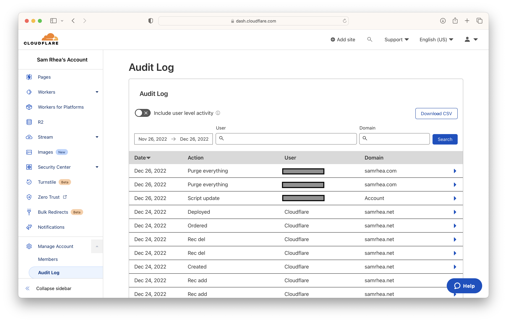

<>

---

**🎯 I have a few goals for this project:**

* Be able to purge the cache on my site by just talking to my Apple Watch.

---

**🗺️ This walkthrough covers how to:**

* Create a GitHub Action that calls the Cloudflare API to purge the cache for a website in your account.
* Configure the workflow to trigger when you push to `main` or when a dispatch event occurs.
* Create an iOS shortcut that creates a dispatch event, which can be used in the Shortcut menu or with Siri.
* Bonus: See how well OpenAI's ChatGPT would perform if it was writing this instead of me.

**⏲️Time to complete: ~10 minutes**

---

> **👔 I work there.** I [work](https://www.linkedin.com/in/samrhea/) at Cloudflare. Several of my posts on this blog that discuss Cloudflare [focus on building](https://blog.samrhea.com/tag/workers/) things with Cloudflare Workers. I'm a Workers customer and [pay](https://twitter.com/LakeAustinBlvd/status/1200380340382191617) my invoice to use it.

## Create Workflow File

<>

### Confirm outcome

The GitHub workflow file is part of this repository and when I merge these changes that qualifies as a push to `main` and I conveniently trigger the workflow. I can see that the GitHub Action run was succesful.

Now to verify at Cloudflare. I'll go to the Audit Logs section of the Cloudflare dashboard and make sure the GitHub Action did trigger the purge event.

**Isn't this enough?**
It could be. By configuring this workflow I can purge the cache for `samrhea.com` anytime I push new content to `main`. However, there are some circumstances where I might not want that in the future:
* If I want more control over my deployments and do not want to purge the cache anytime I push code or merge, I could remove this.
* If I use this zone, `samrhea.com` for several different sites and don't want to purge everything for all of them anytime I push to main. Note - I could also do that with [more selective control](https://api.cloudflare.com/#zone-purge-files-by-url) over what is purged.

### Edit for dispatch

## Create Siri Shortcut

### Confirm outcome

## Can ChatGPT do it?

A few weeks ago, I wrote a [blog post](https://blog.samrhea.com/posts/2022/five-minute-ai-site) documenting how to use OpenAI's ChatGPT tool to create a site that runs on Cloudflare Workers. In that post, I mentioned that someday ChatGPT might write all tutorials better than me.

I'm curious how close we are to that. I'm considering adding a new section to these posts where I evaluate how ChatGPT would have performed.

I asked ChatGPT to first create a workflow file for a GitHub Action that would purge the Cloudflare cache.

* Instead of creating the workflow file, OpenAI just documented how to use `curl` to solve this. ChatGPT seems to have gotten a little lost between steps 3 and 4.
* Interesting to see it use `DELETE`. Cloudflare recommends `POST`. I tried to search the Internet to see examples where tutorials recommend `DELETE`, curious where OpenAI learned this approach, and did find several.

I nudged it to get back on track creating the file.

* This is accurate and should work. Slightly different structure than mine because I prefer to define these as environment variables, which arguably adds more complexity.
* I always like how the service tells you what to do next and why the recommendation is what it is.
* This will only trigger on a push to `main`, like my first phase above, which is fine - I haven't told it I want to manually call this.

I asked it to update the file to be able to trigger on a manual dispatch event.

* Again, accurate. Also it's creepy how natural the conversation feels when it remembers the last output I requested and quickly edits it.

Overall, pretty close today.