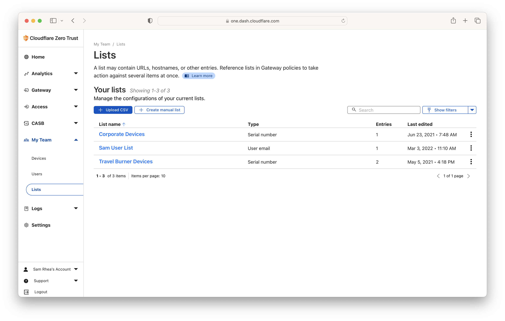
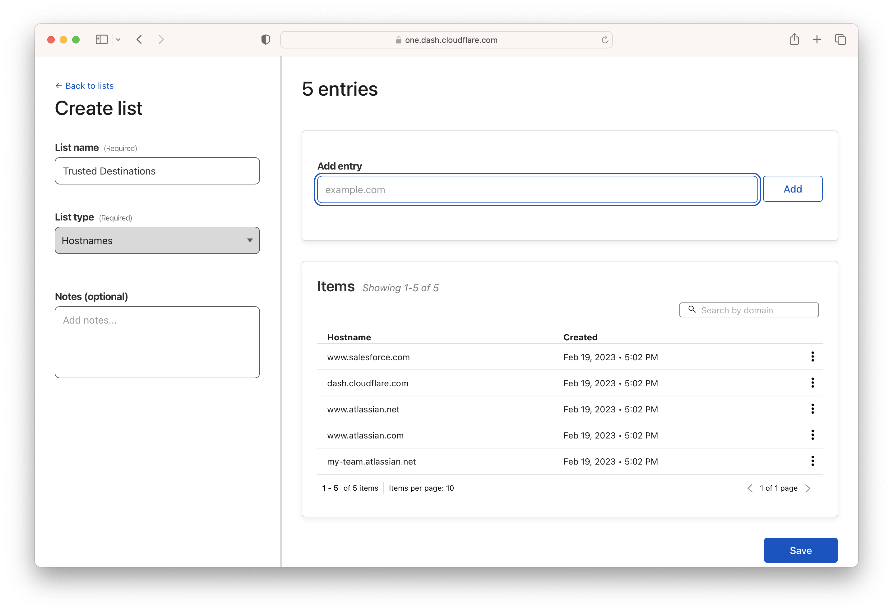
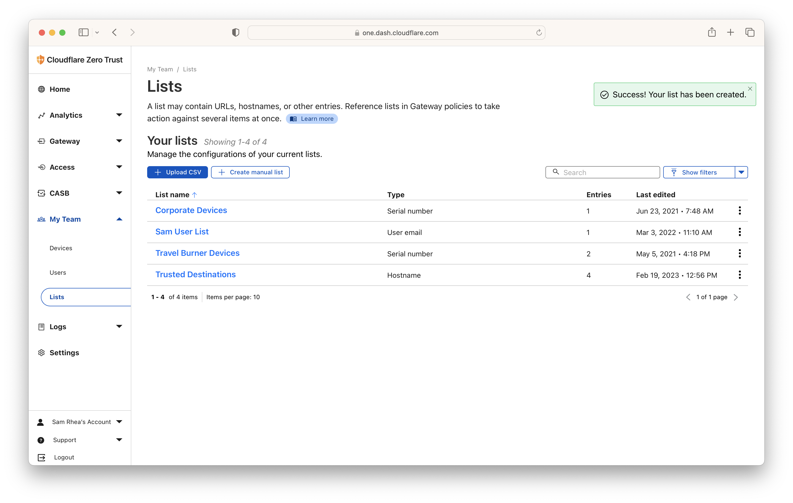
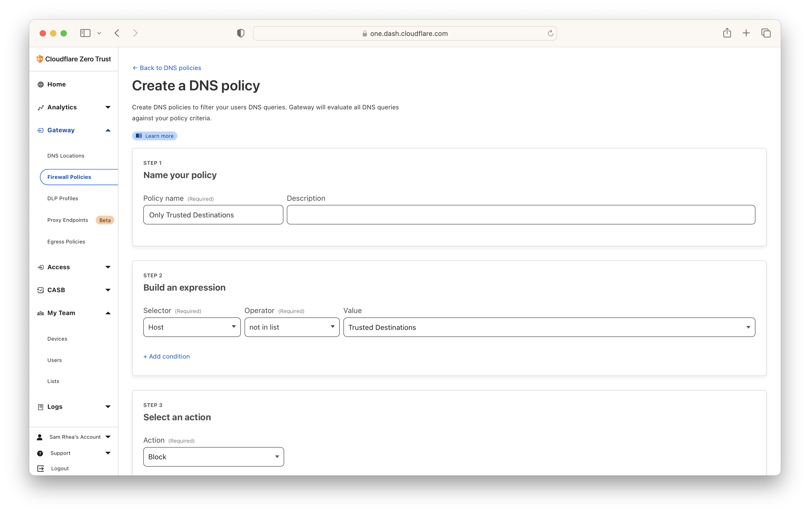
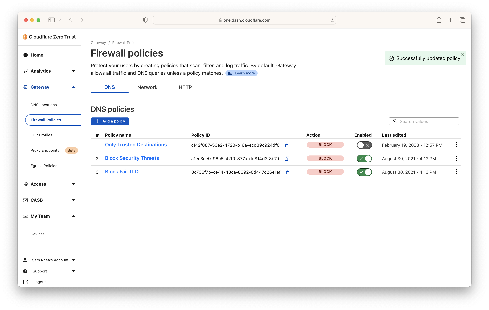
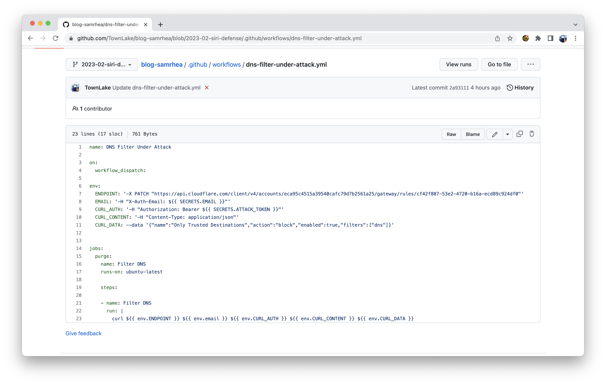
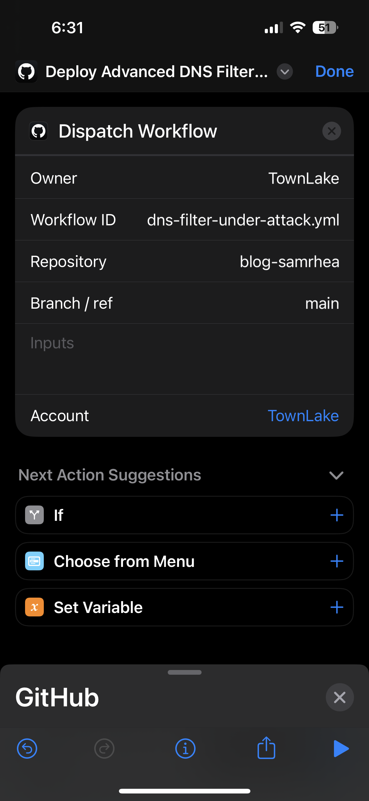
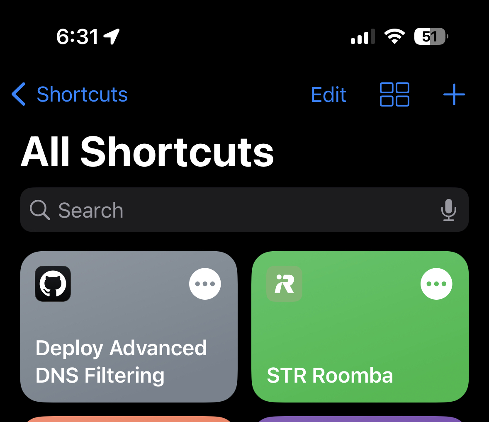
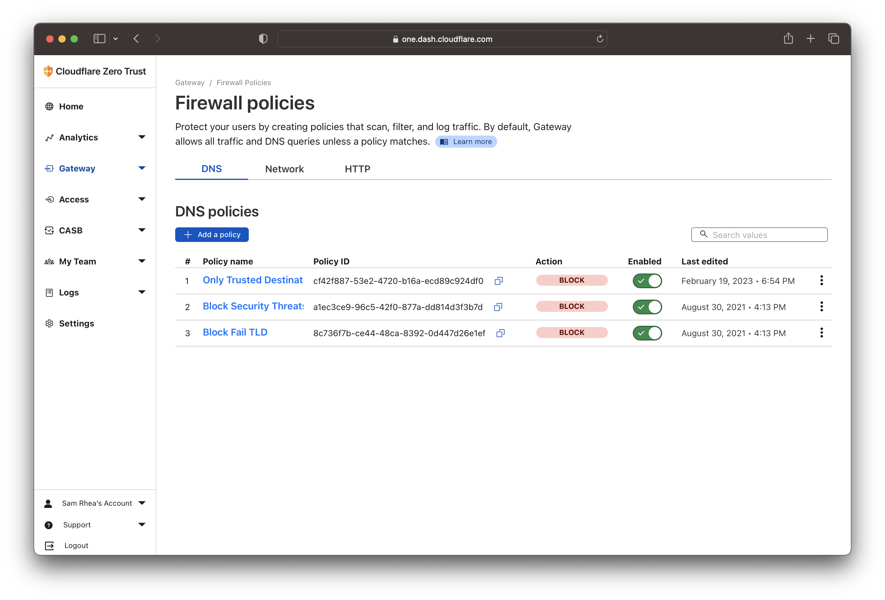
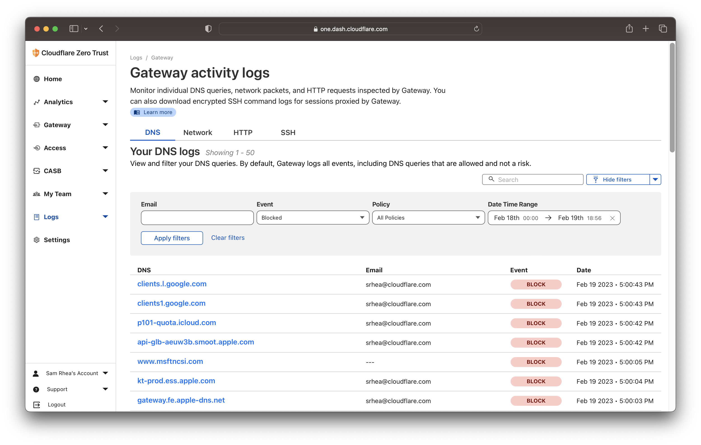

I went to see *Ant-Man and the Wasp: Quantumania* this weekend. I have seen every Marvel Cinematic Universe (MCU) movie in theaters for the last nearly 15 years, excluding *Black Widow* which arrived on Disney Plus during the pandemic. I sat alone (my significant other was on a weekend trip with friends in London to see a West End show). I ate a whole package of Haribo Favorites. I was so happy.

> I spent time with friends this weekend. I promise. I just love seeing movies by myself. If you haven't tried it, you should.

To prepare for the movie (I know, I know, I'm sorry), I rewatched a few MCU films that feature Ant-Man, including *Captain America: Civil War*. That movie is really an Avengers film and, in it, Iron Man relies on the voice-activated artificial intelligence in his suit to upgrade his defenses during a fight with Captain America.

> Look, this tutorial is only going to get nerdier so abandon hope or buckle up.

I decided I would find joy working on a project that somewhat copies that scene. In this case, I am going to use Siri, GitHub, and [Cloudflare One](https://www.cloudflare.com/cloudflare-one/) to talk to a voice assistant and upgrade my defenses in the event of a persistent, advanced attack.

Less exciting than a superhero fight but much more terrifying, some teams and enterprises find themselves the target of bad actors determined to phish credentials or steal data. These coordinated attacks try a handful of different methods to lure users into inadvertantly handing over passwords or access to sensitive materials. If an organization suspects they are under attack, they might want to deploy a more rigorous security model until they can determine the nature of the incident.

In today's tutorial, I am going to create a "break glass" rule for an organization that has already deployed security filtering for their team. An enterprise could enable this particular rule to lock down all outbound traffic to a set of approved destinations while their security team determines the nature of an attack. A **very cool** enterprise could use this tutorial to talk to Siri to enable this rule as if they were on the bridge of a Rebel Alliance cruiser or in Iron Man's suit.

---

**🎯 I have a few goals for this project:**

* Be able to use Siri on iOS to quickly turn on more advanced DNS filtering without the need to use the Cloudflare dashboard.

---

**🗺️ This walkthrough covers how to:**

* Create a positive security model DNS filering rule to be deployed in the case of an emergency.
* Create a GitHub action that can be triggered by Siri on iOS to enable the rule quickly.

**⏲️Time to complete: ~20 minutes**

---

> **👔 I work there.** I [work](https://www.linkedin.com/in/samrhea/) at Cloudflare. Several of my posts on this blog that discuss Cloudflare [focus on building](https://blog.samrhea.com/tag/workers/) things with Cloudflare Workers. I'm a Workers customer and [pay](https://twitter.com/LakeAustinBlvd/status/1200380340382191617) my invoice to use it. This particular post covers products that are part of my group.

## Create a positive security model DNS filtering rule

When your phone, tablet, computer or nearly any other device connects to the Internet, that connection starts with a Domain Name System (DNS) query. The device or service will send a DNS query to a DNS resolver to ask for the IP address of a given hostname. The resolver will respond and the device will establish a connection and begin communicating.

Security teams can and do use this step in how your device talks to the Internet to prevent your devices from talking to dangerous places on the Internet. Public DNS resolvers, like Cloudflare's [1.1.1.1](https://1.1.1.1/), will resolve any DNS query they can. Protective DNS resolvers, like [Cloudflare Gateway](https://blog.cloudflare.com/helping-keep-governments-safe-and-secure/#Delivering-a-protective-DNS-resolver), can be configured to first check the hostname being queried to see if it matches a filtering rule. Depending on the decision, the protective resolver will return the correct address or block the query to prevent the connection from proceeding. For example, if I am unwittingly trying to reach `phishing.com`, a DNS filtering service will recognize that hostname is dangerous and stop the query from finding the malicious destination.

This type of DNS filtering provides a lightweight method to block attacks on the Internet. Individual devices, home routers, corporate networks, and entire Internet Service Providers (ISPs) can be configured to send DNS queries to a protective resolver in just a few minutes. You don't need additional certificates or hardware. Instead, security teams or individual administrators can begin logging and filtering all DNS queries by changing their DNS resolver settings.

In the case of Cloudflare, end users also benefit from the performance boost from using the world's fastest DNS resolver. I'm going to skip over how to configure devices or networks to use Cloudflare Gateway in this tutotorial - check out the [Cloudflare documentation](https://developers.cloudflare.com/cloudflare-one/connections/connect-devices/) to walk through how to set this up.

Instead, I am going to focus on creating a particular type of rule. Most outbound filtering deployments follow a "negative security model" concept. They allow all traffic, in this case DNS queries, unless the query matches something configured to be blocked. This kind of setup can be helpful for filtering dangerous traffic with lower risk of false positives.

Today's tutorial covers an extreme case, though. In this exercise, we are assuming that an organization is under an active and persistent attack. Sophisticated bad actors are attempting to use multiple methods to trick users into visiting malicious destinations on the Internet. In this case, I want the inverse of a negative security model - I want to only allow queries to a small set of trusted destinations.

This kind of deployment, a "positive security model", will block all DNS queries except for those made to explicitly approved destinations. An organization can focus on understanding the attack while permitting users to keep connecting to a narrow set of trusted services.

Teams can also adopt this model with Cloudflare's Secure Web Gateway, our service that inspects and filters HTTP requests to provide more comprehensive security than DNS filtering alone. For today's case I am just going to focus on DNS filtering.

I don't recommend this model as a default. You would have to invest a lot of time to maintain an updated trusted destination list and deal with users who are blocked from going to something outside of that list but otherwise benign. In an emergency, though, this can help lock down your organization while you assess the risk.

To get started, I am going to create a list of trusted destinations in the Cloudflare Zero Trust dashboard.



I'll create a new list, calling it `Trusted Destinations`, and I'll populate it with hostnames that I trust and that should always be available.



> Fair warning - this is tough. Popular applications might use redirects through hostnames that are not obvious. The best approach here is to review the last couple weeks of DNS query logs in your Cloudflare Zero Trust dashboard and assemble the list based on your unique usage. If you are deploying this with Cloudflare's Secure Web Gateway, we define many of these applications for you which makes this a little easier. Again, this is a unique model to deploy in the event of an emergency on a temporary basis.

Now that I have created a list, I can save it and move on to the rule.



I can configure a Cloudflare Gateway DNS filtering rule to operate in a positive security model by using a `not in list` selector. I'll create a new rule and configure it to block anything that is not in the list that I just created.



Once saved, I'm going to disable the rule and rank it at the top of my list. Gateway policies apply in the order of their ranked precedence shown here. When this rule is enabled, it will apply first and take precedence over lower-ranked rules. When disabled, Gateway will move on to the next enabled rule in this list.



## Create workflow file

Like [last month's post](https://blog.samrhea.com/posts/2023/hey-siri-purge), I am going to use a GitHub workflow file to serve as the connector between Siri and the Cloudflare control plane.

First, I'll create a new API token using [the same steps](https://blog.samrhea.com/posts/2023/hey-siri-purge#create-workflow-file) documented in the previous tutorial. I'll also generate a new workflow file that updates this specific Cloudflare Gateway rule to be enabled.



The file contains the configuration below; the value that follows `/rules/` in the `ENDPOINT` environment variable is the rule ID taken from the Cloudflare Gateway UI.

```yaml
name: DNS Filter Under Attack

on:
  workflow_dispatch:
     
env:
  ENDPOINT: '-X PATCH "https://api.cloudflare.com/client/v4/accounts/eca95c4515a39540cafc79d7b2561a25/gateway/rules/cf42f887-53e2-4720-b16a-ecd89c924df0"'
  EMAIL: '-H "X-Auth-Email: ${{ SECRETS.EMAIL }}"'
  CURL_AUTH: '-H "X-Auth-Key: ${{ SECRETS.ATTACK_TOKEN }}"'
  CURL_CONTENT: '-H "Content-Type: application/json"'
  CURL_DATA: --data '{"name":"Only Trusted Destinations","action":"block","enabled":true,"filters":["dns"]}'

       
jobs:
  purge:
    name: Filter DNS
    runs-on: ubuntu-latest
         
    steps:
         
    - name: Filter DNS
      run: |
        curl ${{ env.ENDPOINT }} ${{ env.EMAIL }} ${{ env.CURL_AUTH }} ${{ env.CURL_CONTENT }} ${{ env.CURL_DATA }}
```

## Configure iOS Shortcuts

[Just like last month](https://blog.samrhea.com/posts/2022/hey-siri-purge#create-siri-shortcut), I'm going to use the iOS Shortcuts app to take Siri input and trigger this workflow file in GitHub. Please feel free to follow the steps in that post if you need a reminder on how to create an API key or more detail on setting up the Siri Shortcut. The steps are mostly identical.



Once saved, I can go ahead and test that it works by pressing the shortcut button or using Siri.



I can confirm that the rule has been enabled.



And I'll test a few DNS queries and see them blocked on my device and in the logs.



Now that I have confirmed that this works I'll go ahead and disable the rule and save it for a time when I might need it.

## What's next?

The most fun part about working on Cloudflare One is that every customer we have works towards a different, unique mission but shares one thing in common - no one wanted to get phished today. No team woke up hoping for a ransomware attack. Each organization and enterprise would rather spend their time focused on their goals. We give them the tools to do that.

Adopting a security model like this one means something unnerving has happened and I hope that is not the case for anyone. However, this can be a pretty powerful tool during those chaotic early innings while a team figures out the nature of the attack.
