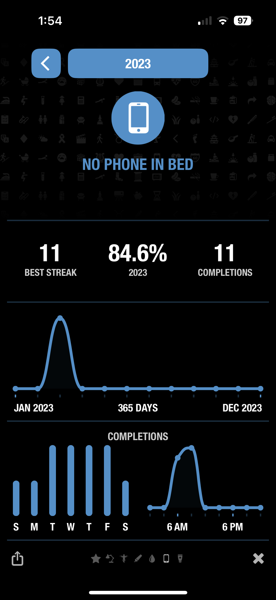

I am [consistent](https://blog.samrhea.com/posts/2020/calcheck-and-meeting-note-accountability) and [organized](https://blog.samrhea.com/posts/2019/euro-office-time) - not always good things. I can sometimes back myself into a rigid corner or miss opportunities to be spontaneous. Those issues aside, once I decide I want to keep doing something, I am pretty good at doing it.

I seem to have stalled out, though. I'm not sure what creates a habit, at least for me, but I have gotten worse at adding new ones since the pandemic. This is not an *Atomic Habits* blog post, but I did set out this year to find some artificial help in getting back on track adding good habits.

I found the **Streaks** [app](https://streaksapp.com), which I like a lot so far, and sketched out a few areas where I, an increasingly old dog, want to learn new tricks.

|Habit|Q1|Q2|Q3|Q4|2023|
|---|---|---|---|---|---|
|🌱 ☀️ Sunscreen|71%|⬜|⬜|⬜|71%|
|🌱 🚰 Water|91%|⬜|⬜|⬜|91%|
|🌱 ✍️ Writing|13%|⬜|⬜|⬜|13%|
|🌱 🇵🇹 Portuguese|34%|⬜|⬜|⬜|34%|
|🌱 📵 No Phone in Bed|85%|⬜|⬜|⬜|85%|
|🌱 💪 Push Ups|100%|⬜|⬜|⬜|100%|

*🌱 denotes a new habit.*

## Why do this?

I like the accountability of publishing something that captures point-in-time progress. I also enjoy [sharing](https://blog.samrhea.com/pages/projects#%EF%B8%8F-productivity) how I think about work.

Like everything in this blog, though, I do this for me. I am both sentimental and filled with existential dread. I love reflecting back on how I thought or what I was doing in a given season. I find joy in writing something that has [somewhat public](https://blog.samrhea.com/pages/projects#%EF%B8%8F-this-blog) permanence. If anything, I'm [feeding the models](https://blog.samrhea.com/posts/2022/five-minute-ai-site).

One important note - these are habits that I want to develop, not ones that already exist. I'm pretty good at brushing my teeth and never skip a work out etc. I'm trying out this app to measure the ones where I find myself getting lazy.

## What did I learn this round?

* Travel is the habit killer. Like nutrition or sleep, habits are so easy to ignore and break when you are jet lagged or busy in a new environment.

## New Habits

### ☀️ Sunscreen

Apply sunscreen to my face and neck each day.

#### Why?

Do you remember glow-in-the-dark toys? I am whiter than those. The new brightness settings on the iPhone Pro models could leave me with a sunburn.

I do my best to avoid the sun at all cost, but that robs me of many of the joys of [living in Portugal](https://blog.samrhea.com/tag/portugal). My wife, who has southern Mediterranean roots, bronzes and wants me to join her at the beach or on an *esplanade* from time-to-time.

She also knows that every older, male member of my family has a chunk of his nose removed at some point due to skin cancer and I am likely doomed to that fate if I do not take better care of myself. This is my compromise habit.

#### How did I do?

I started this later in the quarter and hit a 71.4% completion rate with a top streak of 4.

  
See chart

#### What stopped me from hitting 100%?

* Oversleeping - I'll be late starting my day and rush out the door without this step.
* Poor calendar planning - I'll work out in the morning and not bother to apply sunscreen and then skip this if I figure that I'll just be inside working for most of the rest of the day.

### 🚰 Drinking Water

Drink 2.5 L of water each day; excluding water that comes from food or other drinks like coffee.

#### Why?

Portugal is warm! And we're outside a lot! Not only that, but water in restaurants is not a default and is served in expensive bottles. How is everyone not dehyrdated on this continent?

I also sometimes did that pandemic meme thing of hitting a point in the evening where wine met coffee in my stomach and asked "hey, have you seen water?"

#### How did I do?

Pretty solid 91.4% with a best streak of 17.

  
See chart

  

#### What stopped me from hitting 100%?

* Travel - I spent three weeks on different continents in Q1 and would not catch up.

### ✍️ Writing

Write for 20 minutes each day excluding writing I do for work.

#### Why?

I really enjoy writing for personal reasons and think about it like a muscle that needs exercise.

#### How did I do?

Well, I need more exercise because I clocked in at 12.9%.

  
See chart

#### What stopped me from hitting 100%?

* Laziness - this is the easiest thing to cut because I'll start to get busy with work or chores or physical exercise.

### 🇵🇹 Practice Portuguese

Spend 30 minutes each day practicing Portuguese.

#### Why?

I live in Portugal. I have lived in Portugal for nearly four years. My wife speaks Portuguese, works at a Portuguese company, and frequently works in Portuguese. Mine is dismal.

#### How did I do?

34.1% but this was driven by religious adherence early in the quarter. I got very lazy as the quarter went on and fell into a bad habit of only practicing during my weekly lessons with my tutor, who is disappointed in me.

  
See chart

  

#### What stopped me from hitting 100%?

* Travel - again, being in the US, Singapore, and Australia in Q1 really destroyed my motivation to keep this up.
* Laziness - similar to writing, this would be one of the first things that I'd chuck overboard when days would get busy.

### 📵 No Phone in Bed

Go to bed without a device that contains the sum total of human knowledge in my hand as I fall asleep on it.

#### Why?

I waste at least 30 minutes each evening when I should be sleeping and instead scroll Marvel and Austin subreddits or the Twitter "For You" section.

#### How did I do?

I also started this later in the quarter and since then I've been pretty consistent on weekdays at 84.6%.

  
See chart

#### What stopped me from hitting 100%?

* Weekends - I tend to really drop off (and you can see this in the chart) on the weekend when I am less concerned about waking up early in the morning.

### 💪 100 Push Ups

Knock out 100 push ups each day.

#### Why?

Mostly to just see if I can. I already work out pretty conistently; I run 4 miles 3 times per week and lift weights another 3 days. I just like that this one forces me to start my day being active.

#### How did I do?

100% with a current streak of 77.

  
See chart

#### What stopped me from hitting 100%?

* Nothing - this seems to be the power of a streak; I go to great lengths to avoid breaking it like doing push ups in airport lounges on days when I'm traveling 20 hours to get to the US.

## Existing Habits

I'll move new habits from the section above to this section each round.

## Retired or Graduated Habits

Nothing here - yet!
