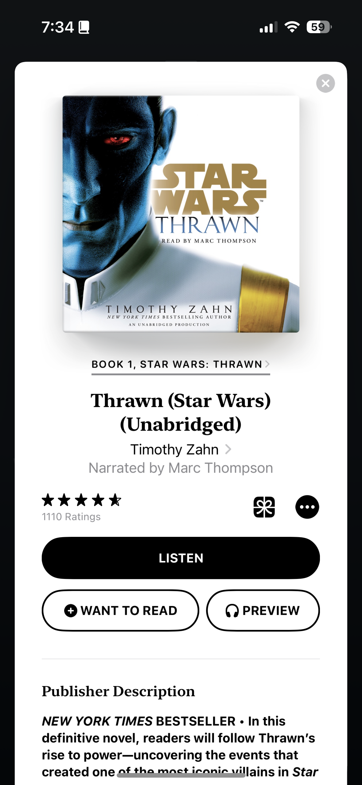

> ## Not a Book Report
> I enjoy [reflecting](https://blog.samrhea.com/posts/2019/analyze-media-habits) on the movies, TV, books and other media that I consume. I'm notoriously sentimental. This [series](https://blog.samrhea.com/category/walkthrough) documents the books that I read. These aren't reviews or recommendations. Just a list. For me. Mostly so that I can page through what I read, where I was, and when.

## Why did I read it?
I adored the Star Wars Extended Universe (EU) growing up. I loved how much depth a book could explore about the universe that a two-hour film focused on a couple protagonists could not. Thrawn became one of my favorite characters after Timothy Zahn's *Heir to the Empire*. The Vulcan of Star Wars. The scary idea of "what if the Empire was way more competent and efficient?" I loved how he teed up the Yuuzhan Vong.

When Disney acquired Lucasfilm, the EU became part of the "Legends" catalog and no longer was canon - Disney had a blank slate to build around the movies. After releasing the sequel trilogy, they seem to be borrowing from more EU content and injecting it into the Filoni-verse.

David Filoni led the animated series, *The Clone Wars* tv show, before the acquisition. The show was good and became great - the end result is the prequel films now seem more interesting. The show gave Anakin a fascinating character arc that mdae you care about the transformation to Darth Vader and created Ahsoka Tano, one of the best characters in the saga and finally one that is not related to a Skywalker. If you have not watched *The Clone Wars* yet, give it a try and then go watch Episodes 2 and 3.

Under Filoni's leadership, Disney released shows that built on his world like *The Bad Batch*, *The Mandalorian*, *The Book of Boba Fett*, and *Star Wars: Rebels*. *Rebels* introduced Thrawn into the screen canon and Disney brought back Timothy Zahn to write an updated, canon-approved, introduction book called *Thrawn* that was released around the same time.

I first read *Thrawn* in 2018 and enjoyed it. I had not followed through with the *Star Wars: Rebels* show, though, and started watching it after finishing the latest season of *The Mandalorian*. I downloaded the audiobook to catch back up. when I remembered that the new Thrawn book and the third season of *Rebels* had overlapping plot lines.

I have also been walking my dogs a lot more lately while we replant our grass and have more audiobook time...

## What is it?
|Category|Value|
|---|---|
|**Title**|*Thrawn*|
|**Author**|Timothy Zahn|
|**Narrator**|Marc Thompson|
|**Year Published**|2017|
|**Format**|Audiobook (Apple Books)|
|**Length**|16 Hours 57 Minutes|
|**ISBN**|9780451486240|

## How did I read it?
|Category|Value|
|---|---|
|**Date Started**|April 22, 2023|
|**Date Finished**|April 25, 2023|
|**Places Read**|Sintra Dog Walks|

## Notes - No Spoilers
* Star Wars has a real power scaling problem when comparing screen and book versions. In books like *Thrawn*, the Empire fields expert pilots and commandos on the ground to ruthlessly quell dissent. In *Rebels*, the stormtroopers and other Imperial characters become goofy cartoons. I get that *Rebels* is a cartoon, targeted to kids, but I found it jarring. *Andor* and *Rogue One* feature characters with capabilities much closer to their book counterparts.
* Star Wars books also make the space battles fascinating in a way that the shows don't. The screen reduces them to colorful laser shoot-outs.
* Likewise the character of Thrawn in the show differs just a few degrees too many for me. Again, part of this is probably the nature of the audience. *Star Wars: Rebels* needs Thrawn to be more of a Saturday morning cartoon villain. However, they make him cruel and arrogant in a way that exceeds any book description.
* Fun to see Colonel Yularen who probably shows up across the saga more than any supporting character.
* I did not love the sequel trilogy. Another project of Filoni's seems to be rehabilitating some of the wilder decisions made in the sequel trilogy, like Palpatine's reappearance, through shows like *The Mandalorian*. Revisiting Thrawn's new, canon, storyline made me wish they had instead adapted the Yuuzhan Vong storyline into the sequel trilogy.
* I forgot how much fun it is to listen to a fiction audiobook narrated by a professional. Most of the audiobooks that I have consumed lately are nerdier, academic non-fiction history tomes. This was a blast and I enjoyed every minute. I immediately bought the sequel in audiobook format after finishing this.
