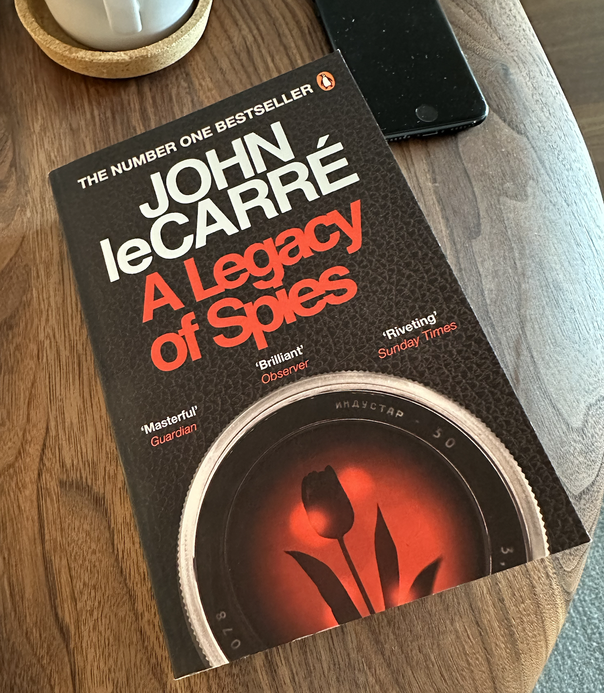

> ## Not a Book Report
> I enjoy [reflecting](https://blog.samrhea.com/posts/2019/analyze-media-habits) on the movies, TV, books and other media that I consume. I'm notoriously sentimental. This [series](https://blog.samrhea.com/category/walkthrough) documents the books that I read. These aren't reviews or recommendations. Just a list. For me. Mostly so that I can page through what I read, where I was, and when.

## Why did I read it?
Austin, Texas is home to an independent bookstore, Book People, that sits near downtown next to a former Whole Foods location back when that Amazon-owned grocery chain was just a local grocery store. Growing up, at all ages, I would drop in to visit to find my next book before online reviews or Amazon became popular.

The spy thriller section lived next to a small cafe on the first floor. When I was 16, I stumbled on to *The Spy Who Came in from the Cold* by John le Carré - I purchased the book and read it in a single Saturday.

Moving to Portugal shifted my book buying habits back to that browsing experience, except now it is something of a treasure hunt. Online delivery here is stuck in the 90s and anything you want to buy is most likely going to arrive in 2-3 weeks from German Amazon with some surprise fees. Instead, I try to find English-language books in the "International" section of FNAC.

A couple of weeks ago I was shopping at the FNAC inside of Cascais Shopping and found *A Legacy of Spies*, the prequel **and** sequel to *The Spy Who Came in from the Cold*. It took two Saturdays to read.

## What is it?
|Category|Value|
|---|---|
|**Title**|*The Spy Who Came in from the Cold*|
|**Author**|John le Carré|
|**Year Published**|2017|
|**Format**|Paperback|
|**Pages**|353|
|**ISBN**|978-0-241-98161-0|

## How did I read it?
|Category|Value|
|---|---|
|**Date Started**|June 10, 2023|
|**Date Finished**|June 24, 2023|
|**Places Read**|Sintra Lisbon|

## Notes - No Spoilers
* I forgot that I was once in love with Liz Gold.
* I also forgot how much I adore the depiction of the George Smiley, the antithesis of James Bond.
* I was worried that the time jumps would throw me off, but I wound up really enjoying learning about the plot behind the plot through the interviews, snippets, and report readings.
* The French get some real shout outs. I know this was written, in large part, as a reaction to Brexit, but I finished the book during a noisy party my erstwhile French neighbors were hosting and I have mixed feelings about the Francophile passages in this novel.
* Speaking of Amazon, now that they own the James Bond franchise I'd love nothing more than an equivalent James Bond installment that was just "British attorneys who are nervous about liability review the fall out from *Goldeneye* thirty years later."