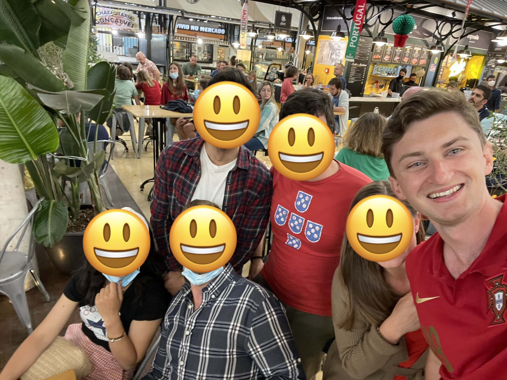
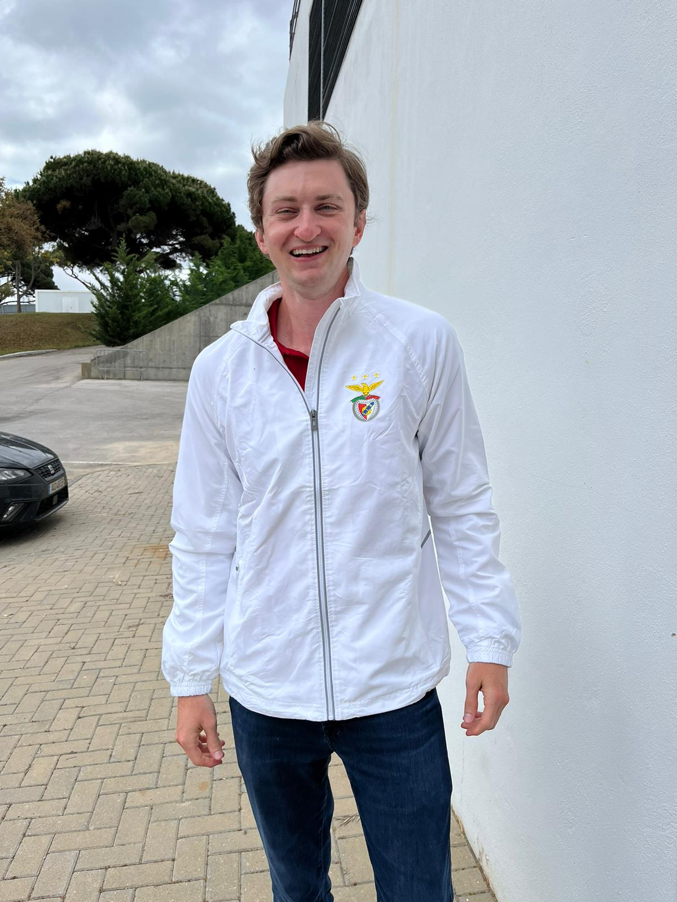
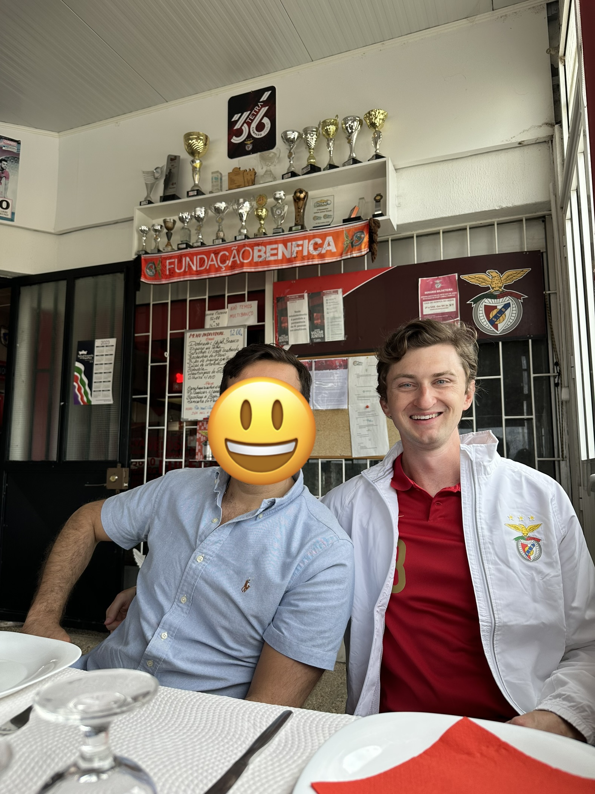

I measure our Portuguese assimilation by counting the number of invitations we receive. This summer’s docket included a bachelorette party, two weddings, and a handful of birthday parties. We’ll always stick out a bit, at least I will, but we seem to be welcome in some cherished moments.

A few weeks ago I attended the birthday party for the one-year-old son of some of our favorite people on either side of the ocean. Birthday parties for one-year-olds are well-deserved celebrations of the parents - something I should have known. They’ve earned it. They threw a real shindig despite getting less sleep than any of us in the last year.

Friends and family from around the country made the trip. A real community gathered - I’m not sure any parent knew the exact location of any of their children during the entire party. The kids threw their own festival about three feet below us, having a blast, occasionally interrupted by being picked up by an aunt or cousin. The adults traded stories practiced over decades of friendship. I felt lucky to be there.

The invitation suggested the party would wrap at 6PM. By midnight about a dozen of us were making steady progress trying to drink all of the wine in their house. This would terrify Americans. When people attend a party in the US, they find reasons to go home. In Portugal, party goers find reasons to extend the good times.

At some point during the afterparty, four or five Portuguese dudes cornered me. This happens to me from time to time. I am tall and slender and foreign - I am easily cornered. The line of questioning almost always opens with “so, do you actually like Portugal?” I genuinely do, but I am not sure I would voice any hypothetical disdain when outnumbered.

_Besides, Portugal is a very small country and one that has the power to deport me - I’ve been at dinners with friends-of-friends only to realize that so-and-so was the Chief of Staff to a Minister of some type. I like it here and wish to stay. I mean it._

This particular cornering focused on sports. Specifically, that I support the wrong football team. Lisbon has two dominant football clubs - Sporting Clube de Portugal (Sporting) and Sport Lisboa e Benfica (Benfica). It’s a Yankees and Mets thing - Benfica being the Yankees. Benfica has long been the most successful team in all of Portugal and the group is the most popular team in the country by a mile (or kilometer). My interrogators were Benficistas, devout fans of Benfica. Their interrogation started with “why are you wrong?”

### The Teams
I support the wrong football team, Sporting, by association. When I first moved here, my initial group of friends happened to be Sporting fans and so I became one. I accepted their invitations to tailgates and games. I always had a great time - even when I earned my stripes watching until the very end when Sporting lost 7-0 to Manchester City.

I first adopted Sporting by proximity, but I still don’t fully grasp why someone chooses Sporting or Benfica. Unlike New York baseball’s rivalry between the Bronx and Queens, the Lisbon stadiums are about 7 minutes apart. What makes someone pick one team or the other? The most consistent answer I can get centers around socioeconomic class. I am going to try to break it out as I understand it - I am sure I am getting part of, or even all, of this theory wrong.

According to legend, Sporting collected more of Lisbon’s bourgeois in the 20th century - the “yuppie” class (the Portuguese word for a yuppie, more or less, is a beto). Benfica represented the working class in Lisbon and nearly everyone else outside of Lisbon or Porto. Sporting’s fandom became a green dot in a red sea.

If you live in a major European city, or a select few in the US, you can find some evidence of this theory if you search for a *Casa do Benfica* on a map. For much of the second half of the 20th Century, hundreds of thousands of Portuguese left Portugal to work as lower cost labor in richer countries like Switzerland and France. As members of the working class in the 20th century, these economic migrants predominantly supported Benfica.

Like most diasporas, the Portuguese of this era created their own gathering places. Unlike other communities, a football team sponsored them. Individuals could apply to open their own *Casa do Benfica* - licensed by the club.

Benfica shipped the kitsch, the owners posted the banner, and the community gathered. The *Casas* anchored the Portuguese neighborhoods in foreign capital cities around the globe. They still do, though the recent waves of emigration tend to be university-educated professionals seeking more opportunities in cities like London or New York.

Whether or not this socioeconomic theory is accurate, that sorting hat tends to be less relevant today. I have friends of all backgrounds who support both teams, but the overwhelming majority adore Benfica. As did the five Portuguese friends who had me surrounded at this toddler’s birthday party.

After confirming that I was, indeed, a Sporting fan, the Benficistas at the birthday party volunteered to fix me. One of them works in the front office for Benfica. He suggested that the group take me on a tour to the Benfica Academy - their training facility and headquarters.

Here’s the thing about the Portuguese and social plans - they mean what they say. If an American tells you “we should get coffee someday” then you have spoken to that American for the very last time. When the Portuguese invite you to something, they genuinely want you to attend. I adore them. However, given the number of empty wine bottles surrounding us, I assumed this was a very considerate offer that we would all forget.

I was still thinking like an American. About a week after the party, I got a text message from my closest friend of the bunch, João, while I was working at home. They’d arrive in an hour to drive me to my conversion.

### The Conversion
Like the Portuguese national team, Benfica’s primary color is red. I figured I could show my appreciation for the tour by throwing on the loudest, brightest piece of red clothing in my closet - my very own Portuguese national team jersey.

I own this jersey thanks to another social invitation. Some friends invited me to a national team watch party a few years ago. My wife was running errands downtown that morning and offered to pick up a jersey for me at the Nike store. The only medium jersey they had left (other than Ronaldo’s) was Rúben Neves - a defender who rarely saw playing time. She went ahead and grabbed it.

No one at the watch party understood why I wore a Neves jersey. It still causes confusion. Every time I wear my Neves jersey I invite scrutiny. I’ve been asked “did he come to America one time?” Or, less often, “are you somehow distantly related to him by marriage?” While he has found success, and a lot of cash, playing in the English Premier League and now the Saudi league, he’s not quite a member of the Portuguese Football Pantheon. Still, most people seem to appreciate that I am cheering on the national team and I figured my tour group at the Benfica campus would too.

When João picked me up, I hopped in the front seat at an angle that would have only shown him the front of my shirt. As we picked up other friends, the seat hid my back. We parked outside the training facility and I followed their lead since I had no idea where we were going. Our friend greeted us, told me “we’ll only speak in Portuguese today,” and we strolled into the Avengers Campus of Portuguese football. Zero members of this tour have seen the back of my shirt at this point.

If you are from the American South, the complex will remind you of the facilities of an SEC or Big 12 college football team. The practice grounds are immaculate. The campus is home to multiple cafeterias, a video game room, a theater, a trophy hall, and plenty of practice fields. Unlike American college football facilities, European soccer clubs include youth and junior teams as part of their ladder system. Imagine if the University of Texas’ training facility housed the Division 1 players, a redshirt freshman squad, an elite high school team, and then a middle school unit. All under one roof where some of the players lived.

We were having a blast. Until our friend and guide received a phone call about ten minutes into the tour. My Portuguese is pretty good, but not “hushed tones overheard on someone else’s phone call” good. I couldn’t make out what was being discussed but he made direct eye contact, looked me up and down, and then slowly walked behind me. I heard a variation of “oh, oh no” and he hung up. He quickly whispered something to João and fled.

João walked over to me and asked “so, um, Sam - why are you wearing a Ruben Neves jersey?” I told him the origin story. He nodded politely and explained that “Neves is a beloved player from the north of the country who started his career with Porto,” Benfica’s other primary rival. “Some of the coaching staff saw your jersey from a distance and they are not happy.”

I had worn a Tom Brady Patriots jersey while touring The Ohio State’s football facilities. I was wearing a Vince Young Titans jersey while exploring the University of Southern California’s campus. A cherished hometown hero of their bitter rival was emblazoned in gold letters on the back of my firetruck red shirt. It wasn’t a Porto jersey, but it was a loud and glaring signal for those who knew Portuguese football. Which I didn’t.

“Ah, that’s funny. I love how rivalries are global. My bad! Not a big problem right?” I asked.

“No, uh, this is an actual problem” João informed me with a nervous chuckle. Rivalries in European football run deeper, apparently. We needed to fix this or leave before the decision to leave was made for us.

A few minutes later our tour guide returned and ushered us, stealthily, into a closet near the largest practice field. I stood with my back against the wall. He accosted a couple members of the equipment crew and they managed to rummage up a white Benfica winter jacket I could wear to finish the tour in the warm sunshine of May in Lisbon. I threw it on. My football baptism godfathers ordered me to turn around while they made sure the name “Neves” was no longer visible. It wasn’t and we continued.

I sweat through the jersey hidden beneath my parka as we wrapped up our early summer day exploring the lower fields that border the Tejo river. With my immodesty covered, I loved every minute remaining on this gracious tour. The club describes the atmosphere as the *mística benfiquista* and I get it. This is a team that returns the adoration of (most of) the country with a tradition of winning. They unite millions of Portuguese abroad with something that anchors them to home.

As far as my assimilation goes, I was invited into the Holy of Holies and I’m grateful - even if I nearly defiled it. I have spent more than four years trying to understand Portugal. I have made progress one friendship at a time. I simply adore that a sports team would inspire the level of passion to compel me to wear a winter coat in the summer. When I think about what a team like this means to an entire community, I understand why. That silly phone call makes me root for Benfica in the same way I root for Portugal - this is a country full of people who hold sacred the promise of what they can achieve as a team.

We finished in time to grab lunch at the *Casa do Benfica* restaurant that sits just outside of the facility’s gates. I kept the jacket on. These licensed bar-and-grills serve as gathering places inside of Portugal, too - even a few meters from the center of the Benfica universe.

We sat next to a table of construction workers on their lunch break. Our table’s conversation veered from sports rivalries into a discussion about the lurking dread of finding more opportunities inside of Portugal. How kids from the rural parts of the country, like most of my tablemates, come to Lisbon for that purpose. How kids in Lisbon wind up seeking opportunities outside of Portugal. A whole community and people on the move to find something better and, for a plurality, united by Benfica. Unless you’re me and you inadvertently sow discord into the sacred grounds. I’ll continue to stick out.

