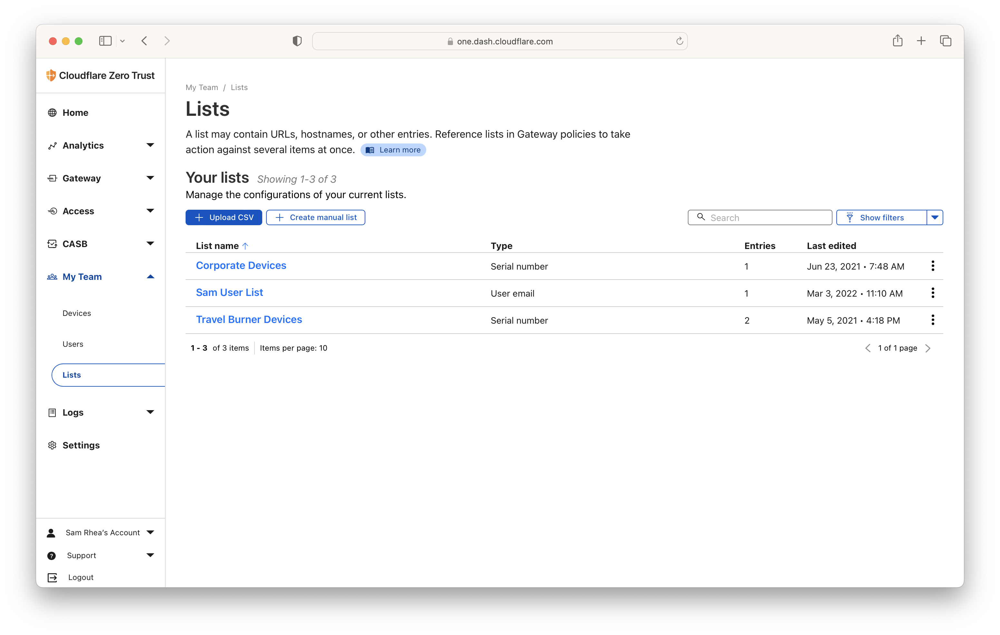
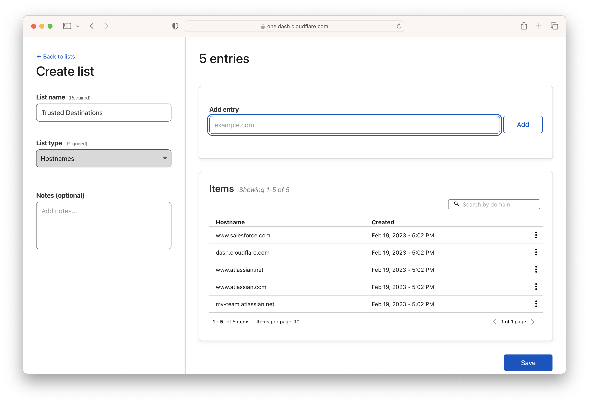
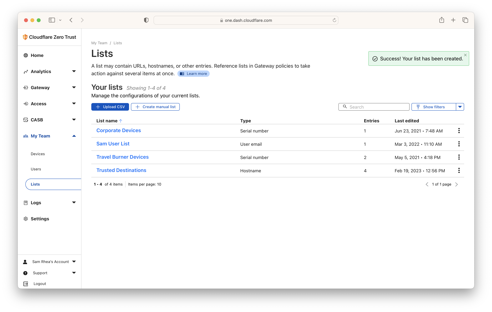
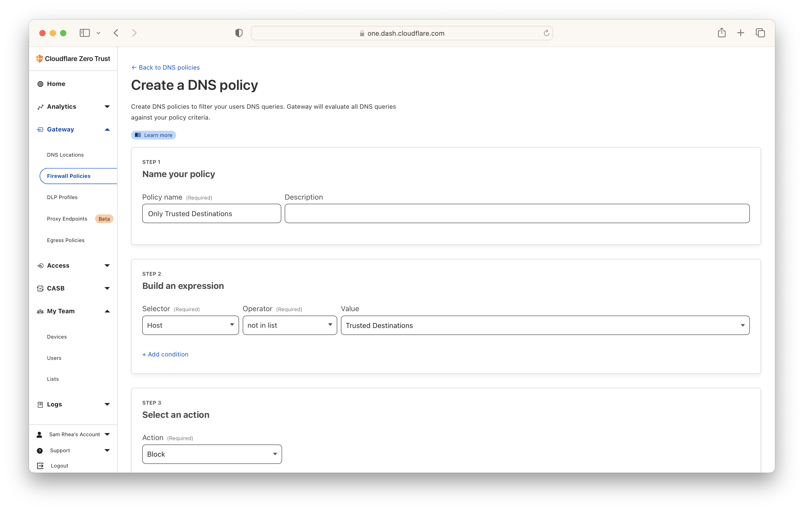
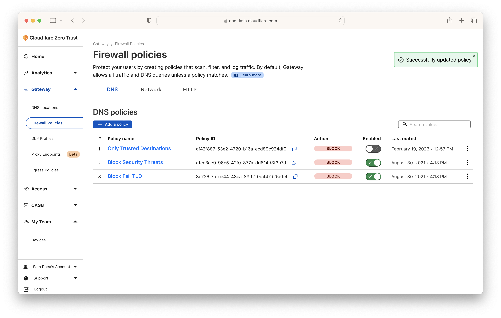

<>

---

**🎯 I have a few goals for this project:**

* Be able to use Siri on iOS to quickly turn on more advanced DNS filtering without the need to use the Cloudflare dashboard.

---

**🗺️ This walkthrough covers how to:**

* Create a positive security model DNS filering rule to be deployed in the case of an emergency.
* Create a GitHub action that can be triggered by Siri on iOS to enable the rule quickly.

**⏲️Time to complete: ~20 minutes**

---

> **👔 I work there.** I [work](https://www.linkedin.com/in/samrhea/) at Cloudflare. Several of my posts on this blog that discuss Cloudflare [focus on building](https://blog.samrhea.com/tag/workers/) things with Cloudflare Workers. I'm a Workers customer and [pay](https://twitter.com/LakeAustinBlvd/status/1200380340382191617) my invoice to use it. This particular post covers products that are part of my group.

## Create a positive security model DNS filtering rule

When your phone, tablet, computer or nearly any other device connects to the Internet, that connection starts with a Domain Name System (DNS) query. The device or service will send a DNS query to a DNS resolver to ask for the IP address of a given hostname. The resolver will respond and the device will establish a connection and begin communicating.

Security teams can and do use this step in how your device talks to the Internet to prevent your devices from talking to dangerous places on the Internet. Public DNS resolvers, like Cloudflare's [1.1.1.1](https://1.1.1.1/), will resolve any DNS query they can. Protective DNS resolvers, like [Cloudflare Gateway](https://blog.cloudflare.com/helping-keep-governments-safe-and-secure/#Delivering-a-protective-DNS-resolver), can be configured to first check the hostname being queried to see if it matches a filtering rule. Depending on the decision, the protective resolver will return the correct address or block the query to prevent the connection from proceeding. For example, if I am unwittingly trying to reach `phishing.com`, a DNS filtering service will recognize that hostname is dangerous and stop the query from finding the malicious destination.

This type of DNS filtering provides a lightweight method to block attacks on the Internet. Individual devices, home routers, corporate networks, and entire Internet Service Providers (ISPs) can be configured ot send DNS queries to a protective resolver in just a few minutes. You don't need additional certificates or hardware; instead, security teams or individual administrators can begin logging and filtering all DNS queries. In the case of Cloudflare, they also benefit from the performance boost from using the world's fastest DNS resolver. I'm going to skip over how to configure devices or networks to useCloudflare Gateway in this tutotorial - check out the [Cloudflare documentation](https://developers.cloudflare.com/cloudflare-one/connections/connect-devices/) to walk through how to set this up.

I am going to walk through creating a particular type of rule, though. Most outbound filtering deployments follow a "negative security model" concept. They allow all traffic, in this case DNS queries, unless the query matches something configured to be blocked. This kind of setup can be helpful for filtering dangerous traffic without the burden of blocking too much traffic.

Today's tutorial covers an emergency case, though. In this situation, we are assuming that an organization is under an active and persistent attack. Sophisticated bad actors are attempting to use multiple methods to trick users to visit malicious destinations on the Internet. In this case, I want the inverse of a negative security model - I want to only allow queries to a small set of trusted destinations. This kind of deployment, a "positive security model", will block all DNS queries except for those made to explicitly approved destinations.

I don't recommend this model as a default. You would have to invest a lot of time to maintain an updated trusted destination list and deal with users who are blocked from going to something outside of that list but otherwise benign. In an emergency, though, this can help lock down your organization while you assess the risk.

First, I am going to create a list of trusted destinations in the Cloudflare Zero Trust dashboard.

I'll create a new list, calling it `Trusted Destinations` and I'll populate it with resources that I trust and that should always be available.

This can be tough. Popular applications might use redirects through hostnames that you did not imagine would be part of their usage. The best approach is probably to review the last couple weeks of DNS query logs in your Cloudflare Zero Trust dashboard and assemble the list based on your unique usage. Again - this is really a situation to deploy in the event of an emergency on a temporary basis.

Now that I have created a list, I can save it and move on to the rule.

I can configure a Cloudflare Gateway DNS filtering rule to operate in a positive security model by using a `Not in` selector. I'll create a new rule and configure it to block anything that is not in the list that I just created.

Once saved, I'm going to disable the rule and rank it at the top of my list. Gateway policies execute according to their ranked precedence shown here. When this rule is enabled, it will apply first and take precedence over lower-ranked rules.

## Create workflow file

I'm going to start by creating a workflow file that relies on a virtual machine (VM) for the sole purpose of having a place to run a `curl` command. This is the same command you'd run f
