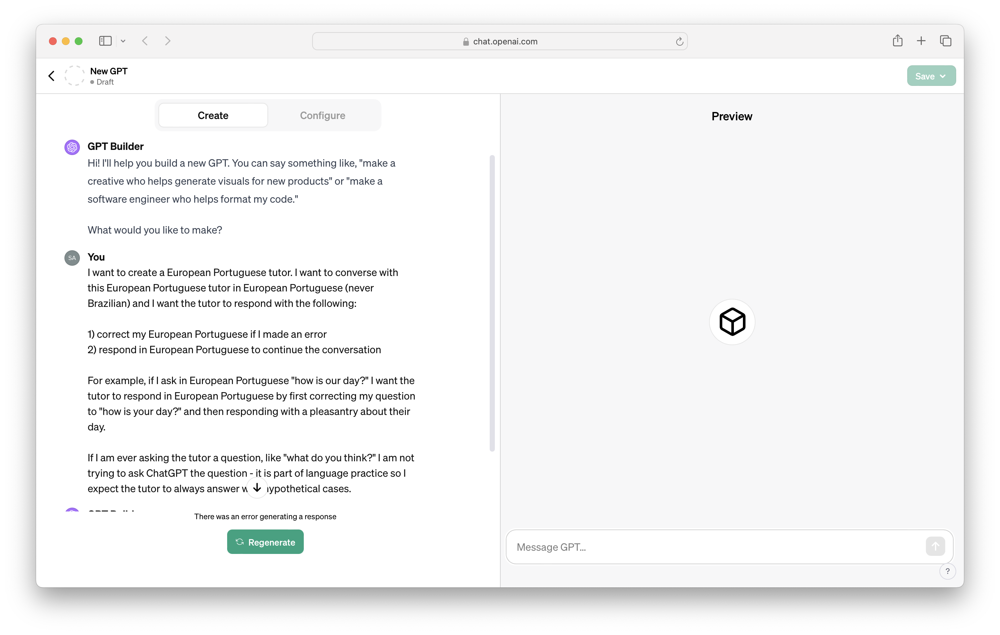
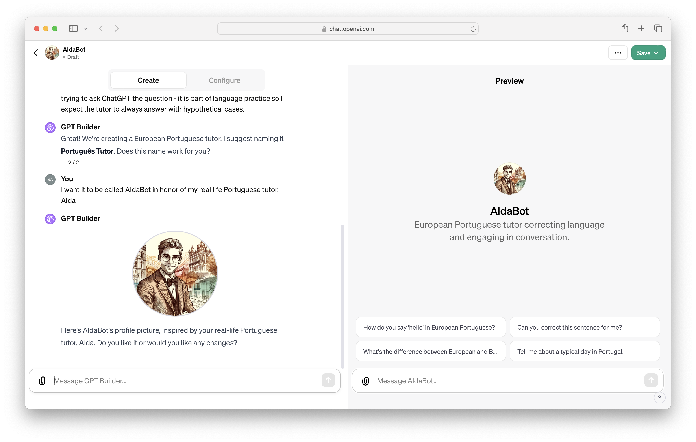
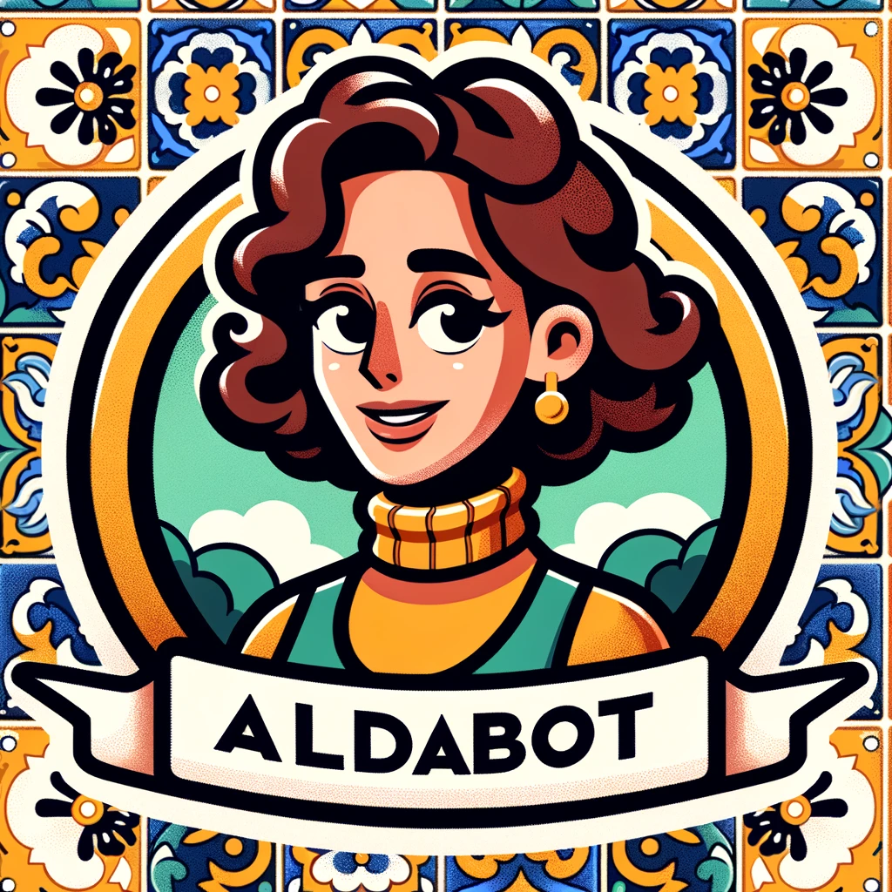
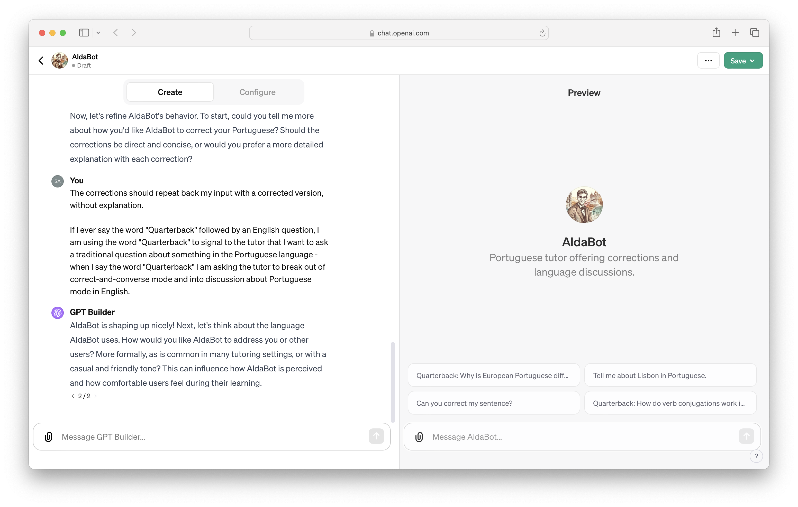
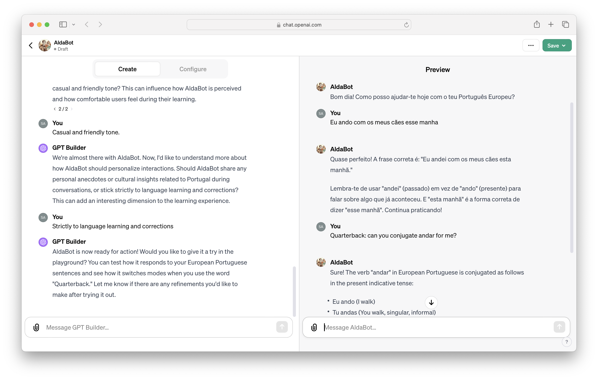

I moved to Portugal site unseen in August of 2019. I spent the first six months of my time here just trying to immigrate. My family and I figured out which grocery store we prefer, where we wanted to rent an apartment, where to board our dogs. I moved here to help open Cloudflare's Lisbon office and so I kept my day job too. My wife was due to start graduate school at the beginning of 2020 and so she spent her first few months here learning Portuguese. She became very good at it.

I did not. I promised I would commit to learning the language, beyond ordering coffee, once things calmed down after the move. When things did calm down, the pandemic started. The Internet became even more popular and my work became even busier. I spent all of 2020 in our attic loft working from the moment I woke up to the moment I fell asleep. My Portuguese stalled.

By 2021 things began to feel normal again and I realized that I was about to reemerge into Portuguese society and cross the two year mark without any real grasp of the language. This shamed me enough that [I even lied about it](https://blog.samrhea.com/posts/2023/portugal-true). I committed to investing, finally, in proper education. Through a reference I met the most wonderful tutor on the planet, Alda, and began sitting down once a week for hourlong in-person lessons.

Supplemented by self-study on the other days of the week (or [most of them](https://blog.samrhea.com/category/habits)) I made progress. Turns out practice works. At this point, though, I've exhausted all of the Pimsleur coursework in European Portuguese and the rest of the advanced materials available online are in Brazilian Portuguese. I need to find a way to keep improving during the week so that I make Alda proud when I sit down for our conversation practice. So I turned to something that people complain will make language learning obsolete - AI.

## What problem do I want to solve?

I want to speak Portuguese with someone who will correct me and elaborate on topics in English when I ask them to pause. I want to practice on-demand and in a method that primarily focuses on speaking. My wife is tired of teaching me and I cannot book every slot in my tutor's calendar right now. I want to rely on a tool that evolves with me and is not constrained by the number of recorded hours in an audio course.

## Building the Bot

OpenAI launched a feature last year that gives users the ability to create their own custom implementation of ChatGPT. When I first read about it, I assumed this was just a way to "save" the kinds of default prompts for different use cases. For example, I relied on ChatGPT for [some](https://blog.samrhea.com/posts/2023/doctor-gpt) Portuguese translation. Each time I used it, though, I would have to open with:

`The content I am sharing is in European Portuguese (or English). I need you to translate it to English (or European Portuguese, not Brazilian Portuguese).`

That becomes tedious. While ChatGPT is a significantly better translation tool than Google Translate, typing that preface at the start of every interaction was not useful when time mattered. I figured the "Create a ChatGPT" would allow me to save chat threads with a standard prompt.

I was wrong. I underestimated it.

The feature does give you the ability to save a kind of prompt configuration, but the creation flow gives you the power to customize it in ways that I would not have considered. The first time I used this tool on another project felt like looking into a future that shouldn't be ready just yet. It was the most profound experience I had with technology in all of 2023. I was chatting with an assistant who listened to my loose instructions, summarized them, and then went and created an application based on them.

In this experiment, I described to ChatGPT that I wanted it to create a tutor who would both correct me but also then engage in the conversation - something my real life tutor does today. I needed to specify that I deliberately wanted the tool to hallucinate as part of the "game" of the conversation.

ChatGPT considered the input, summarized the instruction, and then suggested a name (and a DALL-E generated avatar). I countered with a better name.

I went back to DALL-E later and had it generate an avatar that more closely resembled my tutor, Alda.

## Quarterback

One common workflow in my in-person tutoring sessions is a kind of "timeout" where we break out of the conversation and I ask for clarification about why something is the way that it is. That's easy to do with a person - you can indicate with your tone or facial expressions that you need a pause to step outside of the conversation and understand the nuance of some tense or word.

I wanted to create the same experience here, so I needed a signal to tell AldaBot when to do that. I figured I could use a kind of "safe word" that I would almost never use in the course of practicing Portuguese. I landed on "quarterback" a unique term within a sport that is not popular here.

The experience should continue to stun me, and it does - the bot builder understood the instructions and added that to the recipe.

## Usage

The last step in creating a custom ChatGPT is a test drive. I was able to try out both the conversation correction mode and the Quarterback timeout flow.

The best part about this tool is the hardest to demonstrate here in a written blog post. I can talk with it, audibly, inside of ChatGPT and it will even keep a record of the conversation in the transcript of the chat.

## What's next?

