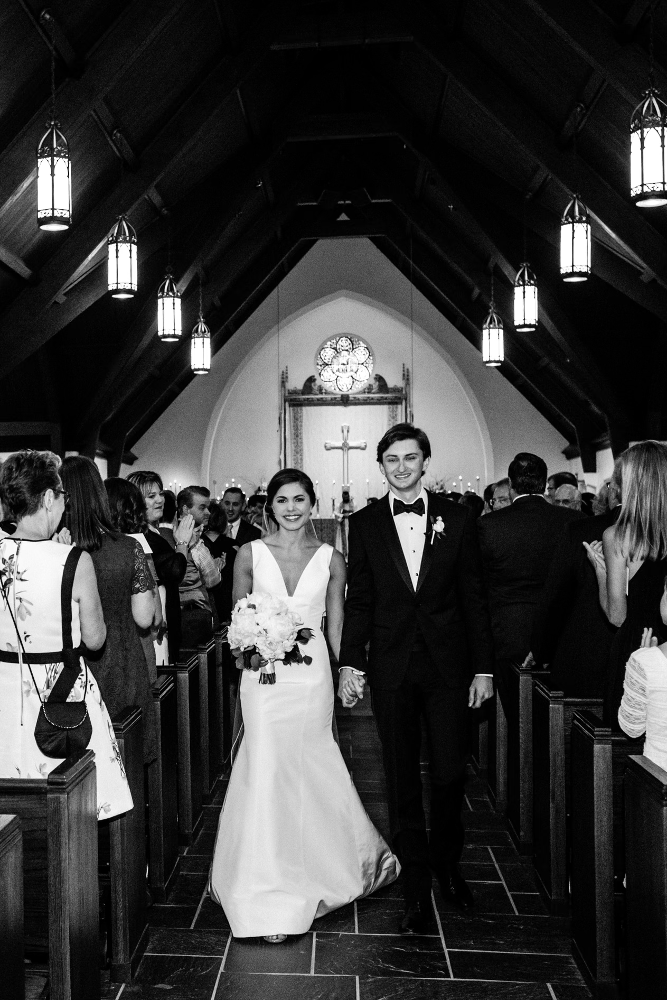
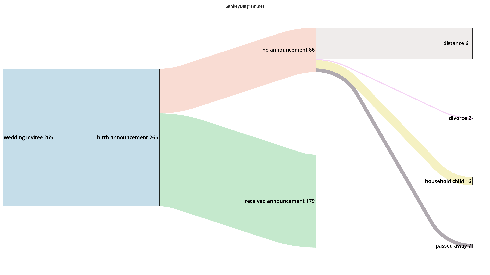
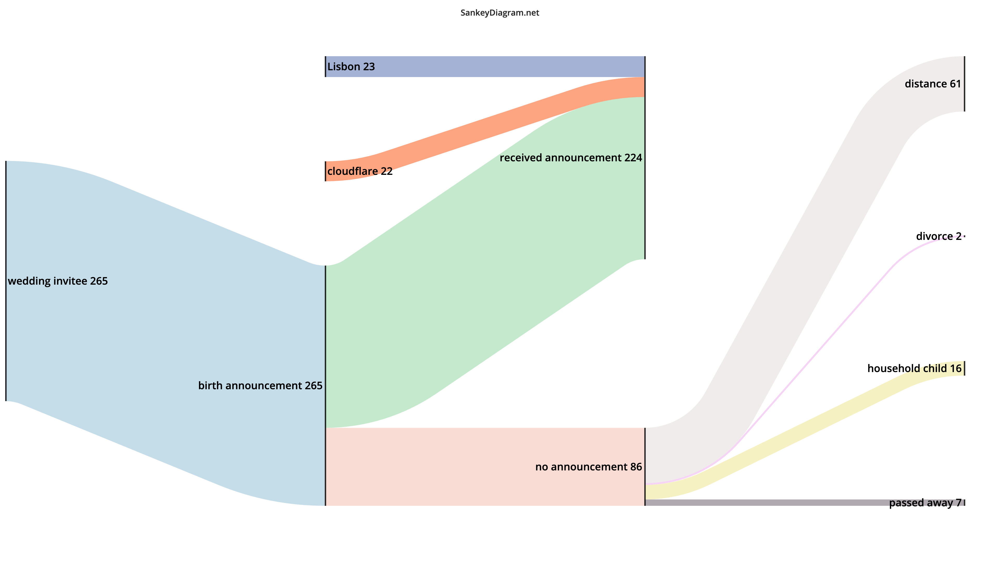

Nearly seven years ago I married Rachel. Our wedding was so delightful that I sometimes wonder what magic charm I stumbled upon. We held the ceremony at Good Shepherd Episcopal in Tarrytown. Rachel walked down the aisle in a Carolina Herrera gown as 240 of our friends and family turned to see her. I stood at the altar trying to remember to keep my knees slightly bent so I didn’t pass out.

We celebrated with a cocktail hour and dinner on the lawn of the Four Seasons in Austin which sits on Town Lake (now Lady Bird Lake). We danced with a live band and threw an after party at the hotel bar.

I wouldn't change a thing.

Except the people. Not like that - I wouldn’t uninvite guests. Instead, we have spent the last seven years collecting new friends in new places. I wish they all could have attended. We’ve had the privilege of attending multiple weddings in Portugal and back in the US to celebrate new friends we didn’t know when we said our own vows. The magic of our wedding was that hundreds of our favorite humans all had an opportunity to spend a joyful evening together. I wish I could extend that to this new wave of community.

One person who also did not attend our wedding was our newborn son, Jack William Welch Rhea. He arrived on this earth a couple of weeks ago at Hospital da Luz here in Lisbon, Portugal. We like and love him - a lot. We’d like to share that with the world.

Instagram is the obvious first place where we broke the news. Unlike some of the trends on social media, we kept the pregnancy a quiet thing amongst close friends and family. No gender reveal videos, no maternity photos, no wedding shower montages.

_I wanted to keep it a secret even from our own family just because I thought it would be hilarious to surprise them with a baby the next time they land in Lisbon. Rachel disagreed._

Instead, we told a small group in real life. We did wind up surprising a lot of folks when we shared his first photos on social media, which was a consolation prize for me.

However, we are also from Texas. Families in the Southern United States send printed birth announcements. They do this elsewhere, but Texas makes it a peer pressure artform. Even though we’ve lived out of the state for nearly half a decade, we still felt duty bound (and excited) to send real notices that unto us a child has been born.

We started our birth announcement recipient list by digging up the only spreadsheet of addresses of close friends and family that we had - our wedding guest list. I started editing it and noticed some curious patterns.

## What was the structure of the wedding list?

We set a rough target of 260 invitees. My wife’s parents were generous enough to allow each of the Big Four to split that list into quarters:

* Rachel invited ~65 folks;
* her parents would claim another ~65;
* I’d shuffle around ~65 and
* my parents would close us out with the remaining ~65.

The quarters caused real consternation. Wheeling and dealing occurred. At one point my mom and I argued about a particular cousin of mine with whom I am close. Should he count as my friend or as a member of the Rhea family? I tried to credit him to her account and she balked. He wound up on my list after a tense negotiation.

Our wedding planner said we should expect an acceptance rate in line with target software gross margins - high 70s. I warned her this was too low; she did not know my friends and family. There is not a polite way to convey to someone that you are well liked in your community. She thought I was joking until we showed up with an 85% hit rate.

## First, who receives an announcement?

Of the 265 guests who attended our wedding, 179 will receive birth announcements.

86 will not. And that’s fine. This isn’t about being vindictive. People change, relationships evolve, and the kinds of folks who might attend your wedding might not also be the people who would receive a baby announcement.

Of those 86, 16 will receive an announcement by proxy - these are the household children who were invited to our wedding. These are mostly cousins. For example, my wife’s aunt and uncle have three children. We will send the aunt and uncle a birth announcement, but not the children. This might be pedantic to call out but I found it interesting.

A couple couples separated and we picked sides - only one half will receive the announcement. I am not counting folks who brought a date to the wedding and now are dating someone else.

The largest category is distance, which is no surprise. Our wedding was seven years ago and one continent away. Some folks we loved dearly, and still do, have just grown a bit distant over the years and we won’t send an announcement. In some cases our wedding was the last time we saw them. More on that below.

We lost seven friends or family members over the years. This part was hard. Updating the addresses for sending the birth announcement meant removing some names. Some of those are names that sit in my Contacts and probably always will. Too hard to delete. But this exercise meant facing that action in some format. Not fun.

## What if you didn’t make it to the wedding?

The “Distance” subcategory correlates with wedding attendance. If you attended our wedding, you were more than three times more likely to receive a birth announcement. Of the 226 guests who attended the wedding, 179 received a birth announcement (79%).

Of the 35 who could not make it to the wedding (and have not since passed away) 9 received an announcement (26%). The 9 who received a birth announcement but couldn’t make it to the wedding were mostly folks who lived very far away or had life events taking place around the same time that made it hard to get to Austin for the wedding.

I don’t think this is representative of scorn or any petty emotion like that. Wedding invites are retrospective things. Rachel and I married in our mid 20s - a transition time where your college friend group narrows down to a close bunch and your “adult” friend group is still somewhat new. You invite folks from childhood or school who you haven’t seen in just a couple years at that point but still feel close to even though they might not attend.

If you’ve had a wedding, you get this - some invites are ceremonial rewards for friendships that have approached the end of their story arc. Here and now, seven years later, the last time you saw them was your wedding. You follow each other on social media but don’t really talk. You’ve completed the distancing that started before the wedding as all relationships evolve.

## Second, who moved?

My favorite category and the one that sparked this post. I needed to make sure that the address I had was current for the 179 people who were invited to our wedding and will receive a birth announcement (this excludes their household children). Thankfully, I could delegate this work by enlisting Rachel’s parents, my parents, and Rachel depending on the cohort of the invitee. That also gives me demographic division.

I broke down the results by cohort and not just if they moved - but if they moved cities or states. I recently read a statistic that the median American lives about a dozen miles away from their mom. Despite thinking that we are a pretty migratory people, about half of Americans (at least) just cluster close to where they are from.

|Bucket|Moved|Moved City|Moved State|
|---|---|---|---|
|Sam Friends|93%|51%|37%|
|Rachel Friends|90%|57%|29%|
|Welch Family|67%|40%|0%|
|Rhea Family|62%|15%|0%|
|Rhea Friends|29%|9%|0%|
|Welch Friends|28%|12%|8%|

This data provides a lot of fascinating life stage analysis. I’m going to try to generalize with more signals than I am sharing here. I know the people on these lists and the lists are small enough that I can document some patterns. I am going to break these down from highest percentage of moves to least.

_Again, when I describe these groups I am referring only to people who were invited to the wedding and received a birth announcement - I’m not describing every friend I have._

### Rachel and Sam Friends

|Bucket|Moved|Moved City|Moved State|
|---|---|---|---|
|Sam Friends|93%|51%|37%|
|Rachel Friends|90%|57%|29%|

Nearly every friend of mine moved in the last seven years. The only ones who did not were my “adult” friends who I knew from work. Otherwise, the rest of us were in our mid or late 20s. We all were living in cheap apartments and working in jobs that would change. We got married, we moved up in our careers, we found new opportunities.

The only bit that surprised me was the percentage that moved out of state. Every single school I attended, from preschool to University, sits within five miles of downtown Austin. Not only that, but Texas is a very large place with two of the five largest metropolitan areas in the United States (Houston and Dallas Fort Worth), a third that grows rapidly (Austin), and a fourth that families love (San Antonio). Turns out, people really like New York.

Rachel’s numbers and stories look very similar, despite attending university on the east coast far away from Texas in a region where you might move across state lines just to get to the airport. My “moved state” rate is a bit higher, but I think this is mostly because of the self-fulfilling prophecy of friends encouraging more friends to move to New York.

### Welch and Rhea Family

|Bucket|Moved|Moved City|Moved State|
|---|---|---|---|
|Welch Family|67%|40%|0%|
|Rhea Family|62%|15%|0%|

The family buckets are a bit more interesting because they contain the widest cross-section of age and socioeconomic groups. You make your friends at school or work. You look a lot more like them than your cousin. You also have staggered age ranges across grandparents, aunts and uncles, and even siblings.

Both family groups moved more often than not, but exactly zero moved out of the state. This probably reflects how many family members have smaller children and they might move across a neighborhood as the family grows but leaving their career and school district altogether is too much hassle.

### Welch and Rhea Friends

|Bucket|Moved|Moved City|Moved State|
|---|---|---|---|
|Rhea Friends|29%|9%|0%|
|Welch Friends|28%|12%|8%|

These are friends of Rachel’s parents and my parents. No surprise here - they stayed put. Both of our parents were in their mid to late 50s when we got married and so were most of their friends. They were in a transitional phase as their last kid graduated from high school or college but their oldest hadn’t yet settled down with grandchildren.

They were also close enough to retirement not to try a new job altogether, but not yet free of the office to move. My father is an attorney and Rachel’s father is a physician - many of their friends are from work and these are both professions with high upward mobility (most can own a house and can keep owning it) and low horizontal mobility (no one wants to rebuild a law practice or even climb another hospital ladder in a new place at this stage).

When they did move, it almost always tended to be for the same reasons that both of our parents moved in the time since we had our wedding - downsizing. Nearly all of my parents' friends are now empty nesters in the time since the wedding and the moves reflect that. Some did move, but almost none moved out of their city or state.

## Third, who is new?

While we’ve grown apart from some folks, we’ve also introduced wonderful new friends into our lives! These  are additions from my work at Cloudflare and our social circle here in Lisbon.

## What now?

We're going to have to do Christmas cards this year and each year after... This could be a fun sociology survey to run each year. I want a better way to chart the `Moved` trends and am open to ideas.