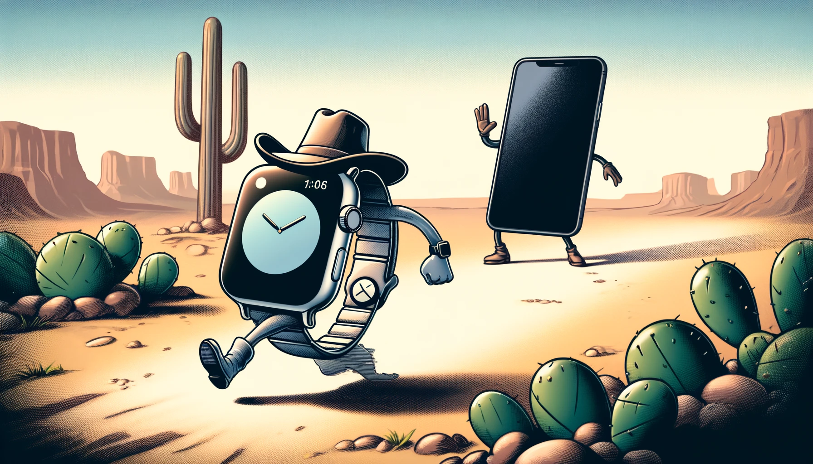

I purchased an iPhone for the first time in 2008. I bought a new iPhone 3G. The launch of that model's 3G connectivity coincided with something much more profound over the long run: the introduction of the App Store. The iPhone stopped being a tool at that point and became, increasingly, a [time-wasting circus](https://blog.samrhea.com/posts/2023/phone-tool).

Your computer still kept you grounded, though. You would plug your phone into your computer to download updates and sync files. The computer took on a role as a kind of forward operating base for your digital life. Start the day by getting what you need (and not a thing more because of storage constraints on your iPhone). Go out into the world with just your iPhone. Be a human. Use your phone to listen to music at the gym, text a friend, call a parent, and maybe take a photo. Sync up when back at home at the end of the day.

I liked that model. Especially because most of your time sucks, like social media, lived in your computer's browser back then and not on an app. Your phone became like a suitcase that you packed for a trip. You couldn't take your whole closet so you had to make some decisions about what to bring. You had constraints about what you could do when you were not next to your closet.

Eventually our phones became capable enough to steal away the central position of our computers. The iPhone exists untethered to any computer today; the device is standalone and for most people has become their primary computing device. For many people I know, who have a work computer, their phone is their **only** computing device (they might also have an iPad but I'm going to bucket that together here).

Today, wherever I go, I carry my entire closet. That felt like a golden future when I was younger but now seems like a curse. I have been writing [more](https://blog.samrhea.com/posts/2023/phone-tool) [posts](https://blog.samrhea.com/posts/2024/apple-mechanical-watch) lately about how much I want to use my phone less. And I have been [failing](https://blog.samrhea.com/posts/2024/naps-and-junk-food) at that. I think it's time to try something drastic. I want to set a hard and audacious ceiling of one hour of phone time per day. To accomplish that I am going to try to `shift right` the role of the devices in my life. I am going to try to use my deliberately constrained Apple Watch, the most "mobile" version of my phone, in the same way that I used my iPhone as the most mobile version of my computer in the 2000s.

## The Tether

The funny thing about the Apple Watch is that it is as capable as our phones were back in those days. The thing does exactly what I need from a piece of technology that goes everywhere with me - and nothing more. I can make calls, send messages, check the weather or my to-do list, and see what's next on my calendar. Like my iPhone in the 2000s, that's about all that it does. The form factor means that social media and other mindless habits have not yet migrated over.

_Although, I did believe that about social media in the 2000s. We posted albums with hundreds of photos and long status updates. I figured the format of facebook would never make sense on mobile. And here we are._

I want to stear into that limitation of the Watch and try to resume a pattern where the "distracting" device in my life, my phone, is confined to a base camp role. My plan is to spend 20 minutes at the start of my day using my phone for the kinds of things that set me up for the day. Similar to how I relied on my computer back in the 2000s. I'll go about the rest of my day leaning on my Watch as my primary device - the thing handles all the tasks that are important in real-time. I'll then return to touch base with my phone and wrap up what happened.

### Morning

Each morning I'll try and grab my phone and start my day by both taking care of things that live on that device and getting my Watch ready to head out into the world.

**1. Check GitHub issues -> Convert to Reminders**
* My wife and I use GitHub issues in a private repository to plan our projects together. Yes, this feels similar to the meme about that couple who uses Notion. No, we do not do anything fancy with it. We simply have a ticket for something like `Enroll Jack in Swim Lessons`. Things that take more than a quick action and, more importantly, benefit from us leaving a comment like "today I emailed the swim center."
* Ask myself: do any of these need me to do something on them today? If so, create a Reminder because the Reminder experience on the Watch is great.
* If I carry my phone around with me at all times, I come back to this GitHub list frequently for no reason other than to bandaid over my stress by staring at it. This removes that temptation.

**2. Money**
* Pay any bills - like most of Europe, Portugal relies on bank transfers for many services rather than recurring charges or direct deposits.

**3. Email and Long Form**
* Do I need to respond to anyone over email? Did someone in the US send me a long iMessage overnight that needs a proper response? I am part of a lot of `Dude Group Chats ^TM` and I tend to wake up to a few dozen messages that I missed while I slept. Catching up on a Watch would be a masochistic exercise.

**4. Health**
* I take my health [pretty seriously](https://blog.samrhea.com/posts/2024/nebuchadnezzar) and rely on a few apps to make progress towards my goals.
* Some of these apps are truly splendid on the Watch anyway - the `Strong` app for weight lifting while at the gym is delightful on the Watch. This check on my phone mostly consists of charts.

**5. Pack the Suitcase**
* What else am I going to want on my Watch for the day? Podcasts, audiobooks, music. Make sure they're downloaded.

### Evening

**1. Close out GitHub**
* What happened today that helped me make progress on something so that my wife can get an email that I closed it in GitHub? I married up and need the credit.

**2. Social Media**
* What did I miss? I still believe that Instagram, dangerous to your focus as it is, is the best way to stay in contact with acquaintances back home.

## The Work Computer

I spend a good chunk of my day on a computer no matter what goals I set in my personal life. I work, more or less, at the Internet. My work computer does not have my personal email or any social media other than Twitter. What it does have, though, is a word processor that allows me to get writing done without the risk of Instagram or Reddit.

## The Gaps

This plan has the potential to introduce hassle. My phone wound up replacing a lot of devices in my life. Which is great until you realize that you don't want to have a phone on you at all times.

First, the camera. I am a new dad who lives on a different continent than most of my family. Pictures of my son are currency (and also important to me). I have not figured out the right answer to this. For now it probably looks like treating my phone like a camera - grabbing it to capture a moment and then putting it back.

FaceTime is a similar challenge. The grandparents want to see the baby - in motion. Maybe I will just exclude FaceTime video calls from the set hour goal. Or maybe those Facebook Portal video conference things could be a present... _Update: they discontinued those. Which makes sense._

## What's next?

This will probably fail like most other phone use experiments, but I'm excited to try it.
