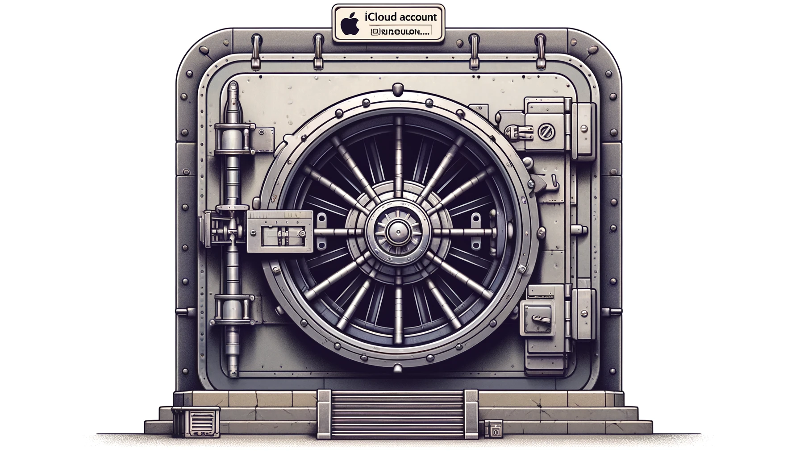

Late last night (my time) users around the world [began reporting](https://9to5mac.com/2024/04/26/signed-out-of-apple-id-account-problem-password/) that they were suddenly locked out of their Apple iCloud accounts.