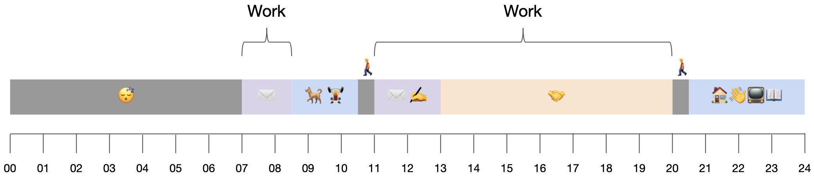

Five years ago I wrote a [post that cataloged](https://blog.samrhea.com/posts/2019/euro-office-time) my working hours in the European office of an American software company. I had moved from Austin to Lisbon to help open up the new Cloudflare office here but I kept most of my day job from back home. And in that capacity I found timezone nirvana. The blog post celebrated what I believe is the ideal working environment - the “Quiet Morning, Filtered Afternoon” setup.

I called it `European Office Time` (EOT). The entry became the second most popular post on this blog after the one tutorial I published for mutual TLS authentication. Turns out people like how-to guides.

My days hummed along in EOT for about seven months until the pandemic changed everything. I thought about writing an update to my time zone manifesto during lock down, but the entire post would have just been this napkin sketch:

* Wake up at 7AM
* Work until midday
* Exercise inside my apartment
* Work until I fall asleep

_Eat all meals at desk. Walk dog to see sunlight. Ignore count of coffees. Repeat._

Lock down ended but my calendar never really recovered. I had given a mouse a cookie and my schedule became an unrelenting parade of video calls at all hours. I mostly gave in because I find the work more interesting than Netflix.

Until I became a dad. My wife and I welcomed a son into our lives earlier this year. I returned to work last month and sat down to create a new calendar. Unlike the last edition, this one is not about a specific spacetime where I can take advantage of time zone overlap based on my geography. Instead, I have to be a dad first.

## What are the constraints?

When I wrote the EOT post I cataloged my “preferences” for how I wanted to spend my time. Being a parent replaces a lot of your preferences with requirements, so I am just going to use that term today.

|Requirement|What is it?|
|---|---|
|Dad Time|Our son is, as I’m writing this, nearly five months old. This age is a blast. Everyday he does something new. I want to be there for as much of it as I can. I get to spend all weekend exploring the world with him but during the week I have to prioritize that time.

His still-developing Circadian rhythm means he is (generally) available from 7A to 7P (of course, I will “see” him between 7P and 7A when he wakes up fo a late night snack, but indulging his desire to play at 2:30A is not good for either of us).

I need to find some way to also be with him in that 12 hour block. If I am going to work a typical workday, that leaves the mornings or the evenings open. Mornings are easier for me because much of my work is done with colleagues in the US which shifts my day to the right a bit - a legacy of EOT.|
|Marriage|Like my time with our son, I have abundant opportunities during the weekend to spend time with my best friend but I have to be deliberate during the week otherwise I’ll run into her on a Saturday and ask her how she’s been over the last week.|
|Work|I still try and get about 10 hours each day. The last time I wrote this the reactions to that were hilarious. American tech folks read that and thought “only 10?” My European counterparts were shocked and terrified. I typically wind up working 60-70, but mostly because I’ll grab a laptop and chew through something if my wife and I put the television on.

Or I’ll wake up before the rest of my family on a Sunday morning and try to make progress on something while I wait for the house to start stirring.|
|Exercise|Some things never change - in this case that’s a good sign! I still plan to spend 1 hour each day working out.|
|Dogs|In addition to a human child my wife and I are also responsible for two very large dogs. We are lucky enough to have a dog daycare that we adore in Lisbon but I still need to get them there each morning.|
|Writing|I’d like to block out 20-30 minutes to write. I think of writing like I think of physical fitness - you have to exercise that muscle or it will atrophy.

I saw a (maybe apocryphal) quote from Toni Morrison that amounted to wanting to get some writing done before anyone called her “Mom” which meant the early mornings. I am nowhere close to a Morrison level writer but I do like the idea. Once the day gets going, it is really hard to set aside time to write.|
|Commute|I need about 20 minutes to walk to the office each day (the office and I both moved since my last post).|
|Lunch|I also still eat lunch at my desk when possible. It’s not that I am antisocial, it’s just that Portuguese lunches (even coworker ones) never last less than 90 minutes and any time I spend at one of these events is time I cannot spend doing actual work which pushes my day later.

I do say Yes to these from time to time, especially when we have visitors from other offices in town.|

You’ll notice something odd - “Dinner” is not listed. I tend to snack a little bit around dinner time but prefer to eat a large lunch.

## Sam, you’re missing this thing

This schedule is pretty stoic if you boil it down: family, work, exercise. That short list excludes some popular alternatives to spending your time, but I just don’t know how I would fit anything else.

The most “positive” missing opportunity here for spending your time is some form of community. Social gatherings, religious meetings, civic groups. I check most of those boxes, they are opportunistic or live on weekends. When I do eat a real lunch, I’ll meet a friend somewhere in Lisbon to catch up. I spend time in our church on Sundays. My wife and I will go out to dinner with friends on our date nights. We frequently have visitors over to our home on weekends. I’m very social - I just don’t prioritize it during the work week. I try to first spend what free time I do have with my family.

Then there’s the other bucket - hobbies and recreation. Like the “being social” category, I just don’t know how I’d create this time. I also don’t really want to. I don’t feel compelled to become a home brewer or F1 enthusiast. When people ask me what I do in my free time I tend to tell them I am a _bon vivant_ - I just like to live well with friends in the Portuguese sunshine.

I also avoid a lot of “screen” hobbies. I have played one video game in the last decade - _Fortnite_, something that my friends and I picked up during the pandemic. We would all log into the game on Sunday nights mostly just to sit around and chat while we played. You did not need to invest a bunch of time in the lore or the game itself to enjoy it with your friends.

I am open to this changing as my son grows up. If this boy likes playing golf, then golf will become a hobby. If he is really into Scouts (which is popular in Portugal) then we are going camping a lot. I’ll adapt to what interests him because he is what interests me.

All of this isn’t to say that I don’t waste time. Like many of you, scrolling is my nemesis. I just don’t deliberately set aside time for other things outside of the table above.

## And today I’m thankful for…

The ability to craft this schedule while also being a father is entirely dependent on the luck and privilege of:

* Having a job that allows me to slightly alter my calendar.
* Being married to someone who can also manage their work schedule slightly to balance parenting with me.
* Being able to afford a nanny during the day to watch our son and, someday, being able to afford daycare as he gets older.

All of these are blessings, though sometimes I wonder if the first point is a trap. Would this be easier if I had a more set schedule? Working for an American technology company can be a kind of open ended pursuit, especially in the kinds of roles I have held. Would this be easier with shift work?

I have a close friend who is a physician in New York. He knows the exact hours he will be working months in advance. That rigidity means he doesn’t have to set aside bonus time for surprise late night meetings (though he does have to be on call at times, but the hospitalist system in the US has made that much easier for most physicians). He also can commit to plans outside of work with religious adherence.

Being a doctor is probably the most highly paid and prestigious form of shift work so it’s a terrible example compared to more manual labor kinds of roles or ones where you are only given 39 hours a week to avoid benefits. I just wonder if I would be less anxious about this if I had a role that expected a finite number of hours from you. I don’t actually want that, but it is interesting to consider.

## So, what is the plan?

IMAGE

| Time | Symbol | What is it? |
|---|---|---|
| 11:00p-6:00a | 😴 | Sleep |
| 6:00a-6:45a | ✍️ | Try to write as much as I can before our son wakes up. The looming deadline of his morning adds some needed pressure to crank out words and skip on Twitter. |
| 6:45a-8:15a | 👶 | Fatherhood! Mornings with an infant are delightful. He is thrilled to see me when he wakes up, we eat breakfast together, and we play games and read books. |
| 8:15a-8:30a | 🐕 | Hand off child to wife who will hand him off to the nanny later in the morning. Get dogs to our dog daycare. |
| 8:45a-10:30a | 🏋️🚿 | Get to the gym, work out, get back home, shower and get dressed for the day. |
| 10:30a-11:00a | 🚶‍♂️ | Walk to the office, available for calls but rarely any takers due to the time zone. |
| 11:00a-2:00p | ✉️ ✍️ | Get some real deep work done before America wakes up. Take European sales calls if I am lucky enough to get added. |
| 2:00p-7:30p | ✉️🤝 | Meet! As in, Google Meet. I’m trying to be in less meetings these days but some telepresence is still required. |
| 7:30p-8:00p | 🚶‍♂️ | Commute home and take calls; this one is more popular. |
| 8:00p-9:30p | ✉️ | Emails and chats as needed. Async work. |
| 9:30p-11:00p | 🏠📖 | Spend time with my wife, read. |
| 11:00p | 😴 | Bed! |

This changes, of course. Late night meetings will pop up. Dentist appointments and errands tend to happen. I travel for work fairly often. However, this represents how I am approaching the default.

## Why work?

The other, nuclear, option to creating a calendar as a parent is to just eliminate the biggest time block - work.

I am very lucky - I don’t need to work anymore. Sure, I am not going to turn down more money but being in the right place at the right time over the last 12 years has put me in a position where I could comfortably live off of my savings and support my family.

Doing so would require reasonable lifestyle changes, mostly around my personal travel habits. My propensity to book business class airfare for long haul flights would come under new scrutiny. As would my guilty pleasure of staying in the nicest hotels in town. Though I’d gladly sit in Premium Economy and sleep at a Westin in exchange for more time with my family.

That isn’t the tradeoff, though. At least it isn’t for me. I want to work. I find it important for my own sense of purpose and community to have a healthy balance between my family, my community, and work that I find rewarding. I am fortunate enough to find what I do at the office to be something interesting and mission-oriented.

I also know that at some point my son is going to go to school. We are absolutely not homeschool people. Creches and daycares are popular in Lisbon and we would like him to start attending and being around other kids sooner than later. He’ll still need me in the mornings, but his days will be spent learning and playing with his neighborhood peers.

And then what? I guess I could return to the workforce or just focus on something I was really passionate about. I’d rather just keep working, maintain a healthy balance, and see how this plays out. This is something I have not explored in a blog post but I would like to. For now I’ll cut it here.

## How static is this?

This will change. My wife will return to work. Our son will start daycare. My role at work will continue to evolve. All of this will look like a snapshot soon, but for right now this is how I’m sketching out my days. I’m excited.
