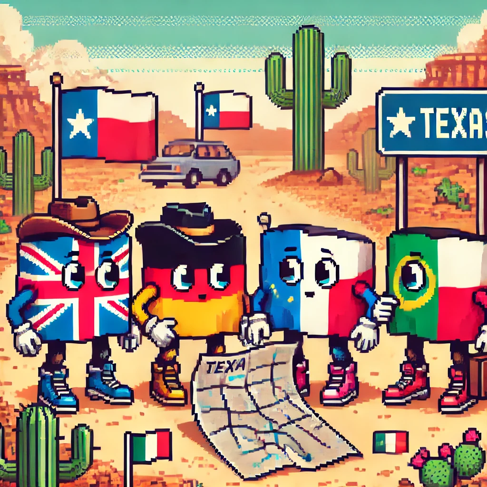

This is not a travel guide for Texas. You will not find BBQ recommendations here. This is a cultural primer on what to expect from the people who inhabit a place that John Steinbeck called “a nation in every sense of the word.”

I wrote this to prepare Europeans, but if you are from New York or California then it will probably be helpful to you as well (at the very least, Texans will consider you about as foreign as a European).

The goal is to not be surprised. These are broad cultural generalizations. Your mileage (not kilometerage) may vary.

### Texans will make dinner reservations at a time that Europeans consider “afternoon cigarette hour.” If the dinner runs longer than two hours, Texans will begin to panic.

I remember being invited to a social dinner early in my time in Portugal. The ringleader made the reservation for 9PM. I figured I would do my best to adapt to local customs and arrive 15 minutes late. This was almost smart - everyone showed up around 10PM. The whole group then sat there and ate and drank until well after 1AM.

Everything in the paragraph above would qualify as a horror story to a Texan (and most Americans). We do enjoy breaking bread together, but we prefer that our meals wrap up.

It’s not that we don’t enjoy your company, we are just tired. We work too much and we assume everyone else does too. We want to have time to go home and sit on our couch for 30-45 minutes with Netflix on the television while we catch up on social media and respond to work emails that arrived during dinner.

### Texans will agree with nearly anything that you say.

This applies broadly to conversational norms in the American South and is not unique to Texas.

We will not challenge you on any claims (unless you offend the United States of America or Texas). You could tell us that you believe that toddlers should always be present on red eye flights or that broccoli is not healthy and we will just nod along with you.

It’s not that we are pacifists. Texans do enjoy a good confrontation from time to time. We just pick our battles. Sports give us an outlet for this. Humans are tribal but the US relies on an increasingly fragile core myth. We have to find an outlet for silly rivalries to exercise that part of our lizard brain and sports are a safe place for it. Mostly.

Anyway, during a conversation Texans would find it unspeakably rude to challenge any assertion you make. We will not debate you on the merits or facts of a given topic. We are mostly taught that you indulge the speaker and move along with the friendly conversation. This does lead to shallower conversations, we know. That’s by design. Texans are friendly on the outside but build up walls to prevent anyone from getting to know who we really are.

The inverse shocks most Americans when they begin spending social time with Europeans. European social norms allow for a bit of debate in a friendly chat. Especially the Dutch. They will just tell you you are wrong. Flights landing in Amsterdam from the US should include a warning over the loudspeaker that the Dutch will say things that offend you but they do not mean it at all.

### We will also interrogate you about Europe.

The average Texan will be delighted that a European made it all the way to their home. We don't get a lot of y'all around here; most Europeans just hit up New York or California.

That also means we don't have much interaction with Europeans. Combined with our friendliness and curiosity, we will ask you a lot of questions that probably seem silly.

For example, I only have a Portuguese drivers license and I also look like I am 16, so I get carded when I buy beer when I'm visiting Austin. When I show the bartender my Portuguese ID, I get questions like "wow, what is South America like?" or "how do you English this well?" or "where should I visit in Spain?"

And in all of those cases I know the person asking meant well. They have encountered for the first time someone they _think_ is Portuguese and their response is to want to learn. You might find it oppressive, but be ready - Texans will want to learn about you and will assume you are capable of speaking about nearly anything on the European continent.

### Texans will serve you beer in bottles and cans.

This is not an insult. Serving you a cold beer inside of a can or bottle is our way of showing you both that we are excited to welcome you and that we hope you stay. One of our favorite sounds is the crack a beer can when you open it or the pop of a bottle cap on a Shiner Bock.

In Texan culture, pouring that beer into a glass is an overly formal, European thing. If a Texan served beer in a pint glass to a friend, that friend would tease them about it. We are casual creatures and we are terrified of being seen as hoity-toity. We are not trying to offend you when we do not serve you a drink in a glass.

### The smaller the geography, the more time it will take for us to consider you a local.

Most Texans consider you a Texan if you spent some of your childhood in the State. You don’t need to have been born in Texas, but you at least need to have spent your formative years in the place.

You earn your Texan-ness by sweltering in August two-a-day football practices, by getting scraped up by mesquite exploring the Hill Country, by watching the Cowboys lose in the playoffs, by going to visit NASA in elementary school, by associating water recreation more with lakes than oceans because your dad’s friends tried to drown you somewhere on the Lower Colorado when you were hanging on for dear life to a tube being pulled by a ski boat, by experiencing real snow for the first time in your teenage years when you go on a ski trip to Colorado, by being a kid in a wide open space.

The qualifications become more strict as the place gets smaller - for different reasons though. Rural East Texas has its own culture that requires someone to really grow up in it to understand the nuance. West Texans are wary of outsiders without family roots in the place, a consequence of the many interlopers showing up to drill for oil and then bail.

Austin is even worse. The city has considered itself under siege for decades by Californians and their ilk. Being an Austinite is a birthright thing. I was born at Seton Hospital and spent the next ~30 years within five miles of it. I am an Austinite - or at least I was. My wife was born in Iowa where her 6th generation Texan father was doing his medical residency. She moved to Austin when she was six weeks old and then spent nearly two decades in the place and I do not consider her an Austinite. She is basically a Yankee.

### You will find no public transit that is useful to you.

I mean it. You will need to use rideshare. Think about the single worst European public transit system. Really imagine it. Think about that time you visited Dublin after finding a cheap Ryanair flight and complained about their garbage public transit the whole weekend. Texas is worse.

No city has a subway system. A couple cities have “light rail” which is a small train that runs along a single line for suburban commuters. Bike lanes are notoriously absent, assuming the weather is good enough for biking. You cannot walk anywhere safely outside of the urban cores (not because of crime, because of trucks and highways and the actual heat). The bus system will be indecipherable and will not get you where you want to go in a reasonable time frame. You must use the apps.

### Overt friendliness follows an East-West path.

Almost all Europeans will find nearly all Texans to be too friendly. When you land in Texas, though, you can prepare yourself for just how friendly the locals will be by finding out your longitude. 

East Texans consider themselves part of the American South. When you encounter them, they will be sweet and charming and affectionate in ways that Europeans find saccharine.

The further west you travel, the less overwhelming you will find the kindness of locals. West Texans in particular are a hardy bunch. When you think about the trope of a stoic cowboy who only speaks sparingly and through pursed lips, you are thinking about a West Texan.

The public university system in the State encourages cross-pollination of the two so this is becoming less distinct. The cities, by and large, are just cities.

### We will refer to ourselves as Texans, not Americans.

Texans think of themselves, first and foremost, as Texans. We identify more strongly with our specific State than we do with the United States (though most Texans are also very patriotic about being Americans).

We do this because we have built up a brand that we feel is unique. The idea of “Texas” carries weight in the rest of the United States and even the rest of the world. When we travel abroad, we say we are from Texas not the United States - most people could guess we are Americans anyway.

### You will find a population that is more diverse, cosmopolitan, and educated than you expected.

Many foreigners base their idea of a Texan on Cowboy Westerns or the TV show Dallas. Or you might think we are all gun-toting religious zealots. Or maybe you saw _Friday Night Lights_ and are surprised when we do not wear our State Championship rings. And all of those worlds exist, especially the _Friday Night Lights_ one. They are just much smaller than you’d think.

New York is celebrated as a melting pot of identities and cultures, but Houston is the most diverse city in the United States by [several](https://houston.innovationmap.com/most-diverse-cities-houston-no1-2667878363.html) [measures](https://houston.culturemap.com/news/city-life/most-diverse-cities-houston-no1/). Austin is the [4th most educated](https://www.forbes.com/advisor/education/student-resources/most-educated-cities/) large metro in America. We think about California as an economic powerhouse but Texas now has  company headquarters than any other state. Despite the vast rural expanses and small towns full of charm, 84% of Texans [live in an urban area](https://kinder.rice.edu/urbanedge/census-redefines-urban-rural). Houston alone houses [earth's most sophisticated cancer treatment hospital](https://www.newsweek.com/worlds-best-specialized-hospitals-2021/oncology), one of the world's largest rodeos, and the birthplace of Beyoncé. Texas is home to NASA, the agency that put humans on the moon, and the SpaceX Starbase, the place that will probably put a human on Mars (or at least most of the satellites you use lately).

You’ll probably be surprised, in a good way, to encounter a population that breaks a lot of your preconceived notions about the place. We like that.

### We will not ride horses to the office.

I swear to God. If one more brie-eating, cigarette-lunch-having, soccer-loving, August-vacationing, tight-t-shirt-wearing, manpurse-carrying, Euro Trash socialist makes that stereotypical joke one more time then I’ll put my hat back on and ride off into the sunset.